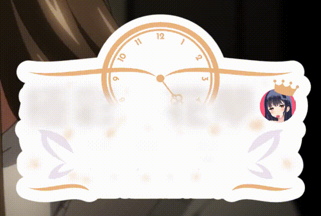

仅对我们当下所使用的字幕结构作说明。

### Ex-KSY template fx error
这一行应该很难有人猜到用处。  
fx修饰语只对对应名称的内联特效有用，这一行仅对"error"名称的内联特效有作用——其实也就是不产生任何实质内容。  
但是，如果字幕前面没有template行就不能执行应用卡拉OK模板(按钮是灰的)，所以这一行其实是为了触发检测做的。

### Ex-KSY code once
这一行定义了全局变量tags和staffs，方便后面使用。

### Ex-KSY code line

<pre>
fxgroup.staff = line.actor == "staff"
if line.actor == "字幕制作人员" then
    match = re.split(line.text_stripped, "[：:]\\s?")
    ksy.table(tags).add(match[1])
    ksy.table(staffs).add(match[2])
end
if fxgroup.staff then
    styleref = ksy.table(line.styleref).copy().value
    styleref.fontsize = 36
    styleref.align = 5
    local _tags = ksy.table()
    local _staffs = ksy.table()
    local gap = 64
    local thr = 320
    local cur_width = 0
    local infos = ksy.table()
    for i = 1, #tags do
        local info = ksy.str(staffs[i], styleref).info()
        if cur_width + gap + info.width > thr or i == 1 then
            _staffs.add({ staffs[i] })
            _tags.add({ tags[i] })
            infos.add({ { 0, info } })
            cur_width = info.width
        else
            _staffs.index(-1).add(staffs[i])
            _tags.index(-1).add(tags[i])
            infos.index(-1).add({ cur_width + gap, info })
            cur_width = cur_width + gap + info.width
        end
    end
    local _shapes = ksy.table()
    for i = 1, #_staffs.value do
        local twidth = infos.index(i, -1).value[1] + infos.index(i, -1).value[2].width
        for k = 1, #_staffs.index(i).value do
            _shapes.index(i).add(ksy.str(_staffs.index(i).value[k], styleref).toshape(nil, 3).move(
                -twidth / 2 + infos.index(i, k).value[1] + infos.index(i, k).value[2].width / 2,
                0).split().out(1).value)
        end
    end
    shapes = ksy.table()
    tags = ksy.table()
    for i = 1, #_shapes.value do
        local twidth = infos.index(i, -1).value[1] + infos.index(i, -1).value[2].width
        for k = 1, #_shapes.index(i).value do
            for l = 1, #_shapes.index(i, k).value do
                shapes.add({}).index(-1).edit({
                    ["domain"] = _shapes.index(i, k).value[l],
                    ["index"] = i,
                    ["char"] = k,
                })
            end
            tags.add({}).index(-1).edit({
                ["text"] = _tags.index(i).value[k],
                ["index"] = i,
                ["x"] = -twidth / 2 + infos.index(i, k).value[1],
                ["width"] = ksy.round(infos.index(i, k).value[2].width),
                ["height"] = ksy.round(infos.index(i, k).value[2].height),
            })
        end
    end
    last = ksy.round(line.duration / #_shapes.value + 50)
end
</pre>

大致功能是：  
如果一行的说话人是"字幕制作人员"则记录进前面设置的全局变量tags和staffs中；  
如果一行的说话人是"staff"则进行真正的特效生成；  
根据staffs的文字长度进行空间分配；  
对每个staff文字进行拆字把所有笔画记录下来；  
将所有笔画的一些属性记录下来方便在template行读取。

### Ex-KSY template line notext fxgroup staff

<pre>!maxloop(#shapes.value)!
!ksy.func(function() shape = shapes.index(j).value end).run()!
!relayer(5)!
!retime("preline",last*(shape["index"]-1),last*shape["index"] < $ldur and last*shape["index"] or $ldur)!
{\an7\p1\pos(1600,865)\1c&HB075A6&\alpha&HFF&
\org(!10000*(ksy.sign(j) > 0 and 1 or 0)!,!10000*(ksy.sign(j) < 0 and 1 or 0)!)
\frz!math.random()*.1*ksy.sign(j*maxj)!
\blur6
\t(!math.random()*120!,!math.random()*520!,\alpha&H00&\frz0\blur.32)
\t(!(last*shape["index"] < $ldur and last or $ldur)-math.random()*240!,!last*shape["index"] < $ldur and last or $ldur!,\alpha&HFF&)}
!shape["domain"]!</pre>

maxloop：循环次数为笔画总数；  
ksy.func：这里是根据当前循环次数j定义/修改全局变量shape，也就是当前笔画的数据；  
relayer：修改层级，避免被其它绘图遮住；  
retime：以preline模式修改生成行的时间；  
\an7\p1\pos(1600,865)\1c&HB075A6&\alpha&HFF&：用\an和\p开启了绘图模式并且修改了对齐，用\pos直接固定了显示位置(但是我们最终实现的效果是有平移的)是因为用\move写平移会不那么直观或者说麻烦；  
\org：修改旋转中心，逻辑是要么生成(10000,0)要么生成(0,10000)，之所以不考虑设置在负半轴是因为后续\frz可以指定为负数；  
\frz：值为随机[-0.1,0.1]，一开始设置\frz也就相当于随机初始位置，之后再由动画调整为\frz0就可以平移到原来位置；  
\blur：给点blur的动态效果感觉会好一点，但其实笔画多的时候不应当这么做，字幕会容易卡顿；  
\t：随机时间开始动画，错开笔画显现及平移的时间；  
\t：在最后使笔画消失；  
!shape["domain"]!：也就是笔画具体的绘图内容。

### Ex-KSY template line notext fxgroup staff
这一行基本只是把对象从笔画改成了tags，不做赘述。

### Ex-KSY template line notext fxgroup staff

<pre>
{...
\fscx0\t(0,500,\fscx100)}
m 0 -2 b -2 -2 -3 -1 -3 0 b -3 1 -2 2 0 2 !ksy.shape("l 0.5 2 ").fsc(tag["width"]+8).move((tag["width"]+8)/2).out(0)! !ksy.shape("b -2 -2 -3 -1 -3 0 b -3 1 -2 2 0 2 ").rotate(0,0,0,0,180).move(tag["width"]+8).out(0)!
</pre>

这一行是staff文字下的下划线。  
\fscx0\t(0,500,\fscx100)：给个简单的缩放动画，也就有了“画线的效果”；  
m：这里的逻辑是生成一个指定宽度的绘图，因为想给这个下划线圆角的效果所以略微复杂一点。

### Ex-KSY 字幕组署名

署名其它部分基本都是纯绘图，这里就不讲其中的逻辑了。  
但署名这里还有个比较明显的动效，是“の”字的弹跳及“花夢”两个字的伸缩效果。

“花”字和“夢”字的伸缩效果是比较简单的，修改\an再在合适的实际进行\fscx\fscy的动画即可。

而“の”字的运动其实也不复杂，弹跳本身就是抛物运动，水平方向速度不变(或者稍微变一点也看不出来)，竖直方向需要有明显的加速度效果，  
我们能拿来控制运动的标签其实就两组，一组是单纯用\move标签实现匀速直线运动，一组是\org\frz\t组合实现变速曲线(或近似直线)运动，  
在这我们就可以拿\move标签实现水平方向的匀速运动，然后用\org\frz\t加上合适的速度系数实现竖直方向的变速运动。

另外还有个挺有意思的效果，是“の”字和下面小字的出现效果。

### Ex-effects AME code line

<pre>
fxgroup.IGNORE = false
if string.lower(line.actor) == "fx-chs" and string.lower(ksy.sub(meta["language"], 1, 3)) == "cht" then
    fxgroup.IGNORE = true
elseif string.lower(line.actor) == "fx-cht" and string.lower(ksy.sub(meta["language"], 1, 3)) == "chs" then
    fxgroup.IGNORE = true
elseif config.JPN_only then
    fxgroup.IGNORE = true
end
</pre>

这行是为了在特定条件下去除一些屏幕字行的显示。  
例如一行的说话人是fx-chs并且当前设定为繁体字幕，那么该行将不会显示——也就是可以为简中和繁中分别设置一行屏幕字效果，这样在应用模板之后总会显示当前对应的行。  
又或者字幕设置为仅日字时，则去掉所有屏幕字的显示。

### Ex-effects AME template line notext fxgroup IGNORE

<pre>!""!</pre>

!""!：这个就是单纯返回一个空的字符串，避免一些问题。

### Ex-invisible cache code once

<pre>
styles = {}
function addCache(style, styleref)
    styles[style] = styleref
    return ""
end
</pre>

将日文中文正文的字幕样式存储起来，方便后续使用。  
这样在修改样式之后也能生成正确的效果。

### Ex-invisible Project.Paulownia code once
请见: https://github.com/KyokuSai/Project.Paulownia/blob/main/ksy.lua

### Sx-jp AME code line

<pre>
fxgroup.SX = (line.styleref.name ~= "Sx-zh" or config.JPN_only ~= true)
if ksy.sub(line.actor, 1, 3) == "fx-" then
    fxgroup.SX = false
end
</pre>

如果当前为仅日字则不显示中文行；  
如果当前行的说话人以"fx-"开始也不显示，也就是对一些需要单独处理的行进行隔离。

### Sx-jp AME template pre-line Paulownia-jp fxgroup SX
fxgroup SX就是上面的逻辑；  
但其实为什么这里要用pre-line单独开一行，我自己是想不起来了，应该是因为会触发什么错误所以需要这样做。

### Sx-jp AME template line Paulownia-jp notext fxgroup SX
内容写!""!是生成空字符串占位，notext是因为文本也需要进行格式化所以都在前面的pre-line中生成了。  
line的名字是Paulownia-jp，也就让前面的pre-line生成的内容能够拼接在这一行的(空)内容之前，实质的内容全部是pre-line那行生成的。  
所以大概率是因为在template line中生成会出现什么错误才另外开了一行template pre-line。

### 后续内容
接着还有几行是针对注释生成的，然后就是日文正文、中文正文。  
在—— FX - 特效生成行 ——之后就是真正生成出来的内容了，我们在编辑字幕时仅修改前面的内容。

### \furi
这是我们加的假名注释效果，具体代码请见: https://github.com/KyokuSai/Project.Paulownia/blob/main/ksy.lua  
在编写此处内容时的代码为：

<pre>
furi = function(num, text, fsc, fsp)
    if config.JPN_only ~= true and ksy_pandora[styleref.fontname]["JPN_only"] ~= nil then
        return nil
    end
    text = text and text or num
    num = tonumber(num) and num or ksy.len(num)
    fsc = tonumber(fsc) and fsc or 100
    fsp = tonumber(fsp) and fsp or 0
    local befores = string.sub(line.text, 1, command_index - 1) .. "}"
    befores = re.sub(befores, "{.*?}", "")
    local init = function()
        local gjpqy = false
        local autofsc = true
        local minfsc = fsc
        for _, elfraw in ipairs(elfraws) do
            local ame = ksy.func(elfraw["str"]).parse()
            local _length = tonumber(ame.args[1]) and tonumber(ame.args[1]) or ksy.len(ame.args[1])
            local _text = #ame.args >= 2 and ame.args[2] or ame.args[1]
            if re.find(_text, "[gjpqy]") ~= nil then
                gjpqy = true
            end
            if #ame.args > 2 then
                autofsc = false
            end
            if autofsc then
                local width = _calwidth(ksy.sub(
                    re.sub(string.sub(line.text, 1, elfraw["first"] - 1) .. "}", "{.*?}", ""), -_length))
                local _width = _calwidth(_text) * ksy_pandora[styleref.fontname]["furigana"]["fscx"] * .01
                local _fsc = math.floor(width / _width * 100)
                if _fsc < minfsc then
                    minfsc = _fsc
                end
            end
        end
        if autofsc then
            local width = _calwidth(ksy.sub(befores, -num))
            local _width = _calwidth(text) * ksy_pandora[styleref.fontname]["furigana"]["fscx"] * .01 * minfsc *
                .01
            fsp = (width - _width) / (ksy.len(text) + 1)
            fsp = ksy.round(fsp, 1)
            fsp = math.max(fsp, 0)
        end
        return gjpqy, minfsc
    end
    local gjpqy, minfsc = init()
    local x = _callineleft() + _calwidth(befores) -
        _calwidth(ksy.sub(befores, -num)) / 2
    local y = meta.res_y - ksy.str(line.text_stripped, styleref).geth() -
        (line.margin_t == 0 and styleref.margin_t or line.margin_t)
    y = y + ksy_pandora[styleref.fontname]["furigana"]["Yoffset"]
    if re.find(line.text, "\\\\an8") ~= nil then
        y = meta.res_y - y + ksy_pandora[styleref.fontname]["furigana"]["Yoffset"] +
            ksy_pandora[styleref.fontname]["furigana"]["Yoffset2"]
    elseif gjpqy then
        y = y + ksy_pandora[styleref.fontname]["furigana"]["Yoffset3"]
    end
    text = ("%s{\\fsp}%s"):format(ksy.sub(text, 1, ksy.len(text) - 1), ksy.sub(text, -1))
    return { characters["Basic"] .. ksy_effect(false) ..
    ksy_character() .. _getlineeffects(string.sub(line.text, 1, command_index - 1) .. "}") ..
    string.format(ksy_pandora[styleref.fontname]["furigana"]["content"],
        re.find(line.text, "\\\\an8") ~= nil and "8" or "2",
        minfsc * .01 *
        (config.JPN_only == true and ksy_pandora[styleref.fontname]["JPN_only"]["fs"] or styleref.fontsize),
        ksy_pandora[styleref.fontname]["furigana"]["fscx"] * styleref.scale_x * .01,
        ksy_pandora[styleref.fontname]["furigana"]["fscy"] * styleref.scale_y * .01,
        (fsp == 0 and "" or fsp), ksy.round(x, 1), ksy.round(y, 1), text) }
end
</pre>

有非常麻烦的判断，例如当前行的所有注释中存在gjpqy字符，则统一上移坐标。

### 特效生成

<pre>
{
!ksy.eff("\\3c", "util.ass_color(util.HSV_to_RGB(math.random()*240+120,1,.5))").genAni(5, 0)!
\p1}
{!ksy.eff("ksy.star(5, 20, 7, 0).reset(7).move(-8).out(1)").genEff(false)!}
{\p0}我相信大家{\p1}
{!ksy.eff("ksy.star(5, 20, 7, 0).reset(7).move(4).out(1)").genEff(false)!}
</pre>

※正常来说，这一行不是template行而是karaoke行，也就是只有特效标签本身能有效，內联变量、!!中的代码全部都是不会有效的！  
而这里之所以有效是因为在前面格式化内容时进行了特效标签内容的检测，只要{}包裹的特效代码部分有!!内容就进行eval后输出结果。  
!ksy.eff("\\3c", "util.ass_color(util.HSV_to_RGB(math.random()*240+120,1,.5))").genAni(5, 0)!  
生成一个往复动画效果。  
!ksy.eff("ksy.star(5, 20, 7, 0).reset(7).move(-8).out(1)").genEff(false)!  
生成一个五角星绘图，并且以"}...{"的形式输出，也就真正地出现在了非标签的内容区域。
