本篇文章将介绍ASS字幕中绘图的一些基础知识，最后写一个“提取连通域”或者说“拆分笔画”的功能。

> 读前须知：  ​
虽然说是入门，但请对ASS绘图有一些基础的认知；  ​
默认读者已经熟悉lua；  ​
笔者(花菓)对拓扑学认知有限，可能表述会有不当或者比较绕，但总之思路还是明确的。

## 入题
本文的最终目标是“拆分笔画”，但准确而言应该是：在指定字体下对指定文字转换成的绘图尽可能提取每一个连通域，达到近似拆分笔画的目的。  ​
例如对于“花”字，最终达成的效果应该是拆为“艹”“亻”“匕”三个部分——如果笔画间有黏连只能通过更加复杂的图形分析才能进行拆分，为了最佳的拆分效果、足够优秀的运算速度我们自然是不考虑黏连笔画的拆分。

> 网络上有过几个人发拆字的逻辑和具体使用的代码，但本文算是完全没参考过其他人的拆字代码。  ​
我个人看到其他人的思路里免不了对每个连通域的顶点进行循环判定是否与其它所有连通域是否相交，觉得全无必要，所以完全凭自己的思路从零写的拆字代码。

文字转绘图不在本文范围内，用得最多的自然是Yutils中的create_font方法，其可以快捷获取到(非标准格式的)文字绘图。  ​
但本文中所有绘图都默认使用标准格式，且只用m、l、b指令。  ​
笔者根据Yutils改写了一个生成标准格式文字绘图的方法，读者也可以对Yutils生成的绘图指令进行标准化。

我们知道(或者说默认你知道)绘图的起点是m指令，而闭合绘图是不需要指令的。  ​
所以每一个m指令都可能是一个新的“笔画”，如果我们要拆分笔画那也就是将组成一个笔画的若干个m指令开头的绘图相拼接。  ​
那么函数的第一步就是将绘图指令转化为一个m指令的数组，下一步就是判断哪些m指令是组成一个笔画的，再将对应的m指令拼接即可。  ​
在这段轻描淡写的表述中，唯一有异样感的就是“判断哪些m指令是组成一个笔画”。  ​
该如何判断？本文大部分篇幅都将围绕这个问题展开。

> 为了更合适的展示效果，本篇文章使用的ASSDraw3是特制的。  ​
仅显示效果不同，实际构成的绘图是一致的。

## 简单的绘图
ASS中的绘图指令不止有m、l、b，还有s、n、p、c，甚至l、b等指令也有连写省略的形式。  ​
但由于 **非常严重的兼容性问题** ，我们在大部分情况下还是应当只使用m、l、b指令且不进行省略。  ​
也就是说对于本文所指的绘图，m、l指令后面必定跟随一对数字(x坐标、y坐标)，b指令后面必定跟随三对数字(第一个控制点坐标、第二个控制点坐标、终点坐标)，并且绘图代码仅由这些指令及坐标组成。  ​
例如： ** **m**  0 -33  **b**  -18 -33 -33 -18 -33 0  **b**  -33 18 -18 33 0 33  **b**  18 33 33 18 33 0  **b**  33 -18 18 -33 0 -33  **m**  11 20  **l**  11 -14  **l**  -11 -14  **l**  -11 17  **l**  -3 17  **l**  -3 -7  **l**  3 -7  **l**  3 20  **l**  -12 20  **b**  -16 20 -19 17 -19 14  **l**  -19 -12  **b**  -19 -14 -16 -17 -14 -17  **l**  13 -17  **b**  15 -17 18 -14 18 -12  **l**  18 14  **b**  18 17 15 20 11 20** 。

### m指令
(闭合之前的绘图并)创造一个新的起点。  ​
一个标准绘图的第一个指令必定是m指令。  ​
一个标准绘图可以存在多个m指令，每个指令都可以看作是一个独立绘图的起点。

### l指令
以上一个指令的终点为起点，该l指令后的坐标为终点，创造一个线段。

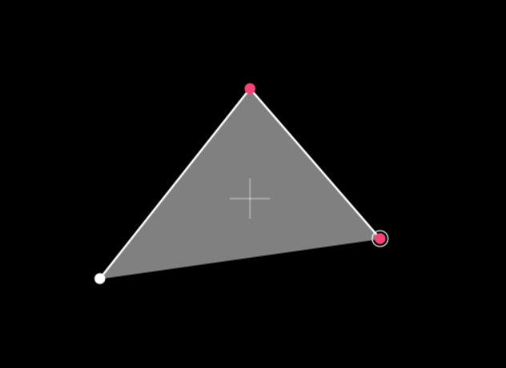

> 图中的白色实心点为m指令坐标点。

### b指令
以上一个指令的终点为起点，该b指令后的两个坐标为两个控制点，该b指令后的第三个坐标为终点，创造一段贝塞尔曲线。

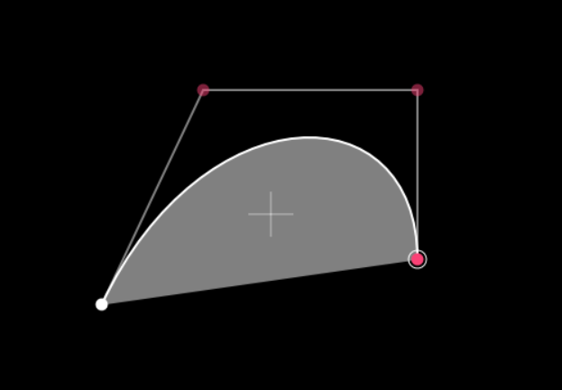

## 绘图的闭合
m、l、b三个指令中没有让绘图闭合的指令，也就是说闭合是自动判断的。

对于本文讨论的绘图，闭合发生在每个m指令结束，也就是说：  ​
以每个m指令开头的独立绘图的最后一个指令的终点坐标为起点，该m指令的坐标为终点，创造一个线段进行闭合。  ​
如果不想以线段结尾可以最后使用b指令且设置终点坐标为起点m指令坐标。

由此一来便构成了一个完整绘图中的每个独立绘图。

## 绘图的相交
如果一个完整绘图中存在两个独立绘图相交，也就是其中一个绘图的部分或者全部都位于另一个绘图当中，这时候会存在两种可能：无事发生、产生缺口。

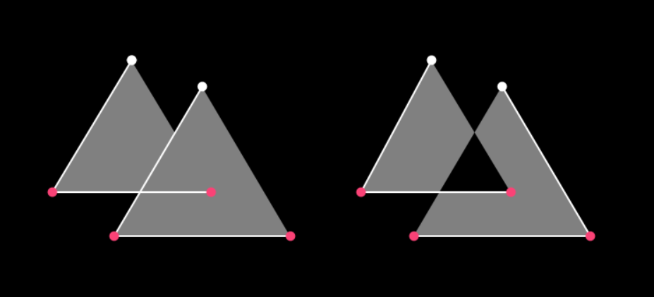

为了便于理解，我们暂且不考虑“部分相交”的情况，只考虑“全部相交”也就是 **包含** 或者 **镂空** 两种可能。

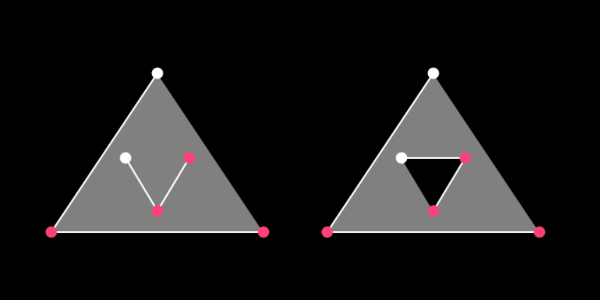

这两种可能都是存在的，上图也就是(特制的)ASSDraw3中的截图。  ​
之所以特地做一个ASSDraw3的改版，主要也是为了强调绘图起点的m指令——上图中的白色实心点就是m指令坐标点。  ​
而相交绘图是否会出现镂空，可以看到明显与m指令坐标点本身无关，但是与独立绘图的 **走势** 有关。  ​
图左的两个独立绘图 **均是逆时针** ，没有出现镂空；而图右的两个独立绘图 **一个是顺时针一个是逆时针** ，就出现了镂空。

——但上文仅是让完全不知道绘图可以镂空的读者知道存在这样的情况，结论泛用性不够。  ​
例如，一个完整绘图中如果存在多个独立绘图相交，该如何判断哪些区域是镂空区域？

直接说结论，ASS中的绘图遵从<a href="https://en.wikipedia.org/wiki/Nonzero-rule" target="_blank" rel="nofollow noopener noreferrer">非零环绕数规则</a>，SVG矢量图等也使用该规则。

## 非零环绕数规则
这里简单解释一下非零环绕数规则。  ​
对于ASS绘图而言，因为每条线都有明确的起点和终点，所以均可以看作是矢量图中有方向的线。  ​
而整个绘图就是矢量图中的多边形。

### 环绕数
我们计初始环绕数为 **0** 。  ​
计算某一个点相对于多边形的环绕数，我们从该点向任意方向引出一条射线；  ​
该多边形的每条边都是矢量；  ​
对于射线与多边形的每个交点，如果该交点处多边形的边是 **逆时针方向** 则环绕数+1，如果该交点处多边形的边是 **顺时针方向** 则环绕数-1；  ​
计算最终的环绕数。

### 非零环绕数规则
如果某一个点相对于多边形的环绕数是0，则该点在多边形外部；  ​
如果某一个点相对于多边形的环绕数不是0，则该点在多边形内部。

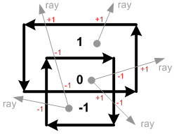

由此，对于ASS绘图中多个相交的独立绘图，我们想知道某个点是镂空(点在外部)还是非镂空(点在内部)，只需要对该点计算相对于全体绘图的环绕数，并运用非零环绕数规则进行判断即可。  ​
如果要知道全体绘图存在哪些部分镂空，只需要对每个点循环以上判断即可。

## 分离绘图
怀揣着迷茫，总之我们能明确要做的第一件事：将绘图依据m指令分离开来。  ​
获得一个独立绘图的表才方便后续进行判断、操作。  ​
不过既然要方便操作，自然不是单纯获得独立绘图的字符串，而是要完整获取每个独立绘图每个坐标点的 **坐标** 及对应的 **指令** 。

### 格式化绘图
我们要处理的绘图代码很简单，标准规整的由m、l、b及坐标组成的字符串。  ​
对于传入的绘图代码，我们第一步直接按空格拆开，并对每个字符串进行循环；  ​
如果当前字符串不能转换成数字，则一定是指令，创建一个commands表进行记录；  ​
如果当前字符串能转换成数字，则一定是x坐标或者y坐标，创建一个points表进行记录；  ​
points表中每个元素设为{ x = x, y = y }的形式，遇到数字判断points表最后一个元素是否存在y键，存在则创建新元素保存当前坐标为x坐标，不存在则用最后一个元素的y键保存当前坐标为y坐标；  ​
遇到数字时将commands表长度补齐到points表长度，补齐使用元素为commands表最后一个元素。

我们打开lua写下一个表：

<pre>
ksy = {
    shape = function(shape)
        local points, commands = {}, {}
        if type(shape) == "table" then --[[为了方便循环使用，如果传入的是已经初始化完毕的表则直接深拷贝]]
            points = ksy.copy(shape.points)
            commands = ksy.copy(shape.commands)
        else
            local tokens = {}
            for token in string.gmatch(shape, "%S+") do --[[循环每个字符串]]
                ksy.table(tokens).add(token)
                if tonumber(token) then --[[是坐标]]
                    if points[#points] == nil or points[#points].y ~= nil then --[[是x坐标]]
                        ksy.table(points).add({
                            x =
                                tonumber(token)
                        })
                    else --[[是y坐标]]
                        points[#points].y = tonumber(token)
                    end
                    if #points > #commands then ksy.table(commands).add(commands[#commands]) --[[补齐commands表长度]] end
                else --[[是指令]]
                    ksy.table(commands).add(token)
                end
            end
        end
        return { split = function() --[[拆分连通域的函数]] end, }
    end,
}
</pre>

如此一来，使用 **ksy.shape(...)** 时就会对绘图代码进行初始化，其中的 **points** 和 **commands** 表的结构类似于：

<pre>points = { { x = -5, y = 5 }, { x = -5, y = -5 }, ... }</pre>

<pre>commands = { "m", "l", ... }</pre>

> 之所以不直接在这一步分离绘图，是因为我们可以为分离绘图另外再写一个函数。  ​
这样如果是不需要进行分离绘图的方法可以沿用格式化部分，需要的就再调用一次即可。

### 分离绘图
有了前面的铺垫，分离绘图主要操作就是循环commands表判断m指令了，我们可以新建一个 **moves** 表代表每个m指令的独立绘图。  ​
这一步唯一需要注意的是我们需要为独立绘图 **进行闭合** ，为每个独立绘图的最后坐标进行判断，如果终点坐标不等于m指令起点坐标则额外添加一个l指令闭合到起点。

在ksy.shape函数的内部我们添加以下内容：

<pre>
local moves = {}
local function _separate_moves() --[[分离绘图]]
    for i, command in ipairs(commands) do
        if command == "m" then ksy.table(moves).add({ commands = {}, points = {} }) end
        ksy.table(moves[#moves].commands).add(command)
        ksy.table(moves[#moves].points).add(ksy.copy(points[i]))
    end
    for _, move in ipairs(moves) do --[[添加额外的闭合线]]
        if move.points[#move.points].x ~= move.points[1].x or move.points[#move.points].y ~= move.points[1].y then
            ksy.table(move.commands).add("l")
            ksy.table(move.points).add(ksy.copy(move.points[1]))
        end
    end
end
</pre>

如此一来，在ksy.shape().split函数的内部使用_separate_moves()就可以获得一个独立绘图表moves。

## 关于思路
虽然一个像样的教程应该按部就班，到这里先进行环绕数计算，然后再说如何依靠环绕数判定来组合独立绘图等等。  ​
但是我觉得这样的按部就班有点违背直觉了，因为即便写完了计算环绕数部分也还是会对如何进行下一步一头雾水，在完全不知道该做什么的时候我相信大多数人不会贸然写下去。  ​
所以这里我会尽可能还原我当时的思路——不过我当时也以为计算环绕数是必需的，其实按照后文的思路使用奇偶判断还可以略微加快计算速度。

前文已经获取到独立绘图表moves，我也是到这里开始面对笔画拆解的核心问题。  ​
唯一明确的尚且只有非零环绕数规则，但显然我们不可能用这个规则对绘图的每一个点进行判断。  ​
是该想办法提取出一些标志点进行规则判断，还是从规则出发找到另外一个等价且方便计算的规则？(就结果而言都做了)

我一开始是选择后者的，但因为我对拓扑学并不熟悉，想谷歌但搜了好久也没有找到方便实现的方法。  ​
那么摆在眼前的只有找标志点了，但我一开始也是奔着最一般化的目标去的，想解决多个多边形部分相交+全部相交(还有多边形内部线条相交)的情况。

### 部分相交
看着部分相交的两个多边形只有束手无策可言。  ​
如果只有线段还好说但是如果有贝塞尔曲线几乎就是无解的。  ​
能得到的结论：解决不了。

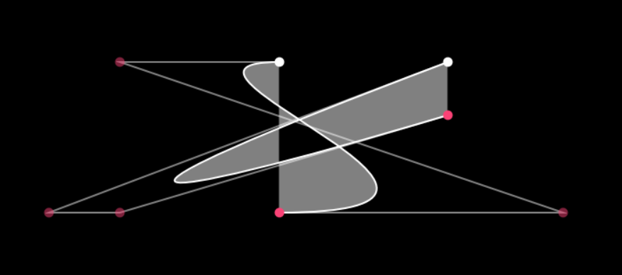

### 全部相交
如果全部相交，那么我们只需要挑选多边形内任意一点计算环绕数进行判定即可。  ​
挑选的点最简单的情况也就是直接用m指令点当做该多边形的顶点。

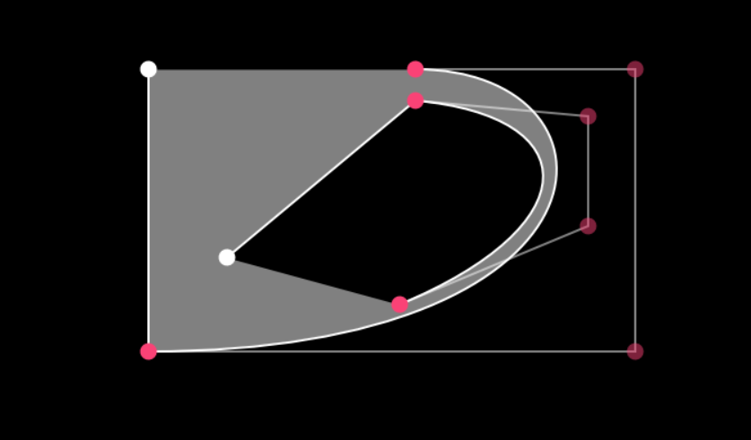

例如上图这种比较刁钻的情况，如果我们知道这两个多边形是全部相交——或者说我们默认它们就是全部相交，那么操作起来就简单了许多。  ​
但实际情况下我们并不太能让代码直接知道(看到)这两个多边形是否是全部相交，我们还是会需要进行判定才知道是全部相交然后才能继续操作——也就是套娃了，如果不能提前知道两个多边形是怎样的相交情况，就只能按照判定部分相交的逻辑走完，也就回到了部分相交的逻辑线上。

思路基本上是被部分相交堵死了。  ​
无论如何实在不太可能按照部分相交进行环绕数判定，我们不可能硬生生对一个多边形内所有点(或者说在一定密度下的所有点)循环计算与其它所有多边形的环绕数。  ​
那么我们可以回到一个拆解笔画上的基础问题： **文字绘图会出现部分相交吗？**

不会，或者严格一点可以说即便因为精度造成了相交也只会有极小面积的相交。  ​
到这一步其实是妥协了，因为一开始我肯定是知道几乎不用考虑部分相交的情况的，只是想奔着一般化去才会想考虑。  ​
但部分相交所带来的计算复杂度实在太高，只能说得不偿失了。  ​
那么如果消除掉部分相交，我们直接 **默认所有独立绘图间的相交只有全部相交** ，思路会一下子开阔不少。

此时要计算环绕数，取标志点我们可以直接取m指令点当顶点；  ​
射线我们直接从该顶点处往沿Y轴的正轴或者负轴方向作射线，这样计算交点最为快捷；  ​
对交点处的l指令或者b指令判断顺逆时针，或者简单而言就是左右方向，即可计算环绕数。

## 超绝等价规则
即便总体思路已经明确，但我还是犹豫了没有直接按照上面的思路写代码。  ​
因为按照前文思路，循环每个独立绘图后需要判定该独立绘图相对于其它所有绘图组成的绘图的环绕数。  ​
实际上拆字算法非常容易算几十个字算几分钟，而我们似乎能从判定环绕数这里出发提升效率。

假如我们计算出一个独立绘图相对于组成绘图的环绕数是0，那么该独立绘图在外部可以直接下一步；  ​
但假如环绕数不是0，该独立绘图与某个或者某些绘图有相交，我们该如何知道与其相交的绘图？再次循环判断吗？

对于上面这个问题一个比较直接的想法是，从最小的单元开始计算，一步一步剔除小绘图可以大大简化计算。  ​
但其实“如何从最小的单元开始计算”本身也是一个问题。

那么如果从我们手头好操作的东西出发，我们可以很简单地对每个独立绘图循环判定与其它每个独立绘图的环绕数。  ​
 **如果知道每个独立绘图间的环绕数，会有什么思路吗？**

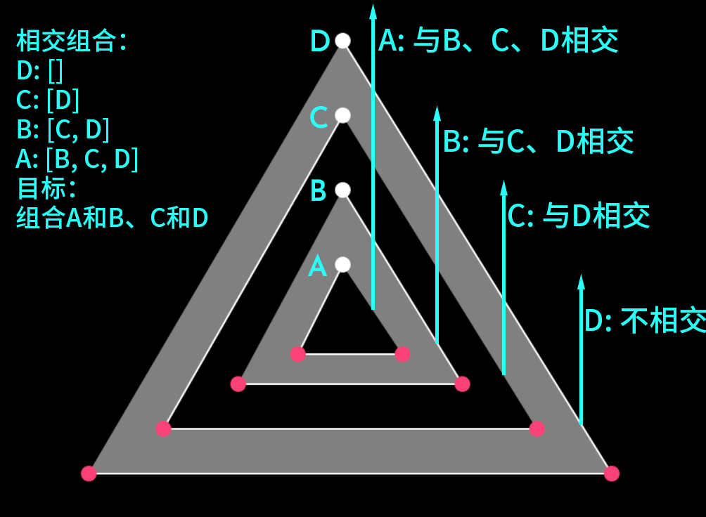

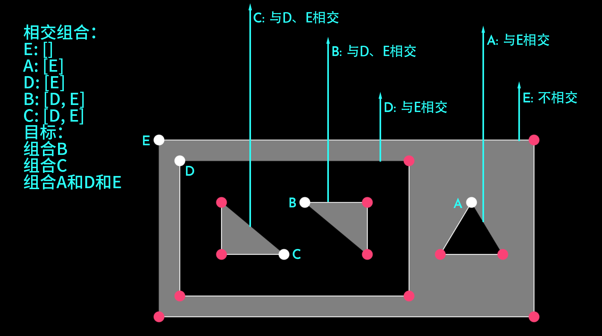

略加尝试和思考之后我们会发现：  ​
对于相交次数为0的多边形，我们其实是要找到其下一个“单位”的多边形，由该多边形和所有刚好只与其相交的多边形组成一个<a href="https://zh.wikipedia.org/wiki/%E8%BF%9E%E9%80%9A%E7%A9%BA%E9%97%B4" target="_blank" rel="nofollow noopener noreferrer">连通域</a>；  ​
对于相交次数为1的多边形，其一定会与某个相交次数为0的多边形组合；  ​
对于相交次数为2的多边形，与次数为0时相似，我们还是要找其下一个“单位”的多边形，由该多边形和所有 **刚好** 满足  **与其相交**  且  **与其相交的所有多边形相交**  的多边形组成一个连通域；  ​
对于相交次数为3的多边形，与次数为1时相似，其一定会与某个相交次数为2的多边形组合；  ​
以此类推。

我们发现了宇宙的奥秘！

就此，我们得出了快捷且代码好实现的组合多边形为连通域的办法。

> 此方法下还是需要计算每个多边形相对于其它所有多边形的环绕数，为什么会更快捷呢？读者可自行思考或者参见后文。  ​
在本文各种的限定下，其实已经不需要计算环绕数了，只需要计算交点数用奇偶规则判断。但后文还是使用非零环绕数规则进行判断。

## 计算环绕数
总体的思路已经明确，接下来就是每个小步骤的具体实现了。  ​
要写一个计算环绕数的函数，我们需要传入的关键参数是 **顶点坐标** 、 **目标绘图** 。

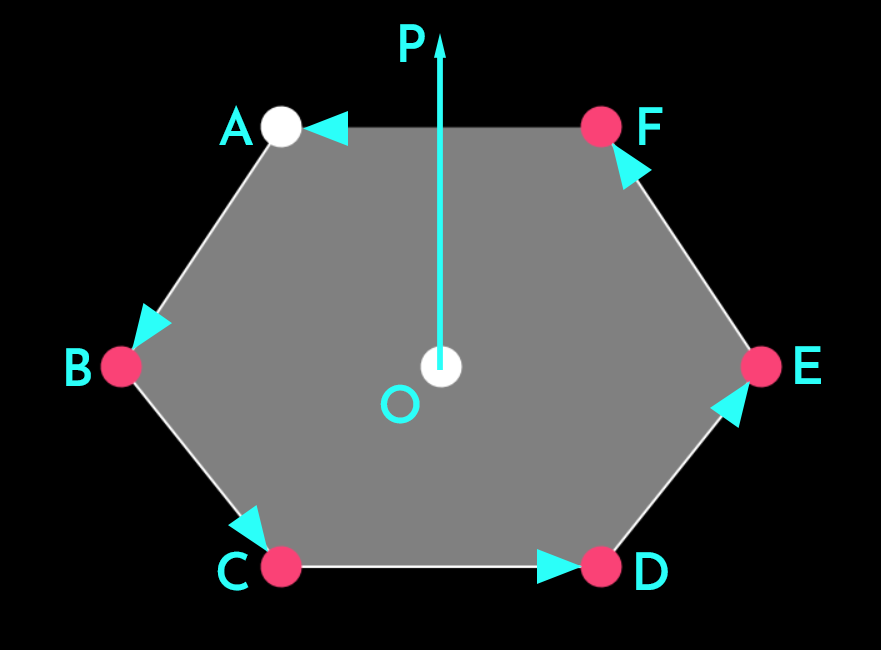

例如上图中O为顶点，我们沿Y轴正方向(实际在ASS画布中应该是负方向但无所谓)作一条射线，参考交点所在的向量FA我们可以得出以下结论：  ​
如果是l指令，在交点处，起点终点的X坐标一定在O点X坐标的两边(不考虑相等)，并且直线FA与射线OP的零点值大于O点Y坐标。  ​
非常简单的数学推导以及适用于代码的判断逻辑。

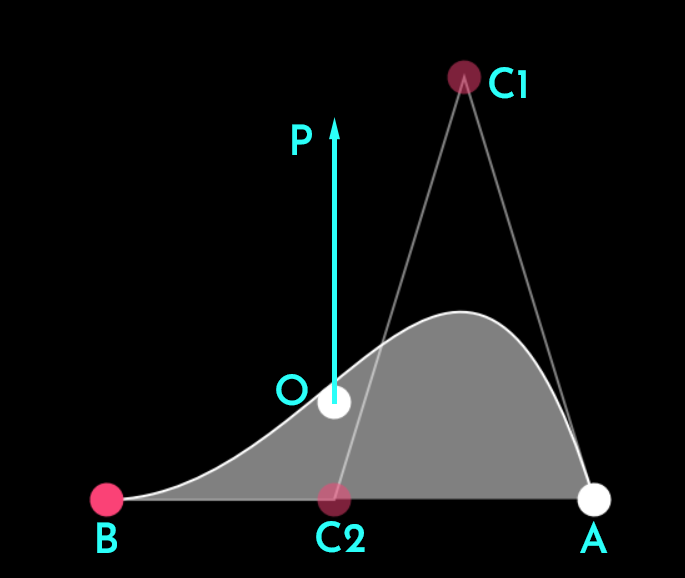

但如果是贝塞尔曲线呢？  ​
我们并不能简单地通过坐标得出是否会有交点，而如果要计算零点，因为三阶贝塞尔曲线是三次多项式方程，求解析解非常复杂所以一般用数值解，也就是逼近零点。  ​
可以用牛顿法求数值解，但其实也会比较麻烦，考虑到我们的需求可能还是简单二分法比较有效，也就是对参数t不断二分求解横坐标接近O点横坐标的位于曲线上的点。  ​
但是我们还可以选择一个更加简单直接的方式：将t从0\~1均分n次，计算出n个贝塞尔曲线上的点的坐标，然后当做l指令处理。  ​
n也就会是准确度，我们可以添加到函数中，求数值解根据需求的准确度降低计算次数可以大幅提升效率。

### 计算提速
对于每个l指令，我们不必要都计算零点，可以先判断起点终点的X坐标是否在顶点的两边，进行一次筛选(也就是如果起点终点的X坐标最小值大于顶点X坐标，或者最大值大于顶点X坐标就跳过)。  ​
b指令也可以用类似的方式进行跳过。  ​
如此一来我们能跳过大部分根本不可能产生交点的线，只计算在顶点附近的少数线是否会产生交点。  ​
并且独立绘图也可以用类似的方式只计算横纵坐标的最大值最小值进行跳过，也就是前文说的会更快捷的理由了。

<pre>
local function _calc_windings(vertex, move, precision) --[[计算环绕数]]
    local _vertex, _commands, _points = ksy.copy(vertex), ksy.copy(move.commands), ksy.copy(move.points)
    local x, y = _vertex.x, _vertex.y
    local windings = 0
    local xmin, xmax, ymin, ymax = _points[1].x, _points[1].x, _points[1].y, _points[1].y
    for i = 2, #_points do --[[计算绘图的横纵坐标最大值最小值]]
        local _x, _y = _points[i].x, _points[i].y
        if _x > xmax then xmax = _x elseif _x < xmin then xmin = _x end
        if _y > ymax then ymax = _y elseif _y < ymin then ymin = _y end
    end
    if x < xmin or x > xmax or y > ymax then --[[进行跳过]] return windings end
    for i = 1, #_commands do
        if i == 1 then goto continue end
        if _commands[i] == nil then
            goto continue
        elseif _commands[i] == "b" then
            _commands[i + 1] = nil
            _commands[i + 2] = nil
            if x < math.min(_points[i - 1].x, _points[i].x, _points[i + 1].x, _points[i + 2].x) or x > math.max(_points[i - 1].x, _points[i].x, _points[i + 1].x, _points[i + 2].x) then --[[进行跳过]] goto continue end
            local _bezier = ksy.shape(("m %s %s b %s %s %s %s %s %s"):format(_points[i - 1].x, _points[i - 1].y,
                _points[i].x, _points[i].y, _points[i + 1].x, _points[i + 1].y, _points[i + 2].x, _points[i + 2].y))
            local __commands = {}
            local __points = {}
            ksy.table(__commands).add("m")
            ksy.table(__points).add({ x = _points[i - 1].x, y = _points[i - 1].y })
            for _t = 1, precision do --[[转换为计算若干个l指令产生的环绕数]]
                local _x, _y = _bezier.bezier(_t / precision)
                ksy.table(__commands).add("l")
                ksy.table(__points).add({ x = _x, y = _y })
            end
            windings = windings + _calc_windings(_vertex, { commands = __commands, points = __points }, precision)
        else
            local x1, y1 = _points[i - 1].x, _points[i - 1].y
            local x2, y2 = _points[i].x, _points[i].y
            if x < math.min(x1, x2) or x > math.max(x1, x2) then --[[进行跳过]] goto continue end
            local y0 = y1 + (y2 - y1) * (x - x1) / (x2 - x1)
            if y0 >= y then
                if x == math.min(x1, x2) then --[[相等时在右边则计入环绕数]]
                    windings = windings + (x2 > x1 and 1 or -1)
                elseif x == math.max(x1, x2) then --[[在左边直接跳过避免重复计入]]
                    windings =
                        windings + 0
                else
                    windings = windings + (x2 > x1 and 1 or -1)
                end
            end
        end
        ::continue::
        _commands[i] = nil
    end
    return windings
end
</pre>

## 分离连通域
到这里其实内容也就不多了。  ​
根据前文的等价规则组合独立绘图，然后再格式化为绘图字符串输出一个列表即可。  ​
下面的代码仅供参考，因为很多用到的函数是我们写在完整的ksy表里的，如果要获取完整的代码可以参考我们发布的字幕文件或者 <a href="https://github.com/KyokuSai/Project.Paulownia" target="_blank" rel="nofollow noopener noreferrer">Project.Paulownia</a> 。

<pre>
ksy = {
    shape = function(shape)
        local points, commands = {}, {}
        if type(shape) == "table" then --[[为了方便循环使用，如果传入的是已经初始化完毕的表则直接深拷贝]]
            points = ksy.copy(shape.points)
            commands = ksy.copy(shape.commands)
        else
            local tokens = {}
            for token in string.gmatch(shape, "%S+") do --[[循环每个字符串]]
                ksy.table(tokens).add(token)
                if tonumber(token) then --[[是坐标]]
                    if points[#points] == nil or points[#points].y ~= nil then --[[是x坐标]]
                        ksy.table(points).add({
                            x =
                                tonumber(token)
                        })
                    else --[[是y坐标]]
                        points[#points].y = tonumber(token)
                    end
                    if #points > #commands then ksy.table(commands).add(commands[#commands]) --[[补齐commands表长度]] end
                else --[[是指令]]
                    ksy.table(commands).add(token)
                end
            end
        end
        local _out = function(move, precision)
            local _commands, _points = ksy.copy(move.commands), ksy.copy(move.points)
            local _shape = {}
            for i = 1, #_commands do
                if _commands[i] == nil then
                    goto continue
                elseif _commands[i] == "b" then
                    _commands[i + 1] = nil
                    _commands[i + 2] = nil
                    ksy.table(_shape).add(_commands[i])
                else
                    ksy.table(_shape).add(_commands[i])
                end
                ::continue::
                local x, y = _points[i].x, _points[i].y
                if precision then
                    x = ksy.round(x, precision)
                    y = ksy.round(y, precision)
                end
                ksy.table(_shape).add(tostring(x))
                ksy.table(_shape).add(tostring(y))
                _commands[i] = nil
            end
            return ksy.table(_shape).join(" ")
        end
        local _out1 = function(precision) return _out({ commands = commands, points = points }, precision) end
        local moves = {}
        local _out2 = function(precision)
            local _shapes = {}
            for _, move in ipairs(moves) do ksy.table(_shapes).add(_out(move, precision)) end
            return _shapes
        end
        local function _calc_windings(vertex, move, precision) --[[计算环绕数]]
            local _vertex, _commands, _points = ksy.copy(vertex), ksy.copy(move.commands), ksy.copy(move.points)
            local x, y = _vertex.x, _vertex.y
            local windings = 0
            local xmin, xmax, ymin, ymax = _points[1].x, _points[1].x, _points[1].y, _points[1].y
            for i = 2, #_points do --[[计算绘图的横纵坐标最大值最小值]]
                local _x, _y = _points[i].x, _points[i].y
                if _x > xmax then xmax = _x elseif _x < xmin then xmin = _x end
                if _y > ymax then ymax = _y elseif _y < ymin then ymin = _y end
            end
            if x < xmin or x > xmax or y > ymax then --[[进行跳过]] return windings end
            for i = 1, #_commands do
                if i == 1 then goto continue end
                if _commands[i] == nil then
                    goto continue
                elseif _commands[i] == "b" then
                    _commands[i + 1] = nil
                    _commands[i + 2] = nil
                    if x < math.min(_points[i - 1].x, _points[i].x, _points[i + 1].x, _points[i + 2].x) or x > math.max(_points[i - 1].x, _points[i].x, _points[i + 1].x, _points[i + 2].x) then --[[进行跳过]] goto continue end
                    local _bezier = ksy.shape(("m %s %s b %s %s %s %s %s %s"):format(_points[i - 1].x, _points[i - 1].y,
                        _points[i].x, _points[i].y, _points[i + 1].x, _points[i + 1].y, _points[i + 2].x,
                        _points[i + 2].y))
                    local __commands = {}
                    local __points = {}
                    ksy.table(__commands).add("m")
                    ksy.table(__points).add({ x = _points[i - 1].x, y = _points[i - 1].y })
                    for _t = 1, precision do --[[转换为计算若干个l指令产生的环绕数]]
                        local _x, _y = _bezier.bezier(_t / precision)
                        ksy.table(__commands).add("l")
                        ksy.table(__points).add({ x = _x, y = _y })
                    end
                    windings = windings +
                        _calc_windings(_vertex, { commands = __commands, points = __points }, precision)
                else
                    local x1, y1 = _points[i - 1].x, _points[i - 1].y
                    local x2, y2 = _points[i].x, _points[i].y
                    if x < math.min(x1, x2) or x > math.max(x1, x2) then --[[进行跳过]] goto continue end
                    local y0 = y1 + (y2 - y1) * (x - x1) / (x2 - x1)
                    if y0 >= y then
                        if x == math.min(x1, x2) then --[[相等时在右边则计入环绕数]]
                            windings = windings +
                                (x2 > x1 and 1 or -1)
                        elseif x == math.max(x1, x2) then --[[在左边直接跳过避免重复计入]]
                            windings = windings +
                                0
                        else
                            windings = windings + (x2 > x1 and 1 or -1)
                        end
                    end
                end
                ::continue::
                _commands[i] = nil
            end
            return windings
        end
        local function _separate_moves() --[[分离绘图]]
            for i, command in ipairs(commands) do
                if command == "m" then ksy.table(moves).add({ commands = {}, points = {} }) end
                ksy.table(moves[#moves].commands).add(command)
                ksy.table(moves[#moves].points).add(ksy.copy(points[i]))
            end
            for _, move in ipairs(moves) do --[[添加额外的闭合线]]
                if move.points[#move.points].x ~= move.points[1].x or move.points[#move.points].y ~= move.points[1].y then
                    ksy.table(move.commands).add("l")
                    ksy.table(move.points).add(ksy.copy(move.points[1]))
                end
            end
        end
        local function _separate_domains(precision) --[[分离连通域]]
            local _intersects = {}
            for i, move in ipairs(moves) do
                _intersects[i] = {}
                local _vertex = move.points[1]
                for _i, _move in ipairs(moves) do
                    if i == _i then goto continue end
                    if _calc_windings(_vertex, _move, precision) ~= 0 then ksy.table(_intersects[i]).add(_i) end
                    ::continue::
                end
            end
            local removeindices = {}
            for i, move in ipairs(moves) do
                if #_intersects[i] % 2 == 0 then goto continue end
                for _, index in ipairs(_intersects[i]) do
                    if #_intersects[index] == #_intersects[i] - 1 and ksy.table(_intersects[index]).contains(unpack(ksy.table(_intersects[i]).copy().remove(index).value)) then
                        ksy.table(moves[index].commands).add(unpack(move.commands))
                        ksy.table(moves[index].points).add(unpack(move.points))
                        ksy.table(removeindices).add(i)
                        break
                    end
                end
                ::continue::
            end
            ksy.table(moves).removeAt(unpack(removeindices))
        end
        return {
            bezier = function(t) --[[计算贝塞尔曲线在参数t处的值]]
                local x1, y1 = points[1].x, points[1].y
                local x2, y2 = points[2].x, points[2].y
                local x3, y3 = points[3].x, points[3].y
                local x4, y4 = points[4].x, points[4].y
                local u = 1 - t
                local uu = u * u
                local uuu = uu * u
                local tt = t * t
                local ttt = tt * t
                local pX = uuu * x1 + 3 * uu * t * x2 + 3 * u * tt * x3 + ttt * x4
                local pY = uuu * y1 + 3 * uu * t * y2 + 3 * u * tt * y3 + ttt * y4
                return pX, pY
            end,
            split = function(precision) --[[拆分连通域]]
                precision = precision ~= nil and precision or 10
                _separate_moves()
                _separate_domains(precision)
                return { out = _out2 }
            end,
            out = _out1,
        }
    end,
}
</pre>

那么对于前文中的这张图：

我们可以得到：

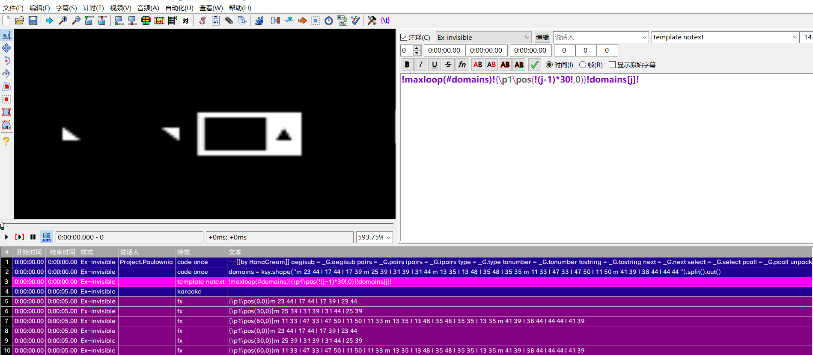

拆字效果参考图：

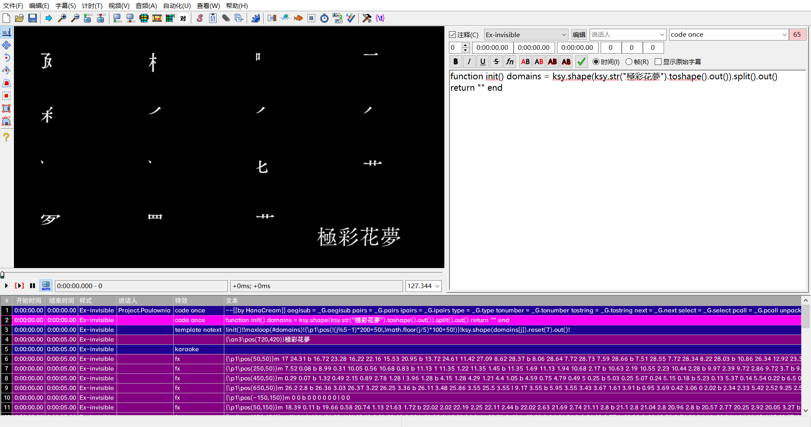
