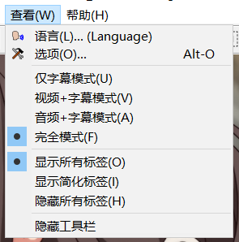
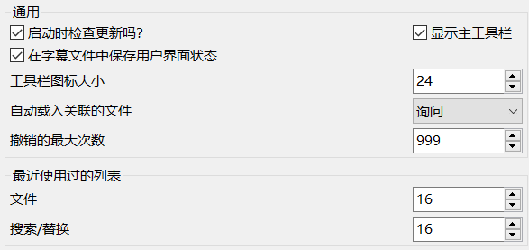
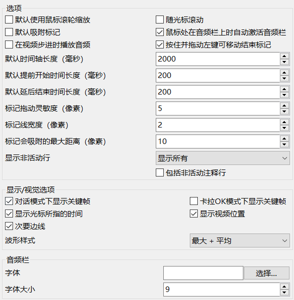
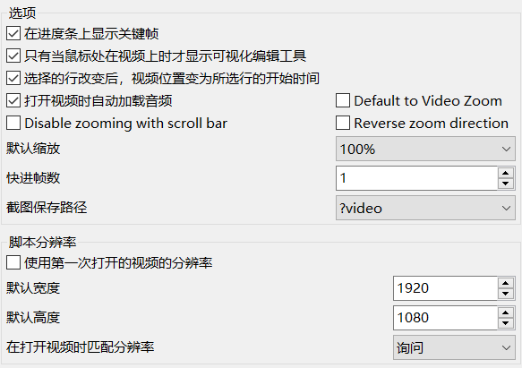
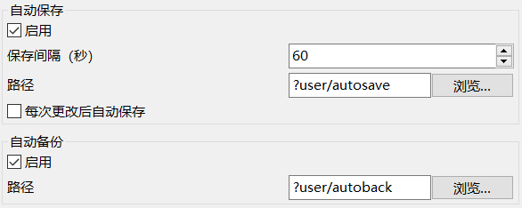
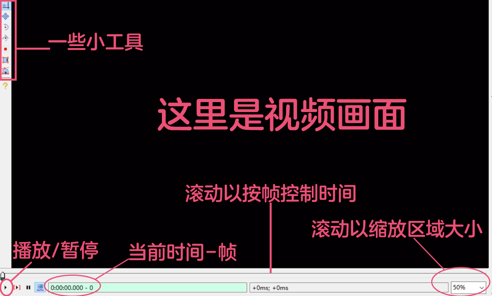
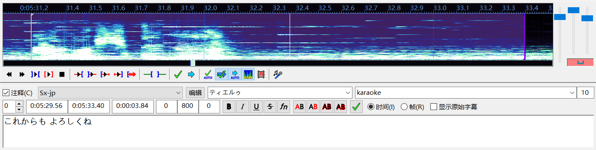
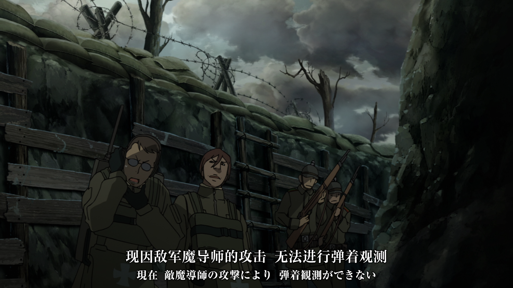
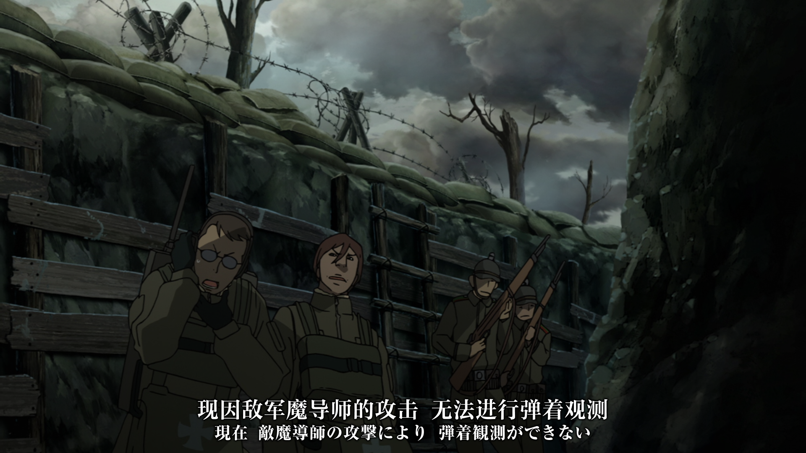
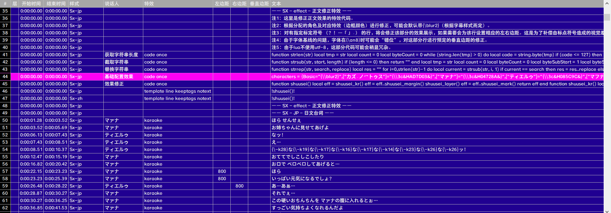

本篇为引导文，主要提供一些关于字幕的基础认识。  
本系列文章所限定的「日本动画」只是一个代表性称呼，所有流程都是为该目标设计，部分或全部不适用于其它载体（如国创动画、直播切片）。  
请不要误以为有政治观点，本系列文章只是教程/科普类文章，请给予包容。

## 系列说明

关于本系列文章的一些注意事项：
1. 并不只有核心的「字幕制作」，本系列文章会默认您想要成立字幕组，按成熟的流程进行字幕制作、视频压制、做种发布；
2. 如无特殊说明，本系列文章所指的「字幕组」均为制作日本动画字幕的民间字幕组。

一些基础的建议和事项：
1. **本系列文章有相当的难度**；
2. 一般而言并不需要通晓所有流程，加之部分流程非常复杂，请酌情参考；
3. 编写系列文章的我们，極彩花夢，制作过较多种类作品的翻译。在系列文章中会对动画字幕较其它载体翻译的区别作相当一部分说明；
4. 某些环节需要您拥有相关的基础知识，例如翻译需要日语知识、特效或脚本需要对应的编程语言知识。

一个关于名词称呼的说明：  
最基础的，系列标题「日本动画字幕制作」中的「动画」为什么不称呼为「番剧」，请不要在乎这种地方；  
对于部分情况下的英语词汇，为了避免混淆会直接使用英语；  
对于另一类情况可能会使用译名，如使用 AI 进行 transcribe 会称「转录」。  
总之不要太计较使用的什么词。

### 字幕格式

本系列文章的字幕对象均为 ASS 格式字幕。  
这也是几乎所有日本动画字幕组的选择。

### 默认设备

本系列文章默认操作环境是Win10的PC。  
其它情况都请自行查阅相应环境下软件的使用。

### 实际应用

需要注意的是，本系列文章可能会有一些非常琐碎的细节。  
正如不需要通晓所有流程一样，单一流程下可能有非常多您可能不在意的东西，也不乏不能深入探究的部分。  
文章仅作抛砖引玉。

## Aegisub安装与配置

虽然有不少能够制作字幕的软件，但我们仅使用其中最适合动画字幕组使用的Aegisub。  
其能够高效编辑 ASS 字幕，是大多数动画字幕组的选择。

Aegisub 官方最新版本是 3.2.2 ——于2014年发布。  
官方版本有些太过时了，为了避免一些潜在的问题，我们推荐您使用其它优秀的 fork 。

2025年 Aegisub 官方版本恢复更新。
但是短期内我们仍然建议使用 fork 版本(官方版本问题仍然很多)。

官方版本  
release：https://github.com/Aegisub/Aegisub/releases  
64位：https://github.com/Aegisub/Aegisub/releases/download/v3.2.2/Aegisub-3.2.2-64.exe  
32位：https://github.com/Aegisub/Aegisub/releases/download/v3.2.2/Aegisub-3.2.2-32.exe

fork版本  
Aegisub有不少优秀的 fork 版本，这里推荐使用 arch1t3cht 制作的版本。  
release：https://github.com/arch1t3cht/Aegisub/releases

安装过程  
打开安装程序后，除了选择存放文件夹外都可以直接下一步。  
存放文件夹则是看个人偏好了。

## Aegisub配置

后续部分操作会根据这里的配置来，部分配置也非常重要。  
如果您不太熟悉配置内容，可以按下文推荐的来。

打开 Aegisub ，点击顶部菜单中的「查看」弹出次级菜单。  
将次级菜单的配置按图示配置。

> 完全模式。  
开启之后将会呈现字幕+视频+音频共三个区域。  
多数情况下不需要切换成其它模式。
>
> 显示所有标签。  
在预览每行字幕时会显示完整的内容，如 **{\blur2}極彩花夢** 会原封不动地展示。  
显示简化标签会将特效部分替换为特殊符号，此时会展示为 **☀極彩花夢** ，具体哪一个特殊符号由用户配置决定。  
隐藏所有标签则是直接不显示特效部分，此时会展示为 **極彩花夢** 。  
大多数情况下选择显示所有标签即可。

点击次级菜单中的「选项」呼出用户配置菜单，按下文配置。

### 通用

打开显示主工具栏；  
可以打开保存状态；  
工具栏图标大小酌情更改，如果您使用过官方版本再使用 fork ，大概率需要调高该值；  
撤销最大次数拉高，可以直接999。

### 通用 - 默认样式

如果您有配置样式库可以自行修改。  

### 音频

关闭鼠标滚轮缩放；  
关闭随光标滚动；  
关闭默认吸附标记；  
显示非活动行改为显示所有；  
**打开对话模式下显示关键帧**；  
**关闭卡拉OK模式下显示关键帧**；  
打开显示光标所指的时间；  
**打开显示视频位置**；  
其它选项可以酌情修改，例如字体和标记线宽度。

> 打开对话模式下显示关键帧。  
显示关键帧有助于设置字幕的开始/结束时间，这将在后文展开说明。
>
> 关闭卡拉OK模式下显示关键帧。  
会使用卡拉OK模式就说明要做的效果是比较复杂的，此时显示关键帧一般没有什么意义。

### 视频

快进帧数改为1；  
其它选项酌情修改。

### 界面

这部分基本都是个人偏好的配置了，酌情调整即可。  
字幕栏配置中可修改字体，可以使用自己喜欢的黑体字体。

### 备份

**开启自动保存**；  
**保存间隔设置为60**；  
**关闭每次更改后自动保存**；  
自动备份随意。

> 路径。  
默认完整路径为：C:\Users\用户名\AppData\Roaming\Aegisub\autosave
>
> 每次更改后自动保存。  
开启时自动保存功能基本作废，更改后保存会重置时间间隔，基本触发不了自动保存——所以一定要关掉。

### 自动化

基本用不到这里的设置。

### 高级

这里有一些实用的选项，但一般情况下用不到。用得到的情况下您应该也熟悉这些选项的意义。

## Aegisub工具栏介绍

顶部菜单除了「查看」以外还有不少功能，这里则是介绍每一个功能下的非基础选项（除开“新建字幕”这类一看就知道作用的选项）的使用。

### 文件

主要内容为配置、附件、字体收集器。  
调整配置可以修改字幕文件的一些数据，这些数据均在以文本文件打开字幕后的顶部，以\[Script Info\]开头；  
附件，请不要使用此选项；  
字体收集器，检查/打包字体的时候使用此操作非常便捷。

> 配置的补充说明。
>
> 分辨率。  
此处分辨率是指字幕脚本适应的分辨率，如对于1920\*1080，画布左上角坐标为(0,0)右下角坐标为(1920,1080)。  
且字幕的边框、阴影、绘图、坐标等像素数值，均受此大小影响。  
对于一个1080P的视频，字幕分辨率设为1920\*1080比起设为1280\*720，像素宽度为5的边框(\bord)会更细。  
不需要指定为视频的分辨率，指定为模板字幕通用的分辨率可以免去不同分辨率下的字幕样式调整。我们均指定为1920\*1080。
>
> 比例缩放边框和阴影。  
建议开启，在实际观看时如果有缩放窗口之类的操作，关闭该选项的情况下边框(\bord)为5则还是按5个像素显示，开启的情况下则等比缩放数值以适应显示效果。  
虽然效果有限但聊胜于无。
>
> YCbCr Matrix。  
色彩空间，一般保持 TV.709 即可。
>
> 换行方式。  
不应该存在需要自动换行的行，保持所有效果均在预计之中。  
理由将在后文详细论述。

> 附加字体、图片。  
此处的附件功能，只是用于在传输字幕文件进行多人合作时“便于”统一字体或者放图片预览效果——并不能使字体、图片作用于字幕。  
非常鸡肋的功能，并且有潜在的提取错误，请不要使用。

> 字体收集器。  
可以用于检查字体是否出错，也可用于收集、打包字体。  
但实际检查出错存在特殊情况，比如某字体没有粗体，但实际可能因种种原因会有明显的“粗体”效果。关于此点会在后文论述。  
另，在 Windows 高版本下使用此功能不会检查用户安装的字体，而是只会检查 C:\windows\fonts ，也就是安装字体时需要为所有用户安装。

### 编辑

撤销重做：请用快捷键 Ctrl + Z / Ctrl + Y ；  
剪切复制粘贴、选择性粘贴：可以选中目标行后右键使用此功能；  
查找、替换：算是这一栏中比较方便的两个功能。

> 选择性粘贴。  
在复制部分行A后，选中另一部分行B呼出选择性粘贴，会用所有A行的部分值覆盖所有B行的对应值。  
比如为日文台词配置了说话人栏，将所有日文复制，选中所有中文行呼出选择性粘贴，将说话人粘贴，中文行会配置为对应的说话人。  
非常便捷的功能。
>
> 替换的正则表达式。  
这里并不是要完整介绍正则表达式，只是对不熟悉的人给一个较为有用的参考。  
如果要为选中的若干行添加{\blur2}效果，开启正则表达式选框，搜索^，替换为{\\blur2}，\\中第一个\是转义用。  
正则表达式是非常复杂的，但会用在替换的情况下并不多，使用较多的是自动化部分。

### 字幕

这一栏重要的就是样式管理器。  
但这里暂不讨论样式配置。

### 计时

平移时间：使用方式较为简单，使用场景主要是 OP / ED 的时轴调整；  
时间后续处理器：如果时轴是按台词出现即开始、完毕即结束，使用这个工具能够快速调整时轴。

> 平移时间。  
在调整 OP / ED 时有一个技巧，在第一次为歌曲打轴时使用一个专门的行来对准 OP / ED 的某一个固定出现的关键帧，此后对齐时轴可以直接根据该关键帧的时间快速而准确地调整。  
但，并不是所有动画的 OP / ED 都会非常准时，有一些动画的歌曲与画面就是容易差个几帧。
>
> 时间后续处理器。  
这里没有详细介绍这个工具的最主要原因——我们并不允许使用此功能。  
我们要求每一行字幕都人为决定延后以达成更好的效果。关于此点会在后文论述。  
有一些字幕组会使用此功能，但不同组的选择不同。  
部分组会提前开始并延后结束，部分组只延后结束。  
**相邻字幕行连续**与**对齐关键帧**是比较复杂的，会在后文论述。  
如果您要使用此功能，根据您自己的感觉不断调整达到期望的效果即可。

### 视频

有时候制作字幕特效想要看显示效果，可以直接在此选择使用空白视频，非常方便。  
时间码文件则是记录关键帧的，一般不太会用到。

### 音频

改为显示频谱。

### 自动化

后续制作特效会经常用到。

## Aegisub区域介绍

### 视频区域

如果配置中的快进帧数修改为了1，在进度条上滚动一次只会前进/后退一帧，在校验关键帧、查看效果时都非常方便；  
右键视频区域可以呼出额外的菜单。

> 小工具区域。
>
> 默认显示坐标，字幕配置分辨率为1920\*1080时，横向坐标最高为1920，纵向坐标最高为1080。  
左上角为(0,0)，右下角为(1920,1080)——但实际设定坐标时可以为负数或是大于此范围的值。  
如需根据数据推算确定屏幕外的字进入屏幕时的前后坐标，也就是\move的两组坐标参数，可能会用到范围外的取值。
>
> 拖放字幕，图省事可以用用。  
对于\pos的情况下是较为方便的，而对于\move的情况还是手动输入吧。
>
> 旋转缩放，不熟悉特效代码时可以用用。  
熟悉之后打代码方便也更准确。
>
> 裁剪，根据视频中的简单范围画区域。  
比如要\clip的时候可以用用，但复制所需帧到 ASSDraw 中进行绘图可以更准确。

### 音频区域

音频区域是主要操作区域。  
在主菜单的音频中开启**显示频谱**，可以得到比波形更清晰易辨的音频图像。

将鼠标悬停在音频区域可以看到指针处的时间（如果设置中如此配置），单击左键设置选中行的开始时间，单击右键设置选中行的结束时间。  
鼠标滑轮滚动以操作音频位置（如果设置中如此配置），也可以拖动音频下的小滚动条来调整。  
白线为视频当前所在时间，紫线为关键帧（均为默认颜色）。

### 音频图像部分

显示为频谱时可以较为直观地“看到”声音，可以看到部分台词的开始、结束。  
在熟悉频谱之后打轴效率、准确率会提高不少。

### 缩放条

从左到右依次为水平缩放、垂直缩放、音量条。  
水平缩放保持在3/4以上，垂直缩放保持拉满。  
如果您使用官方 Aegisub ，请不要将音量调提高到50%以上。

> 水平缩放与垂直缩放。  
水平缩放越高，打轴时的开始、结束时间越能够打准。3/4算是一个比较均衡的选择，而如果是打歌词K轴这样需要极高准确度的情况，基本需要将水平缩放拉满。  
垂直缩放越高，一些细小的声音越能够看出来。基本保持拉满即可。

### 小工具区域

要么用不到要么有快捷键，其中比较特殊的是最后一个切换卡拉OK模式，会在打歌词K轴时用到。  
在输入当前行的内容时按 Tab 可以切换到音频，按下空格键就可播放当前行，按下 Q / W / E / D 分别播放当前行 之前的500ms / 之后的500ms / 前500ms的部分 / 后500ms的部分 （均为默认按键）。

### 注释

打上勾后该行变为「注释行」，不会显示在屏幕上。
1. 可以单纯用于输入一些不用于给观众观看的内容，比如对某行的修改记录；
2. 在使用自动化时可能需要注释行，如规定一个 code 行以声明函数就需要将该行注释。

### 样式

在已配置的样式中选择该行的样式。点击右边的编辑按钮可以修改该样式，也可以把呼出的样式面板当做字体查看器、取色器。  
样式配置会在后文论述。

### 说话人

不会直接影响显示。
1. 可以用于记录一些东西，比如打轴时记录一下这一行对齐了关键帧、那一行需要给一个渐隐的效果；
2. 可以用于记录说话人，但配置之后并不会直接影响显示，一般不会单纯为了记录说话人而配置该项。真正有效的用途是给特效代码区别不同的行。

> 指定特效。  
用说话人指定特效是一个常见的操作，如为歌词行指定说话人为 OP ，可以在 code 行中选取这部分行供 template 行生成指定的歌词特效。  
因在应用卡拉OK模板之后，指定行的特效会设置为 karaoke ，所以不能通过特效来区别不同行。  
说话人和层级是两个比较有效的区别方式。

### 特效

有一些预置的特效：  
1. **banner;<speed>;<direction>;<duration>**，一些非常久以前的字幕，字幕组可能用这个效果来署名，<speed>指定速度，越高越慢，<direction>默认为0指定方向，为0时从右至左为1时从左至右，<duration>指定透明度渐变的时间。如：banner;5;0;200；  
2. **scroll up;<y0>;<y1>;<speed>**，<y0>指定起始坐标，<y1>指定结束坐标，<speed>指定速度，越高越慢。如：scroll up;1080;0;5；  
3. **scroll down;<y0>;<y1>;<speed>**，同上，方向相反。  
但请不要再使用这些预置特效！这些效果也都可以使用特效标签高效地实现。  
特效栏真正主要为：  
1. **code <修饰词>**，声明该行为 code 行，主要写入各种函数、赋值诸多变量；  
2. **template <修饰词>**，声明该行为 template 行，可生成特效行；  
3. **karaoke**，标记该行应用了卡拉OK模板，在后续应用模板时即便该行已注释也会应用效果；  
4. **fx**，标记该行为特效行，在之后应用卡拉OK模板时会删除该行。  
具体如何编写特效会在后文详细论述。

### 最长行的字符数

这不是一项配置值，只是显示值。  
用不到也尽量不要用。

### 层次编号

默认为0。更高层次的字幕会显示在低层次字幕之上，在制作特效时可能为了达成某个特定的效果需要设置层级关系。  
另一主要用途是双语字幕：  
在不使用\pos或\move规定准确坐标时，对层级同为0的一行日文字幕和一行中文字幕，即便将将两行字幕对应样式的垂直边距都设为同一个值，显示时也可能有较高的间隔。

原因有二，一来不指定具体坐标时同一层级的字幕会尽量不遮挡，图示为一句日文在前一句中文在后，中文为了避免遮挡会将底线靠在日文的顶边；二来该日文字体的基线较高，导致顶边较高，即便靠在一起也还是有明显间隔。  
将其中一行设置为更高的层级，如将中文的层级设置为1，并且在字幕文件头部的 **\[Script Info\]** 中添加 **ScriptType: v4.00+** ，可以不受限制地配置间隔。

### 开始时间

如果需要按帧调整，使用 Ctrl + 1 跳到选中行的开始时间。

### 结束时间

如果需要按帧调整，使用 Ctrl + 2 跳到选中行的结束时间。  
另外，在打轴时如果使用 Shift + 鼠标右键 紧贴关键帧了，按 Ctrl + 2 跳到结束时间，在视频进度条上前后滚动可以确认该关键帧是否真的是转场。

### 持续时间

会专门使用其来调整的情况主要是，调整屏幕字的结束时间。  
将计时改为按帧计时，输入一般屏幕字可能持续的帧数来快速调整。

### 左边距 / 右边距 / 垂直边距

快捷调整字幕位置。并不是指定精确坐标，所以会有不遮挡之类的限制。  
使用场景参考：

设置左边距或右边距以避免字幕遮挡角色或者其它内容；

多个角色台词重叠时可以为每个角色设置字幕，或者单个角色出现在屏幕一边时可以将字幕移动至相应区域。

### 特效添加

全部都可以通过手写代码实现，方便也方便不了多少。

### 计时

计时可以按时间和帧。  
按时间，时间相对而言直观得多，在一般编辑字幕时更为高效；  
按帧，一般在调整屏幕字或者特效时可能用到，此时按帧会比按时间准确。

> 按帧的准确。  
视频最终是一帧一帧显示的，帧对应时间，但时间不一定对应帧。  
如同样紧贴关键帧，按帧调整后的精确结束时间为0:05:33.40，而按时间调整则可能得出0:05:33.41，这些误差在某些情况下会放大，使原本应该结束的字幕多显示了一帧。

### 显示原始字幕

不常用。

### 字幕编辑框

编辑字幕。按住 Ctrl 后滑动鼠标滚轮可以进行缩放，右键可以呼出背景菜单。背景菜单不常用。

## 字幕区域

右键顶部呼出菜单，可以将「每秒字符数」关掉。  
相信您显示的效果与上图有不少出入，这些可以在配置中修改，上图只是笔者偏好的风格。

## 结语

作为系列初篇，本文共修改了30余次。

虽然初篇已有7000余字，但这些内容远远不够字幕制作入门。  
原想在开篇着重说明字幕制作的难度，以避免涉足不深的读者浪费时间。  
但相全文到这里已经足够说明字幕制作的复杂程度，也不需过多强调、劝退了。  
而后续文章只会比本篇更复杂。

本篇虽只是初识了一下工具，但相信无论您是否制作过字幕，都能够从本篇的一些细节发现一些新东西。  
那么，我们的征途已然翻过序章，前方又会是怎样一副光景呢。
