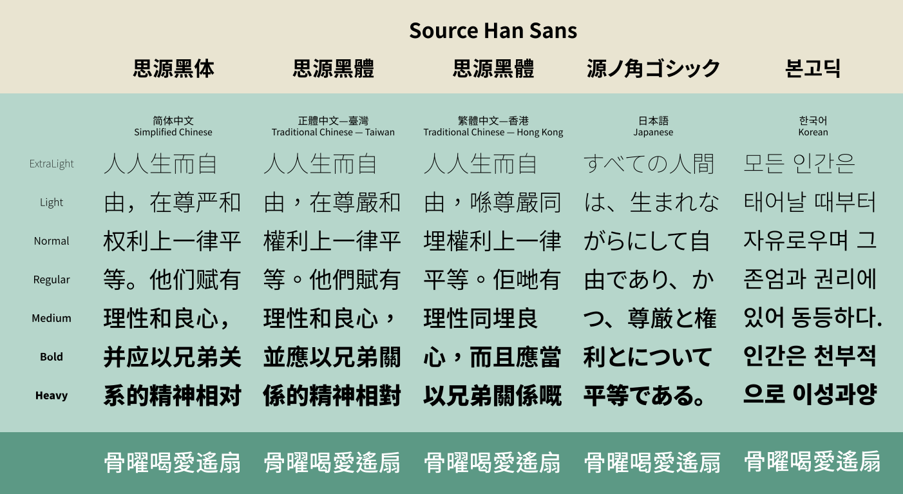
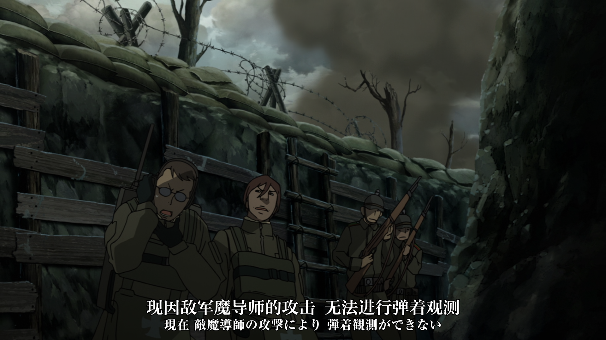
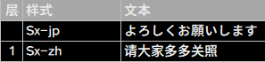
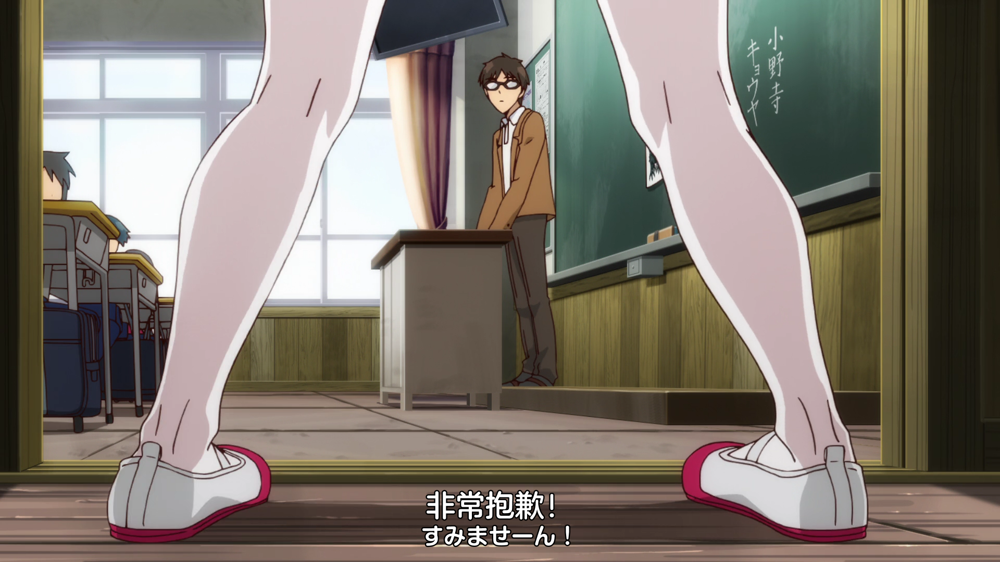
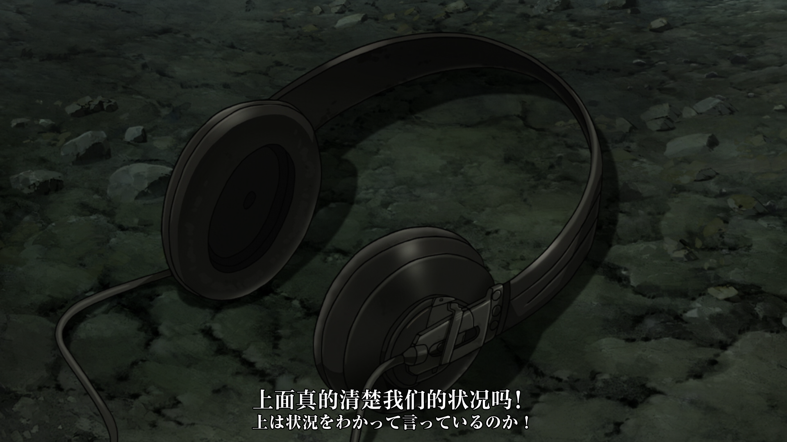
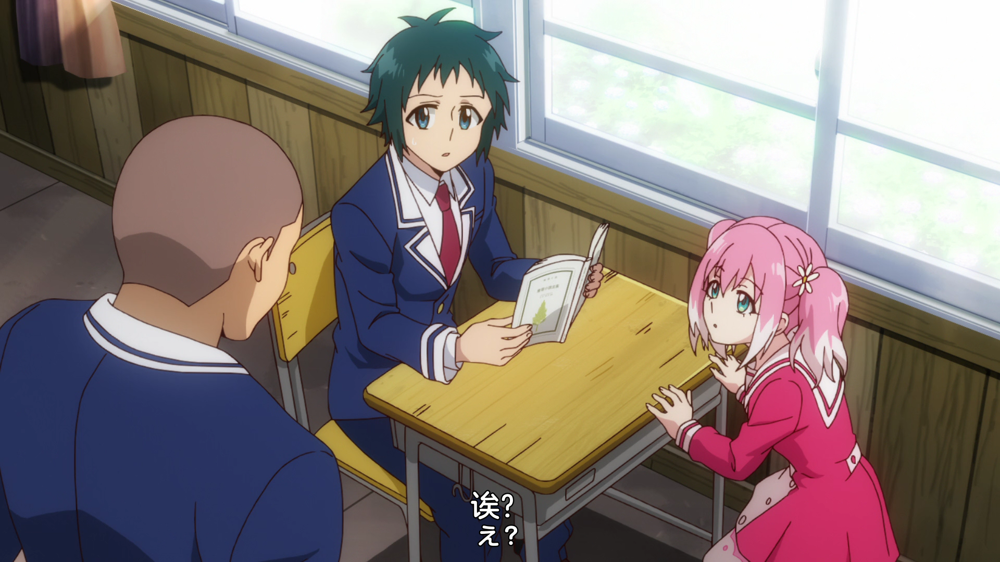
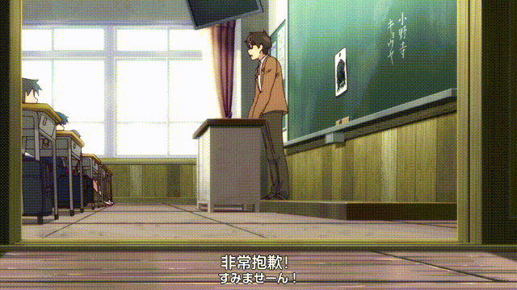

本篇为篇外，介绍我们对正文字幕的优化。  
之所以将本篇独立出来，一来是这部分内容比较冗杂，从样式配置到自动化都有涉及。  
二来是自动化部分只是我们构思出的一个非常特立独行的方案，仅供参考。

本篇主要介绍双语字幕的优化，对于制作仅中文字幕请酌情参考。  
 **本篇中的代码部分或有误** ！如果需要参考我们最新使用的效果代码，可以在我们最新发布的作品中寻找。

# 样式配置

这是非常简单的一句正文台词，直觉而言看不出什么复杂要素。  
但假如是从下面这张图开始：

可以先自己思考一下构成正文字幕所需的要素。  
中文字体、日文字体？  
中文字体大小、日文字体大小？  
对齐自然主要是 **\an2** 但要确定基础坐标还需要垂直间距。  
确定间距时是否又该考虑到中日文显示上的间距？  
对于 **\an8** 的情况又该如何处理？  
回到字体上，边框和阴影该如何取，边框颜色和阴影颜色又该如何取？  
是否有必要更改字体缩放、字体间距？  
或者，更应该一开始确定要适应什么分辨率、什么大小的设备？

## 设备
这里只是稍微提一下，在设计字幕样式时一定要考虑一下主要要适应的设备。  
双语字幕本身显示上字会比较多，所占区域也会较大，在不同大小的设备上可能会有非常不一样的效果。

针对个人电脑，载入字幕后全屏视频就能直观看到效果。  
尽管显示屏上可能差距较大，但不太能考虑所有情况。  
必须强调的一点是，一定要全屏看具体效果，在 Aegisub 中查看只占屏幕部分区域的预览会有一些偏差。

针对移动设备，或者说是最需要考虑的手机，会与大屏设备有较大的感官差距。  
可能在电脑上显示效果非常不错的双语字幕在手机上看着字偏小了，或者太紧密了，需要另外微调一下配置。

至于如何权衡，就我们而言是完全抛弃对手机显示的考量，只针对一般电脑显示屏进行设计。

## 动画风格
这里首先需要明确，能适合当下大多数动画的正文字幕字体，基本上就是： **黑体** 、 **圆体** 、 **宋体** 、楷体。  
其中，圆体本应归属于黑体，但它的显示效果非常非常特别，与黑体出入很大。  
楷体基本不适合双语字幕，这里不做讨论。

根据动画风格一定程度就能确定更适合的字体。  
但其实这一步可能比较多余，因为双语字幕本身独特的要求，效果稳定的选择并不多。

### 黑体
黑体基本是双语字幕的一个大通解，可能有其它字体效果更好，但黑体的效果一定不会多差。  
黑体的可读性非常高，没有那么独特的“风格”让它也比较百搭，并且相关字体非常非常多不愁用。  
大多数双语字幕组都会使用黑体，但非常离谱的是我们至今没有用过也没有配置过，所以这里并给不了参考图。

### 圆体
圆体比较适合日常或者画风可爱的动画，另一方面适合的里番非常多（所以我们一开始是从圆体的样式配置着手的）。  
根据圆角的程度会有一些区别，但我们这里介绍及我们使用的都是比较特别的一种情况，圆角程度非常高：

目视看上去非常圆润，与可爱的画面相得益彰。  
圆体的可读性较黑体偏低，但作为难得的一个黑体以外的选项，显示效果足够特别也存在不少适合的动画。

### 宋体
宋体明显适应的就是日常类的反面，或者说不适合用圆体的那部分（的部分）。  
根据衬线高低、笔画粗细也会有非常不同的表现。  
宋体的可读性稍低，对动画风格比较挑剔，本身效果配置上也会比较挑剔。

显示效果非常优异，但与优秀的效果相对的是，适合宋体的动画并不多，像图例这样非常适合宋体的则少之又少。

## 字体
这里只介绍两个非常特殊的字体，思源黑体、思源宋体。

尽管有一些小问题但瑕不掩瑜，思源黑体和思源宋体算得上是黑体和宋体分别的一个代表字体。  
思源的字符集非常大，不用考虑正文出现一些生僻字就出错的情况；  
思源的字重多，可以根据需要选择适合的字重（由于光度补偿，其中 Normal 适合黑字白底而 Regular 适合白字黑底）；  
思源有针对简繁的字体，对于字幕的简繁两个版本能更好地适应提供更好的效果；  
思源本身好看。  
具体到判断要不要使用哪一个字体，基本就是从这几个方面。  
另外， **GBK** 字符集就包括了大部分简繁常用字，如果一个字体标有（实际是满足）GBK字符集可以视情况优先考虑（部分GBK字体其实字符集并不大可能会出问题，而部分不标注GBK的字体可能字符集反而更大，均需要根据实际情况分析）。  
部分粗体字体不能直接在 Aegisub 中选择，需要用常规字体后勾选粗体或使用 **\b1** 才能使用。

搜集字体的话，中文字体可以使用国内的若干字库的字体，日文字体可以谷歌去搜，另外 Github 也有一些开源字体。  
因为本系列所讨论的均是非盈利性质的字幕制作，可使用字体会多非常多。

挑选字体上，请务必注意要挑选的是 **可读性高** 、 **形体规整** 的 **正文字体** ，并且中日文字体风格必须 **特别相近** 。  
举例而言，并不是越“好看”的字体就越适合正文字幕：

图例用到的两个字体都是非常有特色的、非常好看的字体。  
尽管从图示而言似乎有一些与画面接洽，但实际非常不适合正文字幕，在文字较多的时候可读性非常差并且反而会违和。  
另外，其实图例的两个字体风格有一定的差距，真正选用时一定要注意中日文字体风格要足够接近。

图例用到的是前文的示例字体，但日文字体选择了更轻一点的字重。  
大多数双语字幕组还是会将中日文字体大小调整得差距较大，降低日文行的存在感，也是因此会选用较低的字重来降低违和度。  
但无论如何一定要留意中日文字体的笔画粗细目视差距大不大，差距过大效果就会如图例那样非常差。  
因此，字重更多的字体更能得到满意的效果。

## 字体大小与垂直间距
从下到上，我们需要考虑的依次是：日文与底边距离、日文字体大小、中文与日文间距、中文字体大小。  
并且明确一点，此处提及的字体大小均是目视大小，不是设置中的 fontsize 。

### 日文与底边距离
这一项更多的是看偏好了，有些组会让底边距离非常低（0-10像素），有些组则会提高底边距离（10-20像素）。  
总体而言更高的底边距离需要更加控制字体大小，而底边距离本身的意义非常微妙，主要影响的是日文行的可读性。

### 日文字体大小
这一项则是一种决策性配置，决定了字幕的“双语程度”重不重。  
日文字体更小，那字幕仍是以中文字幕为主，表现得更多的仍是中文字幕风格。  
日文字体大小如果接近于中文字体大小的七八成，那字幕会有明显的双语风格，并且处理上也更需要双语字幕的处理。  
如何选择主要是字幕组性质上的决策，如果字幕组是以双语字幕为主的，需要强调双语字幕的学习交流用途，则后者是更优的选择。  
而本文主要介绍的就是后者这种更复杂的情况。

### 中文与日文间距
一般而言中日文间距在 2-8 个像素，具体如何分配主要是看前面两个选择。  
底边距离更低，那中日文间距的活动性更高，但注意中日文间距不要高过底边距离，不然高度分配会比较违和。  
日文字体大小也是同理，但本身需求上更大的日文字体大小就是更重的双语程度，此时中日文间距需要更低。  
这里有一个很违和的需求，就是日文字体大小大了，两行字幕都非常显眼却还反而降低间距让可读性降低。这种说法不无道理，但这种情况下也需要考虑双语字幕本身可读性就没那么高，提高间距超出双语字幕的需求了，并且提高间距会让字幕整体的高度变高，字幕整体所占区域增大降低观赏性。

### 中文字体大小
类似于日文字体大小，如果重双语就需要中文字体大小更小一些。  
但毕竟双语字幕还是以中文行为主的，中文字体大小还是足够大让中文显示占主体。

## 边框阴影及颜色
双语字幕的可读性虽然不需要特别高，但一定不能低。由此默认的 **\1c** 只能是 **纯白** 。  
而另外还必须需要考虑边框和阴影。

图例为 **无边框无阴影** ，单色字幕始终会在某个场景下显示效果特别糟糕。

图例为 **无边框有阴影** ，可读性高了一点但仍然非常低。  
这样的表现真的非常糟糕，请务必不要只使用阴影来提高可读性。

图例为 **无阴影有边框** ，也就是一开始展示的情况，可读性非常高。  
这是我们的默认样式配置，但其实这样的表现并不够好，因为边框取值低了（低于3），一般需要至少3才能有较好的效果。  
而我们之所以如此配置是因为我们采用了边框阴影之外的另一项提高可读性的选项，高斯模糊。

图例为 **有边框有阴影** ，可读性是最高的，但此时需要考虑到字幕的 **违和度** 。  
正文字幕的 **可读性并不是越高越好** 的，总需要有一个度，否则字幕会有独立于画面之外甚至影响画面的表现。  
但其实有边框有阴影的效果也有自己的特点，可以利用这一点在适合的动画里均衡边框和阴影的效果制造更好的表现。

而边框/阴影的颜色则是一项非常非常影响效果的配置。  
边框本身是要用来提高可读性的，而 **\1c** 为白色这样的亮色， **\3c** 就需要 **偏深的颜色** 提供对比度， **\3c** 本身也可以用来提供观赏性。  
但是，我们至今也收到过由于边框颜色影响字幕阅读体验的反馈，边框颜色是一项部分人可能喜欢也会有部分人可能讨厌的取舍配置。

图例仅供参考，颜色和边框大小效果并不是那么好，但仍可以发现一些问题。  
尽管目视看上去边框颜色不深，但其实是偏深的 \#BD0340 ，由于白色占主体而边框值不会太高， **\3c** 一般需要比想选取的颜色 **更深一些** 来提供更好的目视效果。  
可选的颜色中， **黑色** 自然是最通用的，其次是 **深红** 、 **深蓝** 、 **紫色** 、 **棕色** 等，而绿色、黄色等亮色调则是非常非常不适合。  
此外，边框颜色也可用于区别角色，为不同的角色设置不同的 **\3c** 来提高字幕观赏性（我们也有收到由边框颜色不断变换而影响字幕阅读体验的反馈）。

 **高斯模糊** ，也就是 **\blur** ，不可在样式配置中设置但可另外添加在字幕内容中。  
这也是一项取舍性选择，部分人喜欢部分人不喜欢——但，高斯模糊本身这样一个独特的选择仍然非常有价值。

图例为非常常用的一个选择，3边框。

图例为低一点的边框值加上 **\blur2** 。  
这个效果是我们所有样式所采用的标准效果，整体会更加柔和并且可读性非常高。  
这里额外提供一下快捷使用的一个方式：

当然，后文会使用更快速（更复杂）的方式实现。

## 缩放与间距
 **绝大多数情况下并不需要对缩放与间距额外进行调整** ，因为字体在设计时就会考虑到这些效果，字体设计师也会为了字体应用场景（如屏显）进行诸多改进。  
但部分字体是为了长篇文本设计或者另外一些不那么适合单行字幕的场景，此时显示效果可能会有一点差或者奇怪。

图例的中文行就非常明显，目视上非常“扁”，需要额外进行一些调整。

将水平缩放改为95间距改为2的效果，可以看到明显好了很多。

## 额外补充
途中跳过了一个问题，字幕层级。  
如果您在配置时中文字幕怎么降低边距都会在日文的上方不少，是因为没有额外设置字幕层级（开始时间左边）。

另外，需要在字幕文件头部的 **\[Script Info\]** 中写入 **ScriptType: v4.00+** 才有层级效果。

可能额外需要考虑的是顶部字幕，就是在各种情况下需要将正文移动至顶部显示的情况。  
这时候单单使用 **\an8** 基本不可能满足需求，中日文行的顶边距离一般都会更高，并且部分字幕组想让顶部字幕显示得更小一点。  
此时大多数字幕组的解决方式都是额外设置一个样式来实现相应效果。

其实到这里基本的需求就已经结束了。  
后文内容极为复杂，如果您不是有非常极端的需求、想要实现更好的效果的话，后续内容参考意义并不大了。

# 天平两端的失败模拟

对于图例，可以明显发现字幕并不是那么居中，违和感非常明显。  
那么问题来了，是中文行设置了过高的左边距吗？还是日文行呢？

类似的问题，是哪一行字幕出了问题呢？

不对称并且，中文字体的问号是否显得太奇怪了？

实际以上图例的中日文字幕行左右边距都是0，且均是绝对居中。  
而问题均出在了标点符号。

调整了一下中日文行间距方便对比， **两行字幕都十分规整地排列在中央** ，而 **标点符号** 有明显的区别。  
这来源于书写上的不同，中文的标点 **偏左** 而日文的 **居中** ，这导致最终呈现的效果也有非常大的差别。  
并且仔细观察能发现，两个字体的标点符号风格略有不同，这种不同因字体而异，有时候会非常影响观感（如上方第三张图例）。

解决这种情况的最有效的一种方法—— **不使用标点符号** 。  
这个方法不像个方法，但它确实是绝大多数字幕组的处理方式了。  
也有部分字幕组会使用标点相近的字体，或者使用标点但避免在字数少的行使用。  
我们曾经尝试过的处理是，为中文行人为添加一定的左边距来弥补视觉上的违和。

彩蛋

# 破坏砝码的曲线重塑
如何处理句尾标点的违和感，以及如何处理字体本身标点的违和感。  
这两个问题算是从做双语字幕开始就一直伴随着我们。  
我们当然构思过许多的解决办法，而本文只是将我们最终得出的一个方案提出来，略去我们寻找方案的过程。

既然是句尾标点本身所占的空间很奇怪，我们不如把句尾标点独立出去。  
除了句尾标点以外的字居中，标点跟随在这个居中结果的后面。  
要实现这样的效果，可以通过左边距实现：

计算出两个字体分别的符号宽度，再将两行左边距设置成对应的符号宽度。  
这样的效果就已经好多了，可仍然能注意到两个感叹号与前一个字的距离差距很大，因为中日文符号对齐方式上的不同。  
再如上文所展示的：

或许在处理边距之前需要考虑一下符号本身如何处理。

能够想到的思路：  
1. 将违和符号替换成其它字体的对应符号，缺点就是会徒增一个不怎么用的字体；  
2. 将违和符号替换成其它字体对应符号的绘图，缺点就是绘图一般非常非常复杂，假设一个问号就要多占200k，字幕文件可能从单纯的100k增加到10M；  
3. 将违和符号替换成特殊处理的形式，比如替换成 **{\fscx110}？{\fscx}** 来增加符号宽度，但这种方式有一点治标不治本，字体本身符号的风格并不能改变多少；  
4. 将中文/日文违和符号替换成日文/中文对应符号。

我们差不多就是按顺序尝试过这几个思路，前两个方案的思路在实现上非常简单，但缺点实在太严重缺乏可行性。  
然后我们按方案4制作了很久时间的字幕，现在则是融合方案4和方案3再进行诸多额外的调整。

## 明确符号
在真正实现效果之前需要明确一点，字幕中要用到哪些符号？  
当然这一点是出于字幕组要求的角度，例如按我们要求字幕中只允许出现 **？！…「 」・** 共7个符号（其中有一个半角空格）。  
其中的 **？** 和 **！** ，我们要求统一使用全角符号（并且？！…均不能重复或连用，也因此不讨论符号连用的情况），因为中文日文标准使用均是全角符号。  
 **…** 则是正常省略号，不是三个小数点。  
使用直角引号 **「」** 的主要原因是，其非常适合中文日文这样方正规整的字体。双引号“”在字幕中会非常丑，西文引号"和'则不是中文日文会使用的符号，双层直角引号『』则过于显眼突出。另外直角引号本身不是日本传进中国而是中国传进日本，不应该考虑部分奇怪的声音，其可以正常使用。  
半角空格 ，一般而言应该在日文中使用全角空格 **　** ，但为了方便控制效果我们统一使用的半角空格。  
 **・** ，多是在人名中出现，算是一个出现频率很少但无法避免的符号。  
此外，我们不使用～或者\~，亦不使用破折号—。

对上述符号可能需要的处理。  
 **？** ：由于出现频率十分高需要特别控制显示效果，出现在句中或句尾，另外可能需要 **处理对齐问题** 。  
 **！** ：同问号。  
 **…** ：由于出现频率十分高需要特别控制显示效果，可能出现在任何位置（包括句首），没有对齐问题但需要额外注意一个细节——中日文字体的省略号的 **点的大小** ，可能不一样。  
 **「」** ：可能出现在任何位置（包括句首），这个符号特别就特别在，它位于句首句尾时不能直接将右左边距设置成符号宽度，一般可能将边距设置成符号宽度一半左右效果比较好（也就是不能当标点符号看待而该当文字一部分看待，但其本身两端有太大的空白，需要将这部分空白消除掉）。  
 ** ** ：只出现在句中，由于出现频率十分高需要特别控制显示 **宽度** 。  
 **・** ：只出现在句中，只需要额外控制显示的 **点的大小** 即可。

## 自动化处理
由于可能需要修正到内容，template自然是使用notext的，而既然是“修正”正文的效果，姑且使用shuusei作函数名吧。  
在开头写下：  
Comment: 0,0:00:00.00,0:00:00.00,Sx-jp,,0,0,0,template line notext,!shuusei()!  
Comment: 0,0:00:00.00,0:00:00.00,Sx-zh,,0,0,0,template line notext,!shuusei()!  
然后总结上文必要的修正，需要将目标行的部分内容替换也就是对 **orgline.text** 作处理，需要为句首或句尾有特定符号的行修改左右间距。  
我们让shuusei函数为：

<pre>
function shuusei()
    local res = shuusei_content()
    shuusei_layer()
    shuusei_margin()
    return res
end
</pre>

这里我们命名三个函数， **shuusei_content** 用来修正文本内容， **shuusei_margin** 用来修正间距，而 **shuusei_layer** 则是用来重新设置中文行的层级为1。

我们为了一劳永逸并且使用便捷，将会用到的两套样式都用一套函数解决，这样需要为两套样式的字体分别设置一些参数。  
所以额外命名一个变量，在其中填入可能的数值。

<pre>
local shuusei_pandora = {
    ["A-OTF Shin Maru Go Pr6N DB"] = { --[[日文字体名称]]
        ["contentrep"] = { --[[文本内容替换表]]
            ["？"] = "？",
            ["！"] = "！",
            ["…"] = "…",
            ["「"] = "「",
            [" "] = "{\\fscx160} {\\fscx}", --[[因为半角空格宽度很低，稍微提高一下宽度，因为样式默认横向缩放不一定是100所以直接使用 \fscx 来重置]]
            ["」"] = "」",
            ["・"] = "・",
        },
        ["relocate"] = {
        },
    },
    ["方正兰亭圆_GBK_中"] = { --[[中文字体名称]]
        ["contentrep"] = { --[[文本内容替换表]]
            ["？"] = "{\\alpha&HFF&}？{\\alpha}", --[[将问号隐藏，通过额外生成行来重新添加回去]]
            ["！"] = "{\\fscx50} {\\fscx110}!{\\fscx150} {\\fscx0}!{\\fscx}", --[[将全角感叹号改为半角，因为该字体的感叹号全角半角形态相同并且半角的宽度更低，在感叹号前加上缩短宽度的空格来让中日文的叹号与前方字符的距离相近不违和，之后再添加一个宽空格来填充总体宽度，而由于空格在句末时不会显示所以加上一个 \fscx0 的半角叹号让其占位]]
            ["…"] = "{\\fnA-OTF Shin Maru Go Pr6N DB}…{\\fn}", --[[因为中日文字体的省略号的点的大小有差距，通过统一省略号的字体来修正，另外，之所以修改中文而不修改日文是因为我们会自动化生成日语字幕，日文需要保持不引用中文字体]]
            ["「"] = "「",
            [" "] = "{\\fscx120} {\\fscx}", --[[同前，稍微提高一点空格宽度]]
            ["」"] = "」",
            ["・"] = "{\\fnA-OTF Shin Maru Go Pr6N DB}・{\\fn}", --[[类似省略号，统一点的大小]]
        },
        ["relocate"] = { --[[为部分符号需要额外生成行准备的参数表]]
            ["？"] = {
                ["content"] = "{\\an4\\fnA-OTF Shin Maru Go Pr6N DB\\fscx116\\fscy128\\pos(%s,%s)}？",
                ["Xoffset"] = -2,
                ["Yoffset"] = -2,
                ["Yoffset2"] = -2,
            },
        },
    },
}
</pre>

这里用到的参数是我们使用参数的一部分截取，基础参数均已注释说明。

另外，部分功能需要用到支持Unicode的re模块，在自定义各种功能的时候也可能需要别的模块（如unicode模块）。  
这些模块或者相关的功能可以另写一个code once行声明：

<pre>re = _G.require("re") aegisub = _G.aegisub</pre>

后文可能用到别的模块或者不能直接使用的表达，都可以在这样一个code once行中声明。

然后我们写一个简单的shuusei_content函数：

<pre>
function shuusei_content()
    local content = orgline.text
    for search, replace in pairs(shuusei_pandora[line.styleref.fontname]["contentrep"]) do
        content = strrep(content, search, replace)
    end
    return content
end
</pre>

其中使用 **orgline.text** 来获取原本行包括标签所有的内容，strrep是一个自定义的支持Unicode的字符串替换函数，可以使用 **re.sub** 实现。  
这里的函数没什么复杂的，更需要留意的是 **文本内容替换表** 。  
方案已经在前文说明过，实际应用需要多加实验让符号达到足够好的显示效果。

然后则是修改左右边距的 **shuusei_margin** 函数。  
此时需要考虑到，由于部分字符的替换，已经不能简单获取符号宽度设置边距了，需要额外计算替换造成的宽度偏差。  
这里将计算宽度偏差的函数命名为 **_calrepwidth** ，其主要是需要循环加算替换字符每一段的宽度。  
例如前文对感叹号的替换 **{\fscx50} {\fscx110}!{\fscx150} {\fscx0}!{\fscx}** ，总体宽度由一个\fscx50的半角空格、\fscx110的半角感叹号、\fscx150的半角空格、\fscx0的半角感叹号组成，需要计算每一段的宽度并相加。  
又例如对省略号的替换 **{\fnA-OTF Shin Maru Go Pr6N DB}…{\fn}** ，需要计算样式表中字体替换为另一个字体后的省略号宽度。  
而能够计算出单个符号宽度，再在外部套一个循环来遍历字符串中所有字符，这就是_calrepwidth大致需要的功能了。

<pre>
function _calrepwidth(str)
    local _repwidth = 0
    local _styleref = Yutils.table.copy(line.styleref, 1) --[[复制一份样式表]]
    for _search, _replace in pairs(shuusei_pandora[line.styleref.fontname]["contentrep"]) do
        if re.find(str, _search) ~= nil then
            local _fscx = line.styleref.scale_x --[[获取样式默认的横向缩放]]
            local _width = 0
            for _part in re.gsplit(_replace, "\\{", true) do --[[将替换内容以 { 分割，获取可能有的 \fscx 和 \fn 进行精确的宽度计算}]]
                match = re.match(_part, "\\\\fn(.+)\\}") --[[使用正则表达式获取 \fn 后的字体名称]]
                if match ~= nil then
                    _styleref.fontname = match[2]["str"] --[[如果获取到字体名称则将复制的表的字体改为对应字体]]
                end
                match = re.match(_part, "\\\\fscx(\\d*)") --[[使用正则表达式获取 \fscx 后的横向缩放值]]
                if match ~= nil then
                    _fscx = _G.tonumber(match[2]["str"]) ~= nil and _G.tonumber(match[2]["str"]) or
                        _fscx --[[变量 _fscx 是在循环外的值，因为在没有 \fscx 时横向缩放应该沿用之前字符或默认配置的横向缩放]]
                    if match[2]["str"] == "" then
                        _fscx = line.styleref.scale_x --[[对直接使用 \fscx 来重置横向缩放的情况进行判断，将 _fscx 修改为默认横向缩放]]
                    end
                end
                _width = _width + strinfo(re.sub(_part, ".+\\}", ""), _styleref)["width"] * _fscx * .01 --[[计算显示字符的宽度]]
            end
            _repwidth = _repwidth + (_width - strinfo(_search, _styleref)["width"]) *
                #re.find(str, _search) --[[计算所有字符的宽度和并作差获取实际宽度偏差]]
        end
    end
    return _repwidth
end
</pre>

其中有一个函数strinfo，主要使用的是 **aegisub.text_extents** ，额外进行了一点处理方便使用。

<pre>
function strinfo(str, styleref)
    styleref = styleref ~= nil and styleref or line.styleref
    local width, height, descent, extlead = aegisub.text_extents(styleref, str)
    return { ["width"] = width, ["height"] = height, ["descent"] = descent, ["extlead"] = extlead }
end
</pre>

最后就是实现shuusei_margin了，有了以上函数这里非常简单。  
额外一点是shuusei_margin还需要考虑行已经设置了边距的情况，需要在原有边距上进行加算。

<pre>
function shuusei_margin()
    local dialog_start = strsub(line.text_stripped, 1, 1) --[[获取句首]]
    if dialog_start == "…" then
        line.margin_r = line.margin_r + (strinfo(dialog_start, line.styleref)["width"] + _calrepwidth(dialog_start)) +
            .5 --[[如果句首是 … 则添加右边距，最后加上0.5是因为边距会四舍五入]]
    end
    if dialog_start == "「" then
        line.margin_r = line.margin_r + (strinfo(dialog_start, line.styleref)["width"] + _calrepwidth(dialog_start)) * .5 +
            .5 --[[对于句首是 「 的情况，添加右边距只添加一定值，这里取0.5倍]]
    end
    local dialog_end = strsub(line.text_stripped, strlen(line.text_stripped), 1) --[[获取句尾]]
    if dialog_end == "？" or dialog_end == "！" or dialog_end == "…" then
        line.margin_l = line.margin_l + (strinfo(dialog_end, line.styleref)["width"] + _calrepwidth(dialog_end)) +
            .5 --[[如果句尾是 ？ 或 ！ 或 … 则添加对应符号的边距]]
    end
    if dialog_end == "」" then
        line.margin_l = line.margin_l + (strinfo(dialog_end, line.styleref)["width"] + _calrepwidth(dialog_end)) * .5 +
            .5 --[[对 」 的特殊处理]]
    end
end
</pre>

最后再是重新设置中文行层级的shuusei_layer。

<pre>
function shuusei_layer()
    if line.styleref.name == "Sx-zh" then line.layer = 1 end --[[将样式名称替换为使用的中文样式名称即可]]
end
</pre>

# 多此一举的轨迹扭转
前面的表中出现过一个relocate并且还没用到过。  
这里就是要利用它来解决一个比较极端的符号问题：

实际上就算将问号修改成日文字体也会非常别扭，因为就算能使用各种缩放也更改不了问号的“坐标”，整行的\pos被定死了。  
这时就需要额外创建n行字幕专门放重新定位的问号，将原本的问号效果改成\alpha&HFF&。  
实现重定位的函数，这里就命名为 **shuusei_relocate** 。

在实现shuusei_relocate之前，我们需要额外设一个函数来计算符号替换后新行的line.left，这里将该函数命名为 **_callineleft** 。

<pre>
function _callineleft()
    local _lineleft = 0
    _lineleft = (meta.res_x - strinfo(line.text_stripped, line.styleref)["width"] - _calrepwidth(line.text_stripped)) *
        .5
    return _lineleft
end
</pre>

shuusei_relocate可能会创建若干行字幕，并且需要能够直接影响返回值。  
我们需要修改一下shuusei函数的结构。

<pre>
function shuusei()
    local res = shuusei_content()
    shuusei_layer()
    shuusei_margin()
    res = shuusei_relocate(res)
    return res
end
</pre>

实现shuusei_relocate我们需要对每一个可能需要重定位的符号进行一次计算，无论句中还是句尾都需要进行坐标计算。  
另外，计算得到坐标后要应用出怎样的效果也是预配置的参数表所需要考虑的。

<pre>
function shuusei_relocate(res)
    local relocates = { res } --[[记录所有行的数据]]
    for i = 1, strlen(line.text_stripped) do
        for search, relocate in pairs(shuusei_pandora[line.styleref.fontname]["relocate"]) do
            if strsub(line.text_stripped, i, 1) == search then
                local befores = strsub(line.text_stripped, 1, i - 1) --[[获取符号前所有的字符]]
                local repwidth = _calrepwidth(befores) --[[计算符号前字符的宽度偏差]]
                local twidth, theight = strinfo(befores, line.styleref)["width"],
                    strinfo(befores, line.styleref)["height"]
                twidth = twidth + repwidth --[[计算实际宽度]]
                local x = _callineleft() + twidth + line.margin_l / 2 --[[计算横坐标]]
                local y = meta.res_y - theight / 2 -
                    (line.margin_t == 0 and line.styleref.margin_t or line.margin_t) --[[计算纵坐标]]
                x = x + relocate["Xoffset"] --[[对横坐标进行预配置的修正]]
                y = y + relocate["Yoffset"] --[[对纵坐标进行预配置的修正]]
                if re.find(orgline.text, "\\\\an8") ~= nil then --[[在引入对顶部字幕处理时额外需要进行的计算]]
                    y = meta.res_y - y + relocate["Yoffset"] + relocate["Yoffset2"]
                end
                relocates[#relocates + 1] = characters["Basic"] ..
                    shuusei_character() ..
                    string.format(relocate["content"], x, y) --[[变量characters和函数shuusei_character是效果修正，具体用处请见后文]]
            end
        end
    end
    res = relocates[j]
    maxloop(#relocates)
    return res
end
</pre>

# 不断下注的真理迷宫
前面提到了我们会统一使用高斯模糊来增加可读性，但手动进行替换始终是不那么优雅的手段。  
并且有了这么复杂的符号修正，我们也可以增加一部分效果修正。

我们添加一个变量 **characters** ，在其中存放效果修正用到的数据。

<pre>characters = {["Basic"]="{\\blur2}", ["角色1"]="{\\3c&H830233&}", ["角色2"]="{\\3c&H000090&\\blur4}", ["Blank"]=""}</pre>

然后再修改shuusei函数。

<pre>
function shuusei()
    local res = characters["Basic"]
    res = res .. shuusei_character()
    res = res .. shuusei_content()
    shuusei_layer()
    shuusei_margin()
    res = shuusei_relocate(res)
    return res
end
</pre>

为返回值添加固定的基础效果，再使用 **shuusei_character** 额外添加角色效果。

要实现shuusei_character非常简单。

<pre>
function shuusei_character()
    local actor = characters[line.actor] and line.actor or "Blank"
    return characters[actor]
end
</pre>

当然如果不需要为角色添加效果可以不添加shuusei_character函数。

另外，还有顶部字幕。  
我们没有为顶部字幕额外设置样式，并且即使有这样复杂的处理能很简单实现顶部字幕降低字体大小的功能，但我们也保持顶部字幕一致的字体大小，额外修正的效果中主要是降低了间距。  
如果一行字幕使用了{\an8}则判定其为顶部字幕。

在shuusei_margin中开头添加一行即可。

<pre>
if re.find(orgline.text, "\\\\an8") ~= nil then
    line.margin_t = line.margin_t + shuusei_pandora[line.styleref.fontname]["margin_t"]
end
</pre>

到这一步后的效果：

# 无尽空虚的圆环结束
在以上的基础上，我们现在还额外增加了三个功能：furigana、日语字幕生成、边界检查。

这部分内容就不在本篇文章中介绍了，在我们平时发布的字幕中就有。  
但姑且在这里留一下当前使用的code行全貌：

<pre>
function shuusei()
    local res = characters["Basic"]
    res = res .. shuusei_character()
    res = res .. shuusei_content()
    shuusei_layer()
    shuusei_margin()
    res = shuusei_relocate(res)
    shuusei_check()
    return res
end

local button = aegisub.dialog.display(
    { { class = "label", x = 0, y = 0, width = 1, height = 1, label = "Choose config." } }, { "CHI_JPN or CHI", "JPN" })
JPN_only = false
if button == "JPN" then JPN_only = true end
local shuusei_pandora = {
    ["A-OTF Ryumin Pr6N H-KL"] = { ["margin_t"] = 10, ["contentrep"] = { ["？"] = "？", ["！"] = "！", ["…"] = "…", ["「"] = "「", [" "] = "{\\fscx160} {\\fscx}", ["」"] = "」", ["・"] = "・", }, ["relocate"] = {}, ["furigana"] = { ["content"] = "{\\an%s\\fs%s\\fscx%s\\fscy%s\\fsp%s\\pos(%s,%s)}%s", ["Yoffset"] = 7, ["Yoffset2"] = -6, ["fscx"] = 60, ["fscy"] = 58, }, ["JPN_only"] = { ["fs"] = 70, ["Yoffset"] = 8, ["Yoffset2"] = 6, }, },
    ["方正中粗雅宋_GBK"] = { ["margin_t"] = 62, ["contentrep"] = { ["？"] = "？", ["！"] = "{\\fscx10} {\\fscx}!{\\fscx90} {\\fscx0}!{\\fscx}", ["…"] = "{\\alpha&HFF&}喵{\\alpha}", ["「"] = "「", [" "] = " ", ["」"] = "」", ["・"] = "{\\alpha&HFF&}喵{\\alpha}", }, ["relocate"] = { ["…"] = { ["content"] = "{\\an4\\fnA-OTF Ryumin Pr6N H-KL\\fscx80\\fscy80\\pos(%s,%s)\\fsp-24.5}・・・", ["Xoffset"] = -8, ["Yoffset"] = 0, ["Yoffset2"] = 0, }, ["・"] = { ["content"] = "{\\an5\\fnA-OTF Ryumin Pr6N H-KL\\fscx96\\fscy96\\pos(%s,%s)}・", ["Xoffset"] = 0, ["Yoffset"] = 0, ["Yoffset2"] = 0, }, }, ["furigana"] = { ["content"] = "{\\an%s\\fs%s\\fscx%s\\fscy%s\\fsp%s\\pos(%s,%s)}%s", ["Yoffset"] = 4, ["Yoffset2"] = -10, ["fscx"] = 82, ["fscy"] = 72, }, },
    ["A-OTF Shin Maru Go Pr6N DB"] = { ["margin_t"] = 8, ["contentrep"] = { ["？"] = "？", ["！"] = "！", ["…"] = "…", ["「"] = "「", [" "] = "{\\fscx160} {\\fscx}", ["」"] = "」", ["・"] = "・", }, ["relocate"] = {}, ["furigana"] = { ["content"] = "{\\an%s\\fs%s\\fscx%s\\fscy%s\\fsp%s\\pos(%s,%s)}%s", ["Yoffset"] = 8, ["Yoffset2"] = -8, ["fscx"] = 60, ["fscy"] = 58, }, ["JPN_only"] = { ["fs"] = 80, ["Yoffset"] = 8, ["Yoffset2"] = 6, }, },
    ["方正兰亭圆_GBK_中"] = { ["margin_t"] = 64, ["contentrep"] = { ["？"] = "{\\alpha&HFF&}喵{\\alpha}", ["！"] = "{\\fscx50} {\\fscx110}!{\\fscx150} {\\fscx0}!{\\fscx}", ["…"] = "{\\alpha&HFF&\\fscx90}喵{\\alpha\\fscx}", ["「"] = "「", [" "] = "{\\fscx120} {\\fscx}", ["」"] = "」", ["・"] = "{\\alpha&HFF&}喵{\\alpha}", }, ["relocate"] = { ["？"] = { ["content"] = "{\\an4\\fnA-OTF Shin Maru Go Pr6N DB\\fscx116\\fscy128\\pos(%s,%s)}？", ["Xoffset"] = -3, ["Yoffset"] = -2, ["Yoffset2"] = -2, }, ["…"] = { ["content"] = "{\\an4\\fnA-OTF Shin Maru Go Pr6N DB\\fscx78\\fscy78\\pos(%s,%s)\\fsp-22}・・・", ["Xoffset"] = -8, ["Yoffset"] = 0, ["Yoffset2"] = 0, }, ["・"] = { ["content"] = "{\\an5\\fnA-OTF Shin Maru Go Pr6N DB\\fscx116\\fscy116\\pos(%s,%s)}・", ["Xoffset"] = 0, ["Yoffset"] = 0, ["Yoffset2"] = 0, }, }, ["furigana"] = { ["content"] = "{\\an%s\\fs%s\\fscx%s\\fscy%s\\fsp%s\\pos(%s,%s)}%s", ["Yoffset"] = 2, ["Yoffset2"] = -10, ["fscx"] = 82, ["fscy"] = 80, }, },
}
function _calwidth(str)
    local styleref = Yutils.table.copy(line.styleref, 1)
    if JPN_only == true then styleref.fontsize = shuusei_pandora[line.styleref.fontname]["JPN_only"]["fs"] end
    local width = strinfo(str, styleref)["width"]
    for _search, _replace in pairs(shuusei_pandora[line.styleref.fontname]["contentrep"]) do
        if re.find(str, _search) ~= nil then
            local _styleref = Yutils.table.copy(line.styleref, 1)
            if JPN_only == true then _styleref.fontsize = shuusei_pandora[line.styleref.fontname]["JPN_only"]["fs"] end
            local _width = 0
            for _part in re.gsplit(_replace, "\\{", true) do
                match = re.match(_part, "\\\\fn(.+)\\}")
                if match ~= nil then _styleref.fontname = match[2]["str"] end
                match = re.match(_part, "\\\\fscx(\\d*)")
                if match ~= nil then
                    _styleref.scale_x = _G.tonumber(match[2]["str"]) ~= nil and _G.tonumber(match[2]["str"]) or
                        _styleref.scale_x
                    if match[2]["str"] == "" then _styleref.scale_x = line.styleref.scale_x end
                end
                _width = _width + strinfo(re.sub(_part, ".+\\}", ""), _styleref)["width"]
            end
            width = width + (_width - strinfo(_search, line.styleref)["width"]) * #re.find(str, _search)
        end
    end
    return width
end

function _callineleft()
    local _lineleft = 0
    _lineleft = (1920 - _calwidth(line.text_stripped)) * .5
    return _lineleft
end

function shuusei_character()
    local actor = characters[line.actor] and line.actor or "Blank"
    if JPN_only == true then
        return characters[actor] ..
            string.format("{\\fs%s}", shuusei_pandora[line.styleref.fontname]["JPN_only"]["fs"])
    end
    return characters[actor]
end

function shuusei_content()
    local content = orgline.text
    local effects = re.find(content, "\\{[^\\}]+\\}")
    if effects ~= nil then content = re.sub(content, "\\{[^\\}]+\\}", "{}") end
    content = strrep(content, " ", shuusei_pandora[line.styleref.fontname]["contentrep"][" "])
    for search, replace in pairs(shuusei_pandora[line.styleref.fontname]["contentrep"]) do
        if search ~= " " then
            content =
                strrep(content, search, replace)
        end
    end
    if effects ~= nil then content = re.sub(content, "\\{\\}", function() return _G.table.remove(effects, 1)["str"] end) end
    return content
end

function shuusei_layer() if line.styleref.name == "Sx-zh" then line.layer = 1 end end

function shuusei_margin()
    if re.find(orgline.text, "\\\\an8") ~= nil then
        line.margin_t = line.margin_t +
            shuusei_pandora[line.styleref.fontname]["margin_t"]
    end
    local dialog_start = strsub(line.text_stripped, 1, 1)
    if dialog_start == "…" then line.margin_r = line.margin_r + _calwidth(dialog_start) + .5 end
    if dialog_start == "「" then line.margin_r = line.margin_r + _calwidth(dialog_start) * .5 + .5 end
    local dialog_end = strsub(line.text_stripped, strlen(line.text_stripped), 1)
    if dialog_end == "？" or dialog_end == "！" or dialog_end == "…" then
        line.margin_l = line.margin_l +
            _calwidth(dialog_end) + .5
    end
    if dialog_end == "」" then line.margin_l = line.margin_l + _calwidth(dialog_end) * .5 + .5 end
    if JPN_only == true then
        line.margin_t = (line.margin_t == 0 and line.styleref.margin_t or line.margin_t) +
            (re.find(orgline.text, "\\\\an8") ~= nil and shuusei_pandora[line.styleref.fontname]["JPN_only"]["Yoffset2"] or shuusei_pandora[line.styleref.fontname]["JPN_only"]["Yoffset"])
    end
end

function shuusei_relocate(res)
    local relocates = { res }
    for i = 1, strlen(line.text_stripped) do
        for search, relocate in pairs(shuusei_pandora[line.styleref.fontname]["relocate"]) do
            if strsub(line.text_stripped, i, 1) == search then
                local befores = strsub(line.text_stripped, 1, i - 1)
                local twidth, theight = _calwidth(befores), strinfo(line.text_stripped, line.styleref)["height"]
                local x = _callineleft() + twidth + (line.margin_l - line.margin_r) / 2
                if re.find(relocate["content"], "\\\\an5") ~= nil then
                    x = x + _calwidth(search) / 2
                elseif re.find(relocate["content"], "\\\\an6") ~= nil then
                    x =
                        x + _calwidth(search)
                end
                local y = 1080 - theight / 2 - (line.margin_t == 0 and line.styleref.margin_t or line.margin_t)
                x = x + relocate["Xoffset"]
                y = y + relocate["Yoffset"]
                if re.find(orgline.text, "\\\\an8") ~= nil then
                    y = 1080 - y + relocate["Yoffset"] + relocate
                        ["Yoffset2"]
                end
                relocates[#relocates + 1] = characters["Basic"] ..
                    shuusei_character() .. string.format(relocate["content"], x, y)
            end
        end
    end
    local furiganas = re.find(orgline.text, "\\\\furigana\\(\\d+,.+?\\)")
    if JPN_only ~= true and shuusei_pandora[line.styleref.fontname]["JPN_only"] ~= nil then furiganas = nil end
    if furiganas ~= nil then
        for _, part in pairs(furiganas) do
            local befores, length, furigana, fsc, fsp = "", 0, "", 100, 0
            part = _G.string.sub(orgline.text, 1, part["first"] - 1) .. part["str"]
            match = re.match(part, "\\\\furigana\\((\\d+),([^\\)]+?)\\)$")
            length = _G.tonumber(match[2]["str"]) ~= nil and _G.tonumber(match[2]["str"]) or 0
            furigana = match[3]["str"]
            if re.find(furigana, ",\\d+$") ~= nil then
                match = re.match(furigana, "(.+),(\\d+)$")
                furigana = match[2]["str"]
                fsc = _G.tonumber(match[3]["str"]) ~= nil and _G.tonumber(match[3]["str"]) or 0
                if re.find(furigana, ",\\d+$") ~= nil then
                    match = re.match(furigana, "(.+),(\\d+)$")
                    furigana = match[2]["str"]
                    fsp = fsc
                    fsc = _G.tonumber(match[3]["str"]) ~= nil and _G.tonumber(match[3]["str"]) or 0
                end
            end
            befores = re.sub(part .. "}", "\\{.+?\\}", "")
            local x = _callineleft() + _calwidth(befores) -
                _calwidth(strsub(befores, strlen(befores) - length + 1, length)) / 2 +
                (line.margin_l - line.margin_r) / 2
            local y = 1080 - strinfo(line.text_stripped, line.styleref)["height"] -
                (line.margin_t == 0 and line.styleref.margin_t or line.margin_t)
            y = y + shuusei_pandora[line.styleref.fontname]["furigana"]["Yoffset"]
            if re.find(orgline.text, "\\\\an8") ~= nil then
                y = 1080 - y +
                    shuusei_pandora[line.styleref.fontname]["furigana"]["Yoffset"] +
                    shuusei_pandora[line.styleref.fontname]["furigana"]["Yoffset2"]
            end
            relocates[#relocates + 1] = characters["Basic"] ..
                shuusei_character() ..
                string.format(shuusei_pandora[line.styleref.fontname]["furigana"]["content"],
                    re.find(orgline.text, "\\\\an8") ~= nil and "8" or "2",
                    (fsc == 0 and 100 or fsc) * .01 *
                    (JPN_only == true and shuusei_pandora[line.styleref.fontname]["JPN_only"]["fs"] or line.styleref.fontsize),
                    shuusei_pandora[line.styleref.fontname]["furigana"]["fscx"] * line.styleref.scale_x * .01,
                    shuusei_pandora[line.styleref.fontname]["furigana"]["fscy"] * line.styleref.scale_y * .01,
                    (fsp == 0 and "" or fsp), x, y, furigana)
        end
    end
    res = relocates[j]
    maxloop(#relocates)
    return res
end

function shuusei_check()
    local width = _calwidth(line.text_stripped)
    if width > 1920 * .9 then debug("※Invalid width: " .. line.text_stripped) end
    if width > 1920 * .8 then debug("Dangerous width: " .. line.text_stripped) end
    local x = (1920 - width) / 2
    if x - math.abs((line.margin_l - line.margin_r) / 2) < 0 then debug("※Off the canvas: " .. line.text_stripped) end
    if x - math.abs((line.margin_l - line.margin_r) / 2) < 1920 / 2 * (1 - .8) then
        debug("Dangerous edge: " ..
            line.text_stripped)
    end
end
</pre>

文中其实还有不少没有仔细讨论的复杂问题。  
但至少这样一个处理思路、步骤，是我们更迭无数次得出的答卷。  
至少就笔者而言，相信不会有人会消磨这么多时间在正文字幕上，笔者至今也没有见过其它字幕使用自动化来处理这些细节问题，所以正如开篇所说的，这是我们的非常特立独行的方案。

我们之后还会不断优化一些处理，增加一些样式。  
算是既然走极端就走到底的心理了。

