本篇为实用文，主要在第三篇的基础上运用代码解决正文字幕的各种问题。  
本篇为第一篇实际应用，不止会实际使用前篇的知识点，还会介绍非常有意义的字幕问题及解决方案。

因为不再是单纯的各种理论，阅读本篇之前请保证自己已经实际制作过字幕或是尝试过已有相关经验。

# 字幕结构的重构
一般而言字幕需要 **易辨识** 的结构。

字幕不只是底部几行字（ **正文** ），还有 **署名** 、 **特效** 、 **OP** 、 **ED** 、 **特效行** 等其它组成部分。  
正文：根据是否制作双语可能会分为日文台词、中文翻译两部分，是字幕的核心。  
署名：字幕组的署名，有时会用到各种复杂的特效。  
特效：在动画中出现的各种屏幕字或者需要额外注明的信息，容易出现需要自动化才能解决的情况。  
OP：片头曲，除了歌词的原文、翻译之外还可能需要相关的特效代码。  
ED：片尾曲，除了歌词的原文、翻译之外还可能需要相关的特效代码。  
特效行：前面所有组分可能生成的fx行，行数可能几百到几万不等因而一般都放在字幕最后。

以我们使用的基础格式举例：

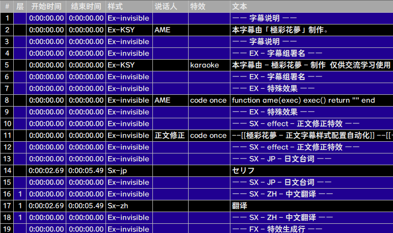

在字幕最开始会有一些说明（均是注释）。  
字幕组署名，这里我们一般会使用自动化特效，所以这里一般会有一些代码行。  
特殊效果，这里我们一般会放若干我们最常用的代码，随后会有屏幕字的特效和部分注释。  
正文修正特效，这里会放我们针对正文字幕的效果进行诸多修正、校验的代码。  
特效生成行，这一行后面就是若干fx行。  
除了特效生成行外都是两行包裹的格式，大致结构（除极少数特殊情况外）保持如此。

多数字幕组会使用空行分割。

此外还有 **Script Info** 部分（字幕文件头部的信息）。  
我们采取统一的格式：

> ScriptType: v4.00+  
PlayResX: 1920  
PlayResY: 1080  
WrapStyle: 0  
ScaledBorderAndShadow: yes  
YCbCr Matrix: TV.709  
Original Script: 極彩花夢

其中有几项不太会选择其它值，也就是保持设置：

> ScriptType: v4.00+  
ScaledBorderAndShadow: yes  
YCbCr Matrix: TV.709

 **ScriptType** 会影响层级等效果， **YCbCr Matrix** 为色彩空间（可能会用到 **TV.601** 但请务必在知道其意义的情况下选择其它值）。  
 **PlayResX** 和 **PlayResY** 是画布大小，由于会影响效果展示所以尽量与视频分辨率一致。  
 **WrapStyle** 除非是英语字幕不然请避免使用。  
 **Original Script** 及一些其它的信息值，由于不影响字幕效果，按自己需要设置即可。

# 样式表的重构
跟随上一部分的思路，我们一共需要9个基础样式分别用于：署名、特效、注释、日文、中文、OP歌词及翻译、ED歌词及翻译。  
由于OP和ED的样式需要按实际需要另行设置（或者可能不需要），我们主要需要考虑的是前五项的样式如何设置。

样式在命名上尽量简单易懂。

## 署名
署名有时就是简单地在片头的顶部显示几秒，有时可能需要另外设计效果。  
除了对齐的 **\an** 一般选择8之外没有太固定的设置。

但我们会使用设计的几个样式表用于不同类型的动画，此时署名一般会根据正文样式有所变动。

## 特效
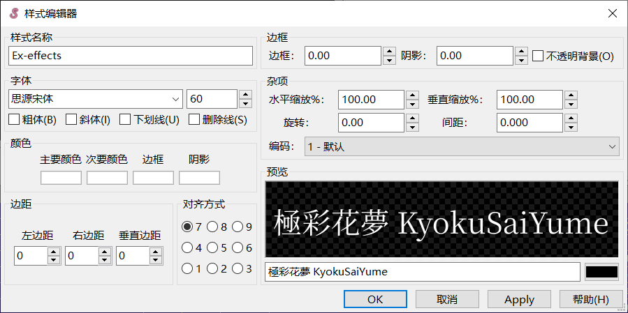

字体及字体大小不重要，这两项一般会需要根据实际内容另外用标签设置。  
此外的选项尽量设置为图中的值，均在需要相应效果时使用标签。

其中最特殊的一项是对齐方式，请固定选择 **\an7** ！  
在这里设置对齐可以避免一些潜在的渲染错误。

另外有一个极其特殊的情况， **不透明背景** 。  
这一项设置的效果在绝大部分情况下不需要，但需要时只能在样式配置中设置， **没有修改其效果的标签** ！

## 注释
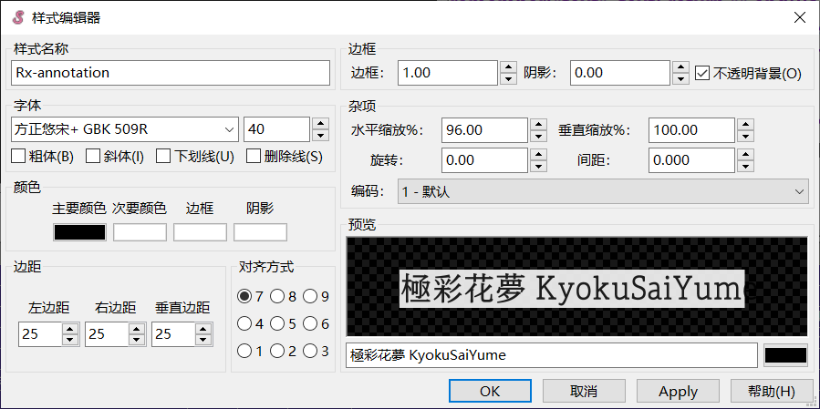

这是我们可能使用的注释样式的其中之一。

我们对于注释也会使用自动化生成特效，所以默认的样式设置均服务于最终的文字效果（与文字最终的基础效果一致）。  
文字最终显示的坐标、长宽等需要保持一致（方便判断最终效果），所以三项边距、缩放、间距等值均设为相应值。

其中有非常特殊的一项， **不透明背景** 是默认开启的。  
为了在打注释时方便观察效果，我们统一使用白底黑字并且不透明背景进行观察。  
并在自动化时另行处理效果。  
这里也可以看到不透明背景的一个错误，其效果不会根据缩放或边距等值进行调整。

## 日文

字体、字体大小、粗体、垂直边距、边框、阴影、水平缩放、间距，这些值是需要专门设计的。  
但此外的值基本可以保持不动。

### 颜色
我们会在自动化时重新配置颜色，所以默认颜色选择白底黑边提供较为标准的效果参考。  
正文的主要颜色 **\1c** 在绝大多数情况下都是纯白的效果最好，但有时需要考虑其它颜色。  
次要颜色不重要，边框和阴影在大多数情况下黑色较好（或者说提供的效果不会太差）。  
我们因为主要使用边框提供效果所以阴影不重要，边框颜色可以按需设置。

### 边距
左右边距我们保持设为0。  
左右边距影响换行，可以为英语字幕提供便捷的换行效果——但对大多数情况下的中文/双语字幕没有好处。

### 对齐
在绝大部分情况下选择2。  
存在极少数情况需要为对话安排其它位置。

### 边框
边框的值一般取2-4，对于动画不会选不透明背景。

### 阴影
不推荐只使用阴影提供效果！

### 杂项
如果要修改字体比例推荐只修改水平缩放，所以垂直缩放保持100。  
水平缩放和间距可以微调字体效果，并且多数情况下需要一起调整。  
编码设置只在字符超出字体字符集时生效，对于日文可以设为128可以设为1。  
因为在一开始选择字体就需要尽可能选择字符集足够大的字体，所以编码设置不重要。

## 中文
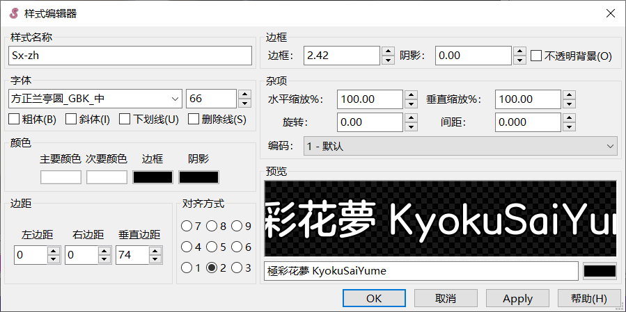

多数值请参考上一部分。

### 边框
根据实际需要可能会选择比日文边框稍高的值。  
如果显示上中日文大小差距不大可以使用相同值，如果中文显示远大于日文需要分别调整边框降低整体违和感。

### 编码
一般只使用1，也不太会根据字幕的简繁修改此处的值。

## 正文样式的重构
<table class="ame">
<tbody>
<tr>
<td>参考图.1</td>
<td>参考图.2</td>
</tr>
<tr>
<td>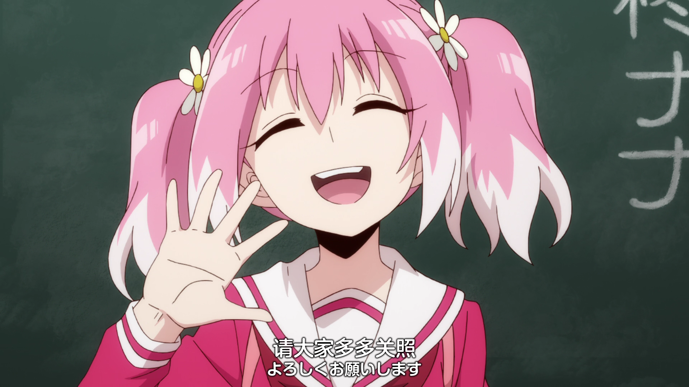</td>
<td>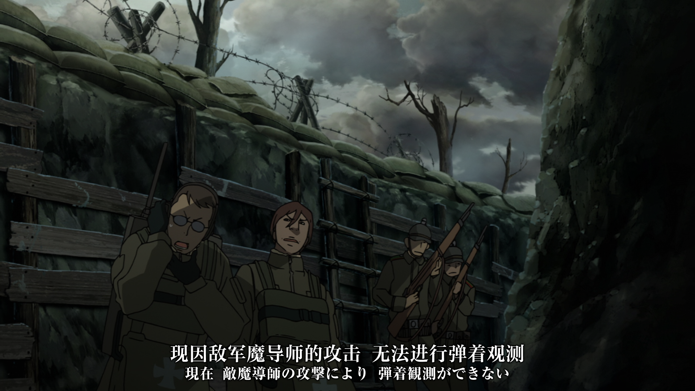</td>
</tr>
</tbody>
</table>

上面两张图的情景是比较典型的，一个给人感觉是轻松欢快的校园生活，一个给人感觉是无比残酷的战场。  
字幕风格也有着明显的不同，但无疑两者都足够适合各自情景，不会过于违和。

从字幕风格出发，我们需要设置几套样式分别适应不同类型的动画。  
而根据不同风格下差别最重要的字体，又会衍生出各种不同的解决方案。

<table class="collapse">
<tbody>
<tr>
<td>一个明显违和的参考</td>
</tr>
<tr>
<td>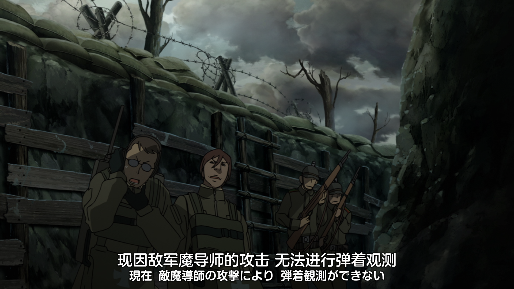</td>
</tr>
</tbody>
</table>

## 动画风格的模拟
正文字幕的字体需要有足够高的 **可读性** ，能够让观众看着不会花太多时间去识字。  
而可读性其实关键在于，字本身是否方正规整，笔画是否清晰易辨，整体看上去是否和谐。  
由此可以得出几种基础的字体类型： **黑体** 、 **宋体** 、楷体。  
其中楷体较为特殊，秀丽的笔画在双语字幕中看上去总体较为“空洞”，建议只在单行的中文字幕中使用。  
而另外还有由最核心的黑体衍生出的，在字幕中效果非常特别的一类字体： **圆体** 。

### 黑体
黑体基本算是双语字幕的一个通解，其提供的效果在绝大部分场景下不会很差，表现非常稳定。  
黑体的可读性非常高，由于风格不独特让它也比较百搭，并且相关字体数量非常庞大。

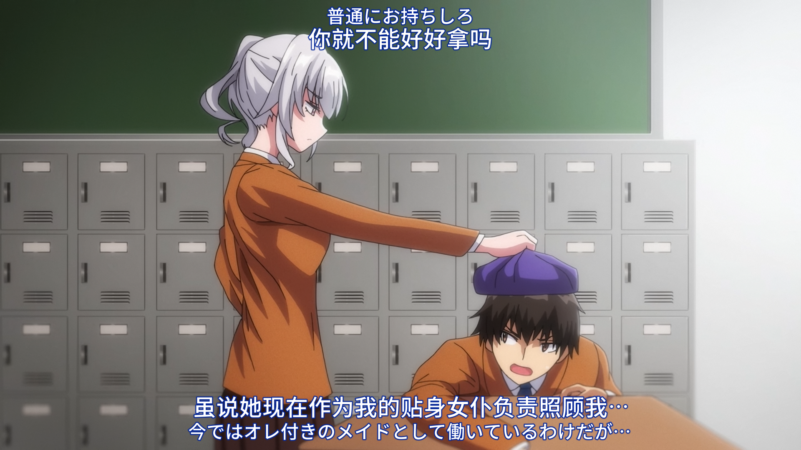

作为最核心的方案，黑体几乎是多数字幕组制作双语字幕的不二之选。

### 圆体
圆体适合少数日常或者画风可爱的动画。另一方面，圆体适合大部分里番。  
根据圆角程度会有较大的效果差距，轻微的圆角可以作为稍柔和的黑体使用，较重的圆角则是：

看上去非常圆润，与可爱的画面相得益彰。  
圆体的可读性较黑体偏低，但作为难得的一个黑体以外的选项，显示效果足够特别也存在不少它适合的动画。

### 宋体
宋体所适应的就是少数不那么日常，并且情节稍显庄重严肃的动画了。  
宋体根据衬线高低、笔画粗细会有非常不同的表现。  
宋体的可读性稍低，对动画风格比较挑剔，本身效果配置上也会比较挑剔。

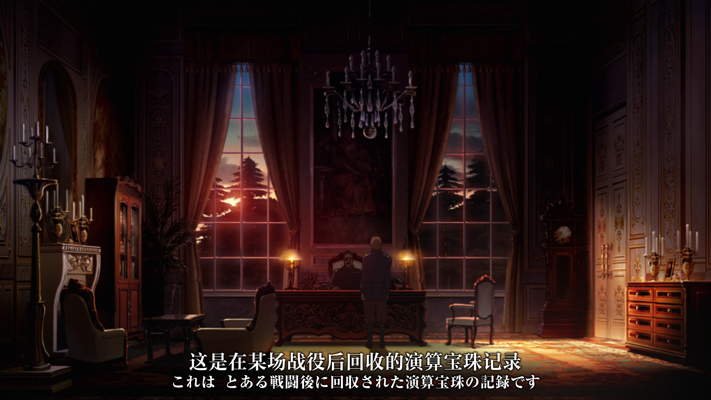

## 字体的模拟
这里介绍两个非常特殊的字体，思源黑体、思源宋体。

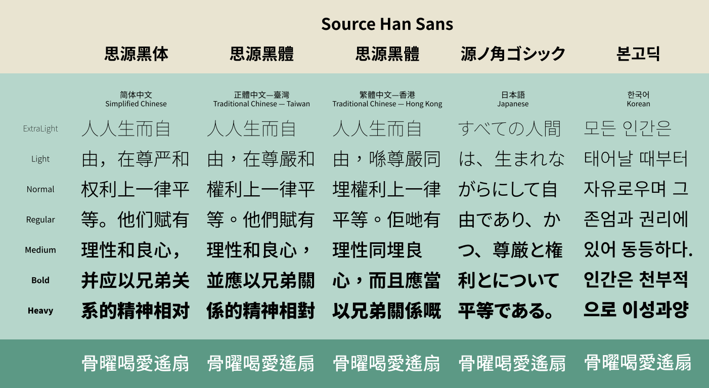

尽管有一些小问题但瑕不掩瑜，思源黑体和思源宋体算得上是黑体和宋体分别的一个代表字体。  
思源的字符集非常大，不用考虑正文出现一些生僻字就出错的情况；  
思源的字重多，可以根据需要选择适合的字重（由于光度补偿，其中 Normal 适合黑字白底而 Regular 适合白字黑底）；  
思源有针对简繁的字体，对于字幕的简繁两个版本能更好地适应并提供更好的效果；  
思源本身好看。  
具体到判断要不要使用哪一个字体，基本就是从上述这几个方面。  
另外， **GBK** 字符集就包括了大部分简繁常用字，如果一个字体标有（实际是满足）GBK字符集可以视情况优先考虑（部分GBK字体其实字符集并不大可能会出问题，而部分不标注GBK的字体可能字符集反而更大，均需要根据实际情况分析）。  
部分粗体字体不能直接在 Aegisub 中选择，需要用常规字体后勾选粗体或使用 **\b1** 才能使用。

挑选字体上，请务必注意要挑选的是 **可读性高** 、 **形体规整** 的 **正文字体** ，并且中日文字体风格必须 **特别相近** 。  
举例而言，并不是越“好看”的字体就越适合正文字幕：

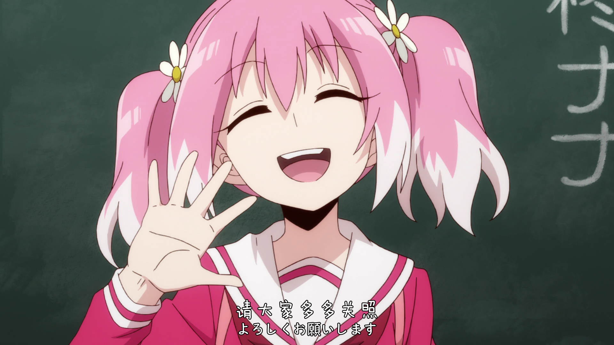

图例用到的两个字体都是非常有特色、非常好看的字体。  
尽管从图示而言似乎有一些与画面接洽，但实际这样的效果非常不适合正文字幕，在文字较多的时候可读性非常差并且反而会违和。  
另外，其实图例的两个字体风格有一定的差距，真正选用时一定要注意中日文字体风格要足够接近。

图例用到的是前文的示例字体，但日文字体选择了更轻一点的字重。  
大多数双语字幕组还是会将中日文字体大小调整得差距较大，降低日文行的存在感，也是因此会选用较低的字重来降低违和度。  
但无论如何一定要留意中日文字体的笔画粗细目视差距大不大，差距过大就会像图例那样效果非常差。  
因此，使用字重更多的字体更能得到满意的效果。

## 坐标的模拟
正文字幕的呈现从下到上，我们需要考虑的依次是：日文与底边距离、日文字体大小、中文与日文间距、中文字体大小。  
这部分提及的字体大小均是目视大小，不是设置中的 fontsize ，举例的像素值均是画布为 1920\*1080 时的情况。

### 极端的特殊情况
有一些字幕组做过顺序颠倒的双语字幕，其中一个可能的原因是为了给日文标注假名，将日文和中文行位置互换。  
但绝大多数情况下请保持中文行在上，颠倒的字幕可读性非常非常低。另一方面，中文行也存在需要标注的情况。

### 日文与底边距离
这是一项非常微妙的设置，如果日文行的“重要性”不高可以设置得低一些（0-10像素），反之可以高一些（10-20像素）。  
如果字幕组或字幕不以双语为核心，那么日文行的“重要性”就偏低，此时日文字体大小会设置得偏小、日文与底边距离也可以低一些。

### 日文字体大小
这是一项决策性配置，决定了字幕的“双语程度”重不重。  
日文字体更小，那字幕仍是以中文字幕为主，呈现的主要风格仍是中文字幕风格。  
日文字体大小如果接近于中文字体大小的七八成，那字幕会有明显的双语风格，并且处理上也更需要双语字幕的处理。  
如何选择主要是字幕组性质上的决策，如果字幕组是以双语字幕为主的，需要强调双语字幕的学习交流用途，则后者是更优的选择。  
而本文主要介绍的就是后者这种更复杂的情况。

### 中文与日文间距
一般而言中日文间距在 2-8 个像素，具体如何分配主要是看前两个选择。  
底边距离更低，那中日文间距的活动性更高，但注意中日文间距不要高过底边距离，不然高度分配会比较违和。  
日文字体大小也是同理，但本身需求上更大的日文字体大小就是更重的双语程度，此时中日文间距需要更低。  
这里有一个很违和的需求，就是日文字体大小大了，两行字幕都非常显眼却还反而降低间距让可读性降低。这种说法不无道理，但这种情况下也需要考虑双语字幕本身可读性就没那么高，提高间距超出双语字幕的需求了，并且提高间距会让字幕整体的高度变高，字幕整体所占区域增大降低观赏性。

### 中文字体大小
类似于日文字体大小，如果重双语就需要中文字体大小更小一些。  
但就算双语字幕也还是以中文行为主的，中文字体大小还是要足够大让中文显示占主体。

## 边框的模拟
双语字幕的可读性虽然不需要特别高，但一定不能低。由此默认的 **\1c** 只能是 **纯白** 。  
而另外还必须需要考虑边框和阴影。

<table class="compare">
<tbody>
<tr>
<td>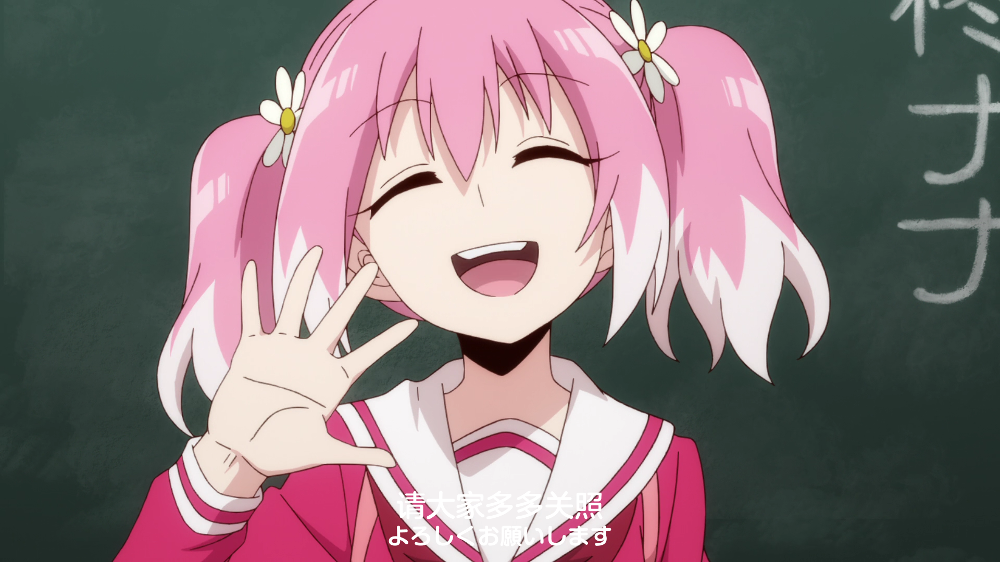</td>
<td>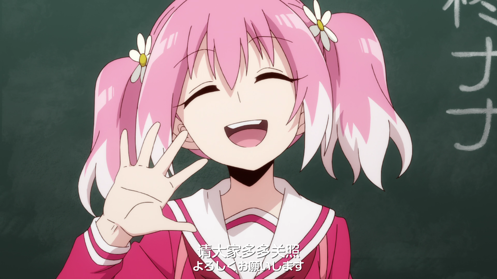</td>
</tr>
<tr>
<td></td>
<td></td>
</tr>
</tbody>
</table>

上图为四种可能情况的对比，分别为：无边框无阴影、无边框有阴影、有边框无阴影、有边框有阴影。

<table class="ame">
<tbody>
<tr>
<td>无边框无阴影</td>
<td>无边框有阴影</td>
</tr>
<tr>
<td>

图例为 **无边框无阴影** ，可读性非常低。  
无论 **\1c** 怎么设置，单色字幕始终会在某个场景下显示效果特别糟糕（但存在正文需要使用标签提供单色字幕效果的情况）。

</td>
<td>

图例为 **无边框有阴影** ，可读性高了一点但仍然非常低。  
部分组使用这样的样式，但这样的表现真的非常糟糕。  
请务必不要只使用阴影来提高可读性。

</td>
</tr>
<tr>
<td>有边框无阴影</td>
<td>有边框有阴影</td>
</tr>
<tr>
<td>

图例为 **无阴影有边框** ，可读性非常高。  
这是我们的默认样式配置，但其实这样的表现并不够好，因为边框取值低了（低于3），一般需要至少3才能有较好的效果。  
而我们之所以如此配置是因为我们采用了边框阴影之外的另一项提高可读性的选项，高斯模糊。

</td>
<td>

图例为 **有边框有阴影** ，可读性是最高的，但此时需要考虑字幕的 **违和度** 。  
 **正文字幕的可读性并不是越高越好** ，总需要有一个度，否则字幕会有独立于画面之外甚至影响画面的表现。  
但其实有边框有阴影的效果也有自己的特点，可以利用这一点在适合的动画里均衡边框和阴影的效果制造更好的表现。

</td>
</tr>
</tbody>
</table>

而边框/阴影的颜色则是一项非常非常影响效果的配置。  
边框本身是要用来提高可读性的，而 **\1c** 为白色这样的亮色， **\3c** 就需要 **偏深的颜色** 提供对比度， **\3c** 本身也可以用来提供观赏性。  
但是，我们至今也收到过边框颜色影响字幕阅读体验的反馈，边框颜色是一项可能讨喜可能不讨喜的取舍配置。

图例仅供参考，颜色和边框大小效果并不是那么好，但仍可以发现一些问题。  
尽管目视看上去边框颜色不深，但其实是偏深的 \#BD0340 ，由于白色占主体而边框值不会太高， **\3c** 一般需要比想选取的颜色 **更深一些** 来提供更好的目视效果。  
可选的颜色中， **黑色** 自然是最通用的，其次是 **深红** 、 **深蓝** 、 **紫色** 、 **棕色** 等，而绿色、黄色等亮色调则是非常非常不适合。  
此外，边框颜色也可用于区别角色，为不同的角色设置不同的 **\3c** 来提高字幕观赏性（我们也有收到边框颜色不断变换影响字幕阅读体验的反馈）。

 **高斯模糊** ，也就是 **\blur** ，不可在样式配置中设置但可另外添加在字幕内容中。  
这也是一项取舍性选择，可能讨喜可能不讨喜——但，高斯模糊本身这样一个独特的选择仍然非常有价值。

<table class="compare">
<tbody>
<tr>
<td></td>
<td></td>
</tr>
</tbody>
</table>

第一张为对比图，使用非常常用的3边框；第二张为参考图，使用低一点的边框值加上 **\blur2** 。  
这个效果是我们多数样式所采用的标准效果，整体会更加柔和并且可读性非常高。

<table class="collapse">
<tbody>
<tr>
<td>快捷添加{\blur2}标签</td>
</tr>
<tr>
<td>
这里额外提供一下快捷添加{\blur2}的一个方式：

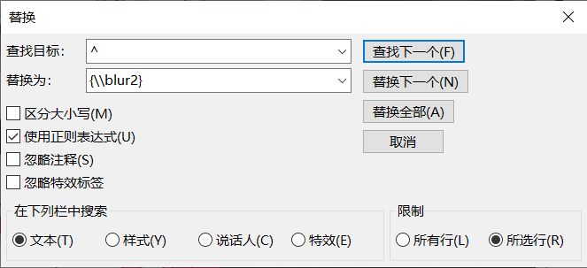

当然，后文会使用更快速（更复杂）的方式实现。

</td>
</tr>
</tbody>
</table>

另外还有 **柔化模糊** ，也就是 **\be** ，也不能在样式配置中设置。  
对于黑体或者宋体，使用高斯模糊可能效果不是那么理想，此时可以考虑使用 **\be1** 略微柔化边框。  
我们为黑体所配置的标准效果就是 **\be1** 。

## 缩放与间距的模拟
 **绝大多数情况下并不需要对缩放与间距额外进行调整** ，因为字体在设计时就会考虑到这些效果，字体设计师也会为了字体应用场景（如屏显）进行诸多改进。  
但部分字体是为了长篇文本设计或者另外一些不那么适合单行字幕的场景，此时显示效果可能会有一点差或者奇怪。

<table class="compare">
<tbody>
<tr>
<td>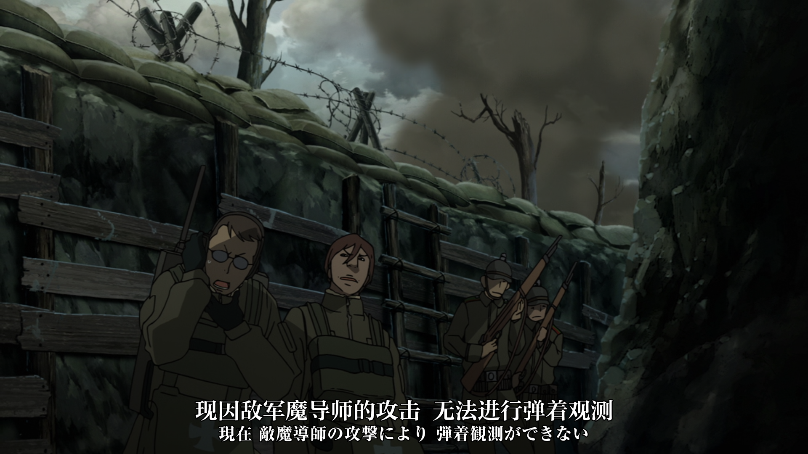</td>
<td></td>
</tr>
</tbody>
</table>

第一张为对比图，目视上中文行非常“扁”；第二张为参考图，将水平缩放改为95间距改为2的效果，可以看到明显好了很多。

<table class="collapse">
<tbody>
<tr>
<td>关于思源字体的补充</td>
</tr>
<tr>
<td>

思源字体如果正常显示，省略号\[…\]会显示在底部，也就是西文标准。  
除了后文会讨论的一种方法外，最简单的处理方式是将样式默认配置的间距设置为一个较小的值。  
例如设置0.5像素的间距：

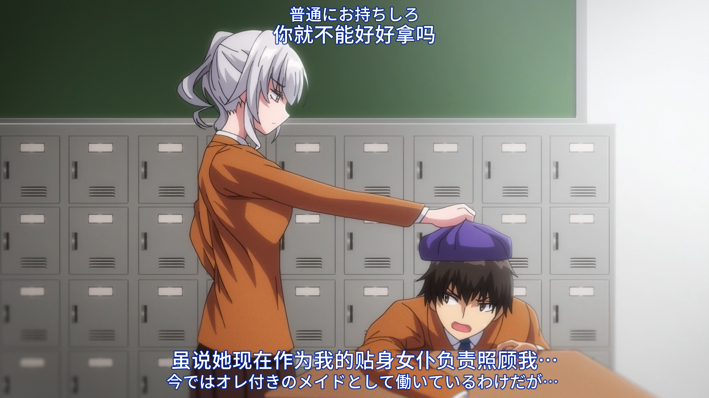

但这种效果或不稳定。

</td>
</tr>
</tbody>
</table>

## 额外补充

### 字幕层级
如果您在配置时中文字幕怎么降低边距都会在日文的上方不少，是因为没有额外设置字幕层级（开始时间左边）。

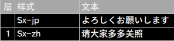

另外，需要在字幕文件头部的 **\[Script Info\]** 中写入 **ScriptType: v4.00+** 才有层级效果。

### 顶部字幕
可能额外需要考虑的是顶部字幕，就是在部分情况下需要将正文移动至顶部显示。  
这时候单单使用 **\an8** 基本不可能满足需求，中日文行的顶边距离一般都会更高，并且部分字幕组想让顶部字幕显示得更小一点。  
此时大多数字幕组的解决方式都是额外设置一个样式来实现相应效果（我们使用 **\an8** 和自动化）。

## 结束语
本文至此就已经满足所有基础需求了。  
后文内容较为复杂，如果您对字幕精度没有那么高的需求那么参考意义不大。

此处也基本是本系列文章的分水岭。

# 天平两端的失败模拟
双语字幕有一些非常特别的问题。  
非常直白地说，原因就是因为显示的是两行字。

## 标点的失败模拟
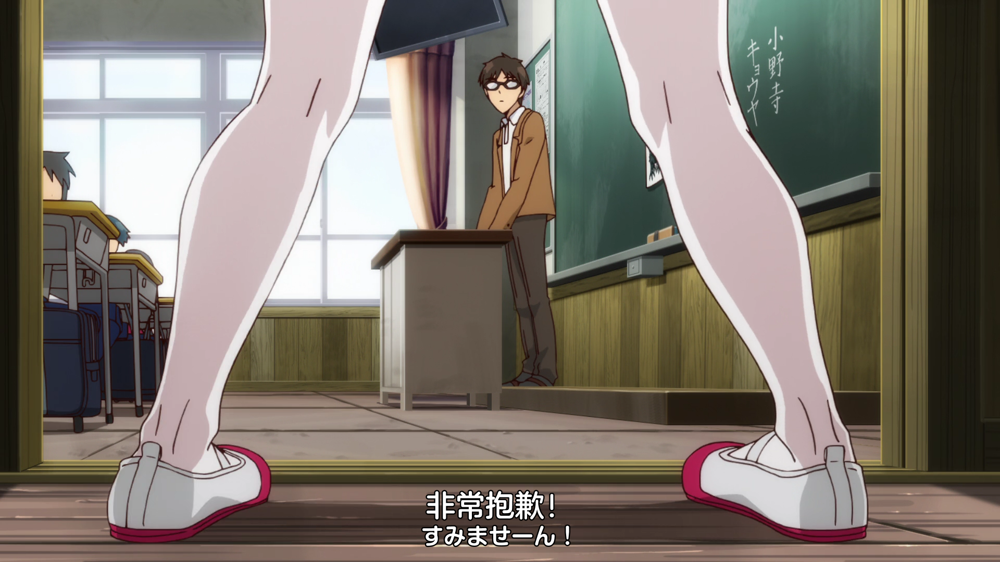

这张图例有一个非常违和的问题——字幕并不居中。  
两行字幕的中心似乎并不重合，看上去“错位”了。  
——那么，  
是中文行设置了过高的左边距吗？  
还是日文行设置了右边距呢？

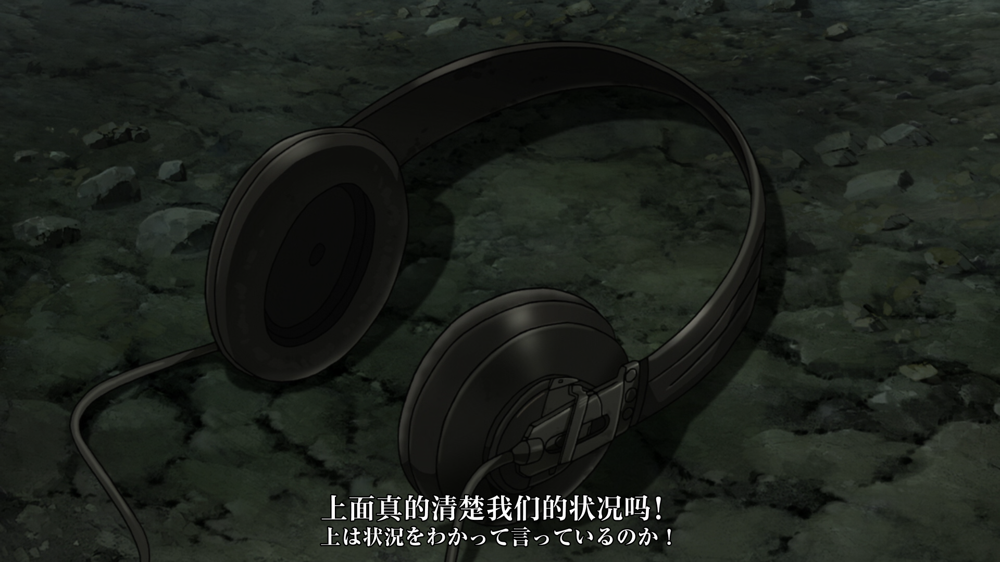

类似的问题，是哪一行字幕出了问题呢？

标点问题是双语字幕的一大核心问题。  
上文的两张图，字幕均是绝对居中，中日文行左右边距也都是0。  
让我们看上去感觉字幕“错位”的元凶，是句尾的标点符号。

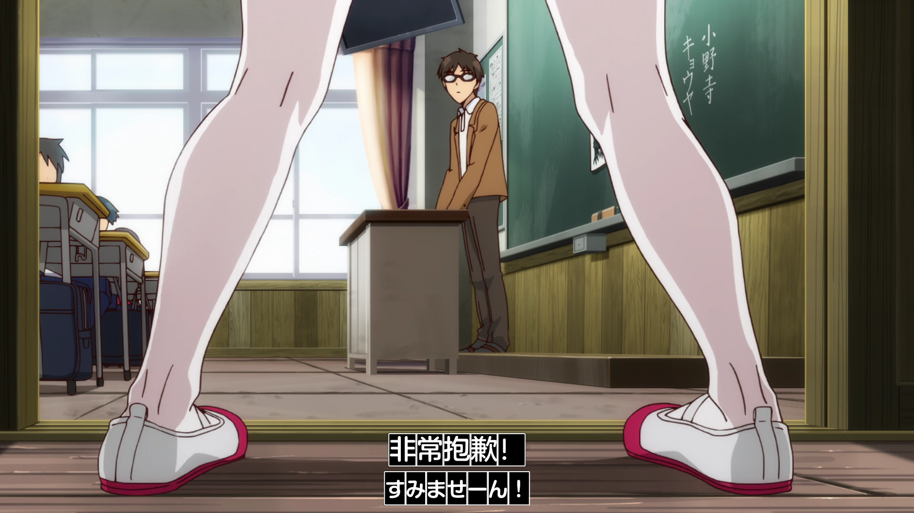

调整了一下中日文行间距方便对比， **两行字幕都十分规整地排列在中央** ，而 **标点符号** 有明显的区别。  
这来源于书写上的不同，中文的标点 **偏左** 而日文的 **居中** ，这导致最终呈现的效果也有非常大的差别。  
并且仔细观察能发现，两个字体的标点符号风格略有不同，这种不同因字体而异，有时候会非常影响观感。

解决这种情况的最有效的一种方法—— **不使用标点符号** 。  
这个方法不像个方法，但它确实是绝大多数字幕组的处理方式了。  
也有部分字幕组会使用标点相近的字体，或者使用标点但避免在字数少的行使用。  
我们曾经尝试过的处理是，为中文行人为添加一定的左边距来弥补视觉上的违和。

<table class="collapse">
<tbody>
<tr>
<td>彩蛋</td>
</tr>
<tr>
<td>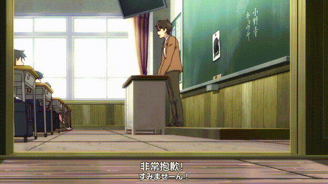</td>
</tr>
</tbody>
</table>

## 对齐的失败模拟
前文是直接抛弃了顶部对齐这个问题。  
尽管顶部对齐提高了阅读难度、不那么好看，但是它绝对是一个不总是能回避掉的问题。

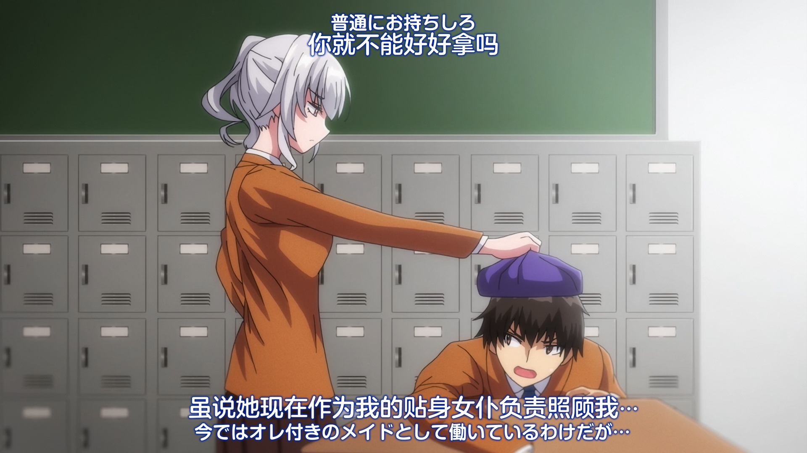

这是顶部对齐使用同样式，并且除 **\an8** 以外没有任何修改的参考图。  
仔细观察能够发现顶边的边距比底边的边距还高，这不符合顶部字幕是次要字幕的直觉。

另外有一些字幕组会为顶部字幕额外配置样式，使其字体更小。  
但后文不考虑额外样式的配置。

可能会有其它对齐的需求，但其实本质上来说其它对齐都能通过边距解决。

## 坐标的失败模拟
有时为了不遮挡画面要素或者提供特殊效果，会考虑为字幕行设置左右边距和垂直边距。

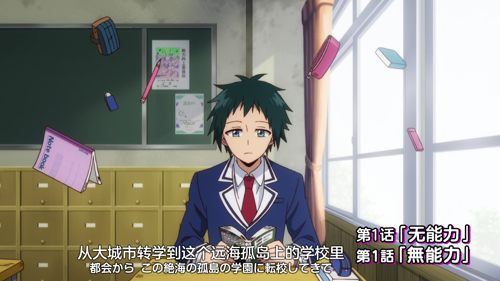

单纯从这一点倒不会有什么直接的效果影响，但边距可能和其它要素互相影响。  
中日文行的垂直边距本身不同，设置垂直边距需要考虑默认值。

另外，有一些情况可能需要用到 **\move** ，如果借助边距可以有另一种解决办法。  
靠左右边距确定初始x坐标，垂直边距确定初始y坐标，也就是不用借助 **\pos** 或是 **\move** 达成定位。  
然后用 **\org** 和 **\frz\frx** 配合 **\t** 实现（变速或伪匀速）（直线或曲线）移动。  
这样解决，除了本身能提供更丰富的效果外，还能免去中日文行需要分别计算 **\move** 坐标的麻烦。

## 角色的失败模拟
其实从前文能看出，思路上本文在避免创建多的样式。  
但是如果在部分需求下，要为不同角色分配不同的样式，样式表会变得极其冗余。

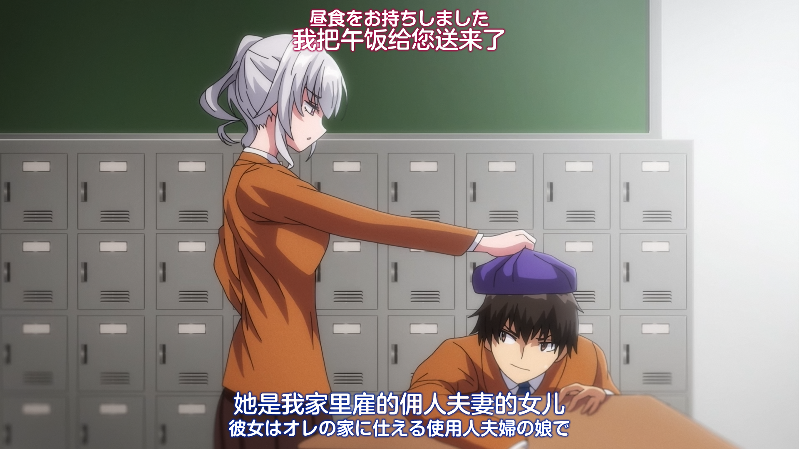

无论为角色设计不同样式这个方案本身讨不讨喜，这个需求还是稍有意义的。

<table class="collapse">
<tbody>
<tr>
<td>涉及剧透的彩蛋！</td>
</tr>
<tr>
<td>
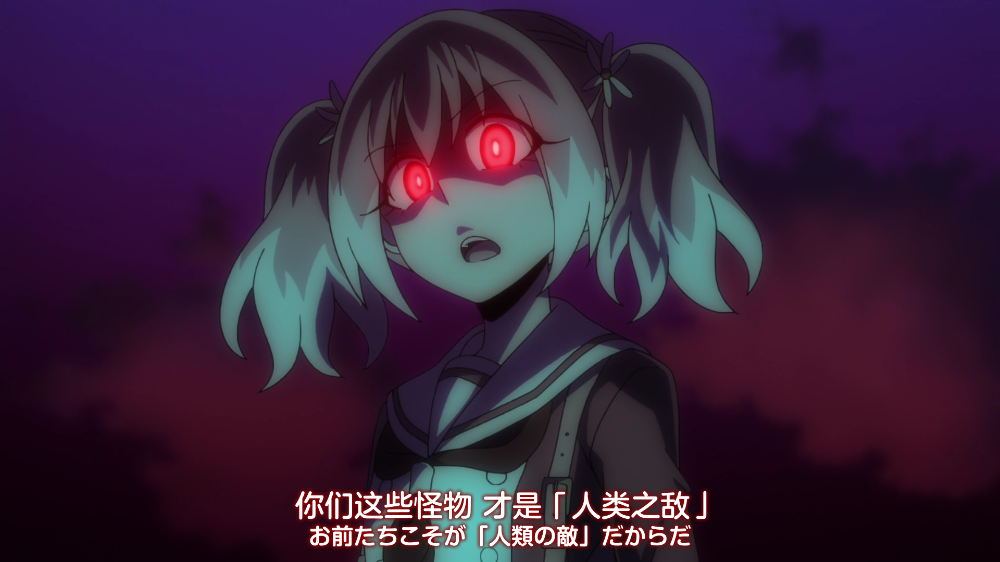

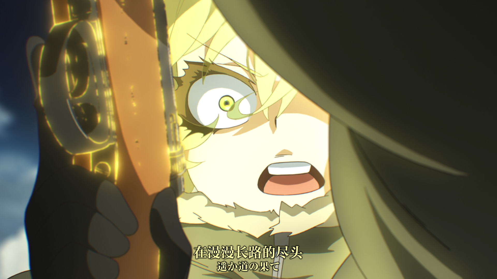

</td>
</tr>
</tbody>
</table>

## 校验的失败模拟
单纯从结果而言，我们还有一些特殊的需求。  
检验字幕行的持续时间，避免一些交接中潜在的错误，也可以重新检查是否有行的持续时间过短；  
检验字幕行是否有闪轴；  
检验开始结束时间前后是否有关键帧；  
将开始时间、结束时间设置为最近的帧，避免潜在的同步问题；  
快速测试效果。

## 破坏砝码的曲线重塑
我们知道在制作歌词特效时，一般需要使用template行来添加各种效果。  
我们会在歌词中写入许多标签、进行复杂的图形计算。  
那么同样地，我们也可以使用与歌词类似的方式来处理字幕正文。

## 秩序的曲线重塑
字幕组一般需要确立一些基础要求。  
例如日文的空格用半角还是全角？其它符号用半角还是全角？允许使用哪些标点？以及一些标点的使用细则。  
这些琐碎的地方也是需要统一的。

这里介绍一下我们的细则。

对于 **空格** ，我们统一使用半角空格。  
半角空格\[ \]和全角空格\[　\]在日文中都有使用，一些组会要求使用更正式的全角空格。  
而由于我们会调整空格宽度，所以使用哪一个并不重要。出于结构考虑我们选择统一使用半角空格。  
并且我们要求 **最多只连续使用一个空格** 。  
另外，在句中出现英语时可能需要考虑前后加空格——正式的书写方式是需要加空格的，但这样的效果并不总是适合字幕，有时可以考虑不加。  
西文半角标点后一般要加空格，但是我们除空格外均使用全角标点，不存在标点后需要加空格的情况。

对于 **，** ，我们禁止使用。  
字幕中使用空格代替逗号是非常有必要的，空格既能有逗号的作用又不会影响美观性（逗号非常不美观）。  
近年来动画字幕组没有写逗号的了，但是baha字幕有逗号（并且baha字幕的标点运用非常混乱）。  
当然也有极端的例外，就是句子本身需要（如格言）。

对于 **？！…** ，我们统一使用全角符号。  
问号和感叹号均有全角\[？！\]和半角\[?!\]形式，一些组使用半角加空格的形式（句尾标点使用半角可以一定程度减弱前文所述的问题）。  
我们要求一般使用全角形式，除极少数特殊情况（句子本身是英语就使用半角标点）。  
省略号本身没有半角，但是有人喜欢用英语使用的小数点\[...\]。同理我们也是使用标准省略号，在英语中使用小数点。  
在正式的中文表达里省略号是\[……\]两段，但是这样的书写非常破坏字幕的美观程度，字幕中一般只书写一段\[…\]。  
我们要求这三个标点 **均不能重复或连用** ，重复如\[？？\]，连用如\[…！\]，均非常不美观。  
这三个标点均可出现在句尾，可以出现在句中，省略号可以出现在句首。  
额外可能需要注意的一点是，问号和感叹号出现在句中不是那么美观。

对于引号，我们统一使用 **「」** 。  
首先需要强调一下，直角引号\[「」\]不是日文专用，在中文中也一直有使用。  
引号非常之多，有\[“”\]\[‘’\]\[""\]\[''\]\[『』\]\[「」\]六组。而前四组有着非常严重的问题，与规整的汉字完全不搭，在字幕中格外违和。而双层直角引号有一些“复杂”了，简单的单层直角引号即可满足需求。  
多数字幕组也统一使用单层直角引号，当然也是排除全句英语的少数情况。  
我们额外要求去除掉直角引号前后的空格，因为直角引号本身就是一处“空隙”，再有空格容易影响美观性。  
直角引号可能出现在句首、句中、句尾。  
额外需要注意的是，它在中日文中常常是错位的，日文中可能句首用到而翻译中只能放在句尾，此时字幕会非常别扭——日文的开头一个字符是“空着的”，中文的最后一个字符是“空着的”，两句似乎是错位的。

关于波浪号\[ **～** \]。  
中文在正式场合不会使用波浪号，并且波浪号本身在中文字幕中影响美观。  
但是日文中常常使用，在漫画中出现频次非常高。  
一些组会使用波浪号，更多的组是日文使用中文不使用。  
我们统一不使用波浪号，在日文中一般使用\[ー\]代替。  
类似于弯引号，波浪号与规整的汉字也非常不搭边，我们是稍激进地选择彻底不使用。

关于点\[ **・** \]。  
多是在人名中出现，有半角\[·\]形式但我们统一使用全角。  
出现频次低但无法避免的一个特殊标点，只出现在句中。

所以简单来说，除去全句英语等特殊情况外：  
我们统一使用半角空格\[ \]并只能连续使用一个；  
其它符号统一使用全角\[？！…「」・\]；  
\[？！…\]不能重复或连用；  
\[「」\]前后去空格。

# To be continued
