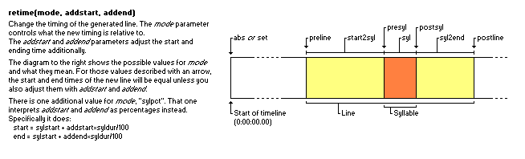

本篇介绍字幕的特效。

为了大致表现字幕的特效是什么、能干什么，我们先再次看一下系列的封面图：

整张图都是由字幕实现的，多样的文字、复杂的图形。  
而本篇正是要将这些效果的如何实现一一阐明。

字幕的特效有数个复杂等级，基础的特效标签的使用、自动化代码的使用、歌词特效设计等。  
其中有非常复杂、各种各样的算法，也时常需要偶然的灵感妙手。

### 特效标签
关于标签的使用，除了极少数特别的标签外，方法都是类似的。  
在内容中插入大括号 **{}** ，然后在括号中填入特效代码，例如要添加一个数值为2的高斯模糊，就是 **{\blur2}** ，括号中可以填入多个特效。  
作用效果上， **部分特效标签只作用在后续内容** ， **部分特效标签作用于整行** ；标签重复时， **作用于后续内容的标签以最后一个为准** ，作用于整行的标签以第一个为准。  
部分标签之间会互斥，互斥时以第一个标签为准。  
在标签原本需要数值但未填入数值时，作用效果为样式表中的默认效果，例如样式默认配置边框为2时， **{\bord3}極彩{\bord}花夢** 的第二个标签会将边框重置为2。  
部分特效标签允许一些非常奇怪的取值，但请尽量按正常取值。  
在不同滤镜(VSFilter/libass)下部分特效的效果可能会有非常大的差距，甚至部分效果会出错。

> 关于 mod 。  
如果使用 mod 会有更多的特效标签，但其主要用来单独制作极度复杂的歌词特效，不适合字幕环境故不做介绍。
>
> 关于旧特效标签。  
旧特效标签：  
banner;\<speed\>;\<direction\>;\<alpha\>  
scroll up;\<start\>;\<end\>;\<speed\>  
scroll down;\<start\>;\<end\>;\<speed\>  
是直接填写在特效栏的标签。  
但请不要使用这些标签，它们都可以被现有特效标签替代并且可能出现效果问题。  
这里只是提一下有这样的旧标签存在，但基本只能在非常早的字幕中找到了。

## \N 硬换行符  

特殊标签，不放在大括号中而是直接使用，如 **字幕とか儲からないし\N翻訳とか適当でもいいよ** 。  
可使用 Shift + Enter 快捷输入。

### 注意事项
换行后，行与行之间的间隔 **最小值是固定的** ，受字体、字体大小影响。  
会受 **\an** 影响而改变换行风格。  
部分字体（如思源）使用换行标签 **可能兼容性较差** ，在不同播放环境下效果不一。

换行标签对特效不友好、兼容性又较差，导致部分人十分排斥使用标签换行。  
但使用它非常便捷，不需要重新计算坐标、不需要额外添加字幕行，其本身意义已然非常重大。

### 额外的使用说明1
没有降低行间距的方式，但是想要适度提高可以考虑配合 **\fscy** 标签，如 **\N{\fscy10}\N** ，数值可以自行调整。

## \n 软换行符
特殊标签，不放在大括号中而是直接使用。  
在条件允许时（见 **\q** 标签）效果与 **\N** 标签一致，其余情况则是一个空格的效果。  
 **请避免使用这个标签！** 

> 关于自动换行。  
这里需要明确一点，在严格的字幕制作环境下， **请务必保持所有效果都在预期之内** 。  
换行就是非常基础的一项，不该换行的地方就得保持不换行，该换行的地方就得保持换行。  
类似的，还有不少标签都是效果不稳定需要避免的，在本文中会标注避免使用。  
“避免使用”更多的是在严格的日本动画字幕制作这个环境下， **这部分标签可能在其它环境下仍有自己的作用** 。

## \h 硬空格
特殊标签，不放在大括号中而是直接使用。  
作用效果类似空格，但一般空格在句尾时不会占位，该标签则会强制占位。  
但真实效果因字幕滤镜或播放窗口而有所出入，部分时候所占宽度与空格不等，效果不稳定。  
 **请避免使用这个标签！** 

## \fn 修改字体

使用 **\fn\<字体名称\>** 来修改后续内容的字体。  
字体名称可以是字体家族名等，但即便名称有空格或中文也都是直接写，如 **\fn思源宋体 CN Heavy** 。  
一般在还原屏幕字时使用，因为无论屏幕字需要多少个字体一般都只会配一个样式。  
而在做歌词特效的时候帮不太上忙，歌词特效中为了方便使用内联变量等参数一般需要样式的字体就是目标字体。

### 注意事项
在播放非内嵌字幕视频时，播放器一般会载入视频内封的字体文件和用户安装的字体文件。  
为了正常显示效果，一般会将字幕中用到的字体都内封进视频，或者提供单独的字体包供用户安装。

> 一种说法认为，字幕应该将所有用到的字体分别设置一个样式，方便用户修改、采集。  
甚至有极端说法认为字幕组不应该使用 **\fn** 标签。  
但在制作字幕时可能用到较多的字体，每份字幕都采用截然不同的样式并且样式繁多反而会让字幕更加晦涩。  
我们始终认为 **\fn** 是一个非常有效的标签。

## \fs 字体大小
使用 **\fs\<字体大小\>** 来修改后续内容的字体大小，如 **\fs60** 。  
字体大小可以取小数，根据 **画布尺寸** 、 **字体** 的不同而显示效果不同，故换字体后需要检查下大小是否合适。

### 注意事项
设置过大的数值之后可能不显示。

### 额外的使用说明1
使用该标签指定字体大小会受字体微调影响，所以最好不要在 **\t** 中修改 **\fs** 。

> 字体微调。  
为了在低分辨率下保持优秀的显示效果，字体通常会对小尺寸时的轮廓进行微调以提高字体可读性。  
微调后的字体在对应尺寸下会显示得更加锐利、清晰。  
如果通过动态修改字体尺寸会使字体轮廓不断变化而可能产生不理想的效果。

## \b 粗体

使用 **\b\<字重\>** 设置后续内容的字重或粗体，一般使用 **\b1** 设置粗体、使用 **\b0** 取消粗体。  
字重可以根据字体取字重，例如600、900等，但这种用法很不常用也不推荐使用。  
实际值在\[0,1)范围内取消效果，\[1,2)范围内有与数值无关的固定粗体效果。

### 注意事项
部分字体没有粗体或者没有粗体效果！  
没有粗体效果的字体调整样式默认粗体也是没有效果的，其本身只有一个字重。  
而有一些字体没有粗体，却有“粗体效果”，这是由强制计算得出的不准确效果，字体的边缘往外延伸一定像素。  
在使用字体收集器检查字体可用性时可以进行检查，尽量避免不规范粗体。

## \i 斜体

使用 **\i\<值\>** 设置后续内容的斜体，一般使用 **\i1** 设置斜体、使用 **\i0** 取消斜体。  
实际值在\[0,1)范围内取消效果，\[1,2)范围内有与数值无关的固定斜体效果。

### 注意事项
无法指定倾斜程度，所以大多数时候没用。  
替代标签为 **\fax** 。

## \u 下划线

使用 **\u\<值\>** 设置后续内容的下划线，一般使用 **\u1** 设置下划线、使用 **\u0** 取消下划线。  
实际值在\[0,1)范围内取消效果，\[1,2)范围内有与数值无关的固定下划线效果。

### 注意事项
没什么应用场景，即使需要也可以另外用绘图制作更精美的下划线效果。

## \s 删除线

使用 **\s\<值\>** 设置后续内容的删除线，一般使用 **\s1** 设置删除线、使用 **\s0** 取消删除线。  
实际值在\[0,1)范围内取消效果，\[1,2)范围内有与数值无关的固定删除线效果。

### 注意事项
是不是感觉参考图非常奇怪？让我们放大看一下：

没错，与字重叠的区域会消失。  
另外与下划线类似，需要用到的时候一般可以通过绘图实现更好的效果。

## \\<1,2,3,4\>c 颜色标签

以 **\1c** 举例，使用 **\1c\<ASS颜色\>** 设置后续内容的主要颜色，ASS颜色格式为 **&HBBGGRR&** ，与html颜色格式#RRGGBB相反。  
 **\1c** ：主要颜色，字体本身或者绘图本身的颜色。  
 **\2c** ：次要颜色，预填充卡拉OK时字体本身或绘图本身的颜色，复杂且 **非常不常用** 。  
 **\3c** ：边框颜色，在文字或绘图有边框时边框的颜色。  
 **\4c** ：阴影颜色，在文字或绘图有阴影时阴影的颜色。  
这些标签都可作用于绘图，其中主要使用 **\1c** 和 **\3c** ，少数时候用到 **\4c** ， **\1c** 可以简写为 **\c** 但不建议简写。  
实际值可以取一些不规范的值，但如此取值时效果不稳定，请尽量使用标准格式（大小写无所谓）。

### 注意事项
一般在 Aegisub 的调色盘里试颜色，在取屏幕字颜色时可能用到的取色工具不能转化成ASS颜色格式，手动从html颜色格式转写的时候注意RGB的顺序。

## \\<1,2,3,4\>a 指向性透明度标签
可参考颜色标签， **\1a** 、 **\2a** 、 **\3a** 、 **\4a** 提供了指向性的透明度修改。  
以 **\1a** 举例，使用 **\1a\<透明度\>** 设置字体本身或者绘图本身的透明度，透明度格式为 **&HAA&** ，AA为16进制。  
16进制也就是0-9然后A-F， **&H00&** 为完全不透明， **&HFF&** 为完全透明。  
实际值可以取一些不规范的值，但如此取值时效果不稳定，请尽量使用标准格式（大小写无所谓）。

### 注意事项
除了有指向性的透明度标签外，还有非指向性的 **\alpha** 标签。

## \alpha 透明度标签
使用 **\alpha\<透明度\>** 设置后续内容的整体透明度。  
取值参考 **\\<1,2,3,4\>a** 标签。

### 注意事项
该标签相当于分别设置了四个指向性透明度，可在后续使用指向性透明度标签再次修改。

## \bord 边框

使用 **\bord\<边框宽度\>** 设置后续内容的边框宽度，使用 **\bord0** 取消边框。  
作用效果为像素宽度，也就是说在不同分辨率的画布下效果可能不一样。  
 **值可以取小数** ，过大的取值会造成各种问题。

### 注意事项
此标签实际上是在文字/绘图的边缘延伸出去，也就是说边框是圆润的曲边：

在边框宽度取值较低时不太明显，如果取较高值则需要多加注意这个效果。

### 额外的使用说明1
 **\bord** 标签有衍生的 **\xbord** 和 **\ybord** 标签，分别为横向、纵向产生边框。

### 额外的使用说明2
如果样式开启 **不透明背景** ， **\bord** 标签会制造一个特殊的“边框”。

### 额外的使用说明3
使用 **\xbord** 或者 **\ybord** 配合 **\blur** 可以做出一些特别的效果。

## \shad 阴影

使用 **\shad\<阴影距离\>** 设置后续内容的阴影距离，使用 **\shad0** 取消阴影。  
阴影为文字/绘图右移\<值\>个像素并下移\<值\>个像素后的效果，值可以取小数。

### 注意事项
阴影优先跟随边框效果，其次跟随文字/绘图主体效果。  
也就是说如果有边框且 **\3a** 不为全透明时，阴影效果为边框的阴影； **\1a** 不为全透明且无边框时，阴影效果为主体的阴影。  
而如果有 **\1a&HFF&\bord0** 时则不会显示阴影。

### 额外的使用说明1
 **\shad** 标签有衍生的 **\xshad** 和 **\yshad** 标签，分别为横向、纵向的阴影距离， **此时\<阴影距离\>可以取负数** 。

### 额外的使用说明2
阴影优先跟随边框效果，也就是说在开启不透明背景时，阴影也会是特殊“边框”的阴影。

&nbsp;

## \an 对齐方式
&nbsp;

使用 **\an\<位置\>** 设置该行的对齐方式，值与位置对应关系类似小键盘1-9。  
 **\an** 会影响换行，效果如图。  
实际上 **\an** 是根据参考点排列内容，例如 **\an7\pos(0,0)** 就是将参考点移动至(0,0)然后以该点的横轴为顶部边界纵轴为左边界进行排列。

### 注意事项
为了保证效果一致，请务必在绘图行写入 **\an** 标签，否则可能出现错位。

## \a 旧对齐方式
类似 **\an** 但值与位置的对应关系不同，1、2、3分别为左下角（底部左边）、底部（底部中间）、右下角（底部右边），要从底部改为顶部则数值加4，从底部改为中间则数值加8。  
值与位置对应关系非常不直观，请使用 **\an** 替代。

## \blur 高斯模糊

使用 **\blur\<高斯模糊强度\>** 设置后续内容的高斯模糊，使用 **\blur0** 取消高斯模糊。  
 **值可以取小数** ；高斯模糊有较大的计算量，故请勿将值设得过高。

### 注意事项
高斯模糊优先作用于边框，其次作用于文字/绘图主体。  
也就是说如果有边框时，文字/绘图主体完全不会被模糊。  
 **\shad** 标签会跟随边框/主体的模糊效果：

### 额外的使用说明1
在还原屏字的时候可以考虑给文字加一点高斯模糊(0.2-0.5)。  
因为动画中一般出现的不是清晰锐利的文字，而是由于各种原因变得有些“模糊”柔和的文字，此时加一点点的高斯模糊可以使还原得到屏字不那么违和。  
如果柔和度较高，请考虑使用 **\be** 标签，因为高斯模糊在值稍高之后会降低文字辨识度。

## \be 柔化模糊

使用 **\be\<柔化模糊强度\>** 设置后续内容的柔化模糊，使用 **\be0** 取消柔化模糊。  
值可以取小数。

### 注意事项
 **\be** 类似于 **\blur** 会先作用于边框，其次作用于文字/绘图主体。  
相较于 **\blur** 在高强度下会破坏文字本身， **\be** 可以更好地保留文字可读性，也就是说 **\be** 最好用在无边框的文字模糊上。

图例取自《小市民シリーズ》ep.1，使用了 **\be3** 。

 **但是该标签在部分情况下取(0,1)区间内的值时会失效！**   
如果为了兼容性，可以考虑在低强度时使用 **\blur** ，稍高强度时使用 **\be** 。

## \pos 定位
使用 **\pos(\<x\>,\<y\>)** 设定该行的坐标。  
x、y可以取小数、负数。

### 注意事项
在字幕的meta信息中需要填写字幕画布的宽和高，也就影响了所有的像素宽度和坐标。  
 **即便是画布外的坐标也是有效的** 。

## \move 匀速移动
使用 **\move(\<x1\>,\<y1\>,\<x2\>,\<y2\>,\<t1\>,\<t2\>)** 设定该行的匀速移动起点终点(及运动开始时间结束时间)。  
坐标取值规则与 **\pos** 标签一致。t1为运动开始时间(毫秒)，t2位运动结束时间(毫秒)。  
可以不设置t1及t2使用 **\move(\<x1\>,\<y1\>,\<x2\>,\<y2\>)** ，此时t1为0，t2为该行持续时间!line.duration!。

### 注意事项
这个标签比想象中的会难用许多，本质上是很少会需要用到匀速运动，以及在自动化中该标签写着会比较麻烦。  
而因为变速曲线运动只要“变速”和“曲线”不明显就可以代替匀速运动，所以大多数情况下写由 **\org\t\frz** 组合实现的变速运动就行。

## \fad 渐变
使用 **\fad(\<t1\>,\<t2\>)** 设定该行的淡入淡出效果。  
t1为淡入时间(毫秒)，t2为淡出时间(毫秒)。

### 注意事项
该标签作用于整行，即便在末尾添加也会有效。  
淡入淡出为匀速，如果需要复杂的效果可以使用透明度标签配合 **\t** 。  
如果t1与t2的和超出整行的持续时间，会导致在某一刻透明度骤变。

## \fade 复杂渐变
使用 **\fade(\<a1\>,\<a2\>,\<a3\>,\<t1\>,\<t2\>,\<t3\>,\<t4\>)** 设定该行的两次透明度变化。  
0~t1期间透明度为a1；  
t1~t2期间透明度由a1线性变化为a2；  
t2~t3期间透明度为a2；  
t3~t4期间透明度由a2线性变化为a3；  
t4~line.duration期间透明度为a3。  
透明度取值为0~255，0为完全不透明，255为完全透明。

### 注意事项
该标签非常晦涩，完全可以使用透明度标签配合 **\t** 达成更好且更直观的效果。

## \fscx \fscy 缩放

使用 **\fscx\<横向缩放\>** 和 **\fscy\<纵向缩放\>** 来调整后续内容的缩放程度。  
值可以取小数，当值取100时则为不缩放。

### 注意事项
该标签可以缩放绘图，所以在一开始制作绘图时可能并不需要严格按照字幕的画布尺寸进行绘制，可以在制作完成之后再使用 **\fscx\fscy** 进行调整。

### 额外的使用说明1
使用这两个标签进行缩放时是对结果进行缩放，也就是说不会受字体微调影响，比起 **\fs** 标签更适合配合 **\t** 制作缩放动画。

### 额外的使用说明2
 **\N** 标签没有降低行间距的方式，但是想要适度提高可以考虑配合 **\fscy** 标签，如 **\N{\fscy10}\N** ，数值可以自行调整。

## \fsp 字体间距

使用 **\fsp\<字体间距\>** 来设置后续内容的字体间距。  
值可以取小数、负数，单位为像素宽度。

### 注意事项
该标签的效果实现类似于每个字符之后加上/减去一个空间，在部分情况下可能造成不对称的情况。

图例为开启不透明背景之后字符实际的空间占用情况。

### 额外的使用说明1
思源等字体在排版时可能有省略号按西文标准沉底的情况，此时如果使用的是VSFilter滤镜则可以添加一点点的间距来取消因前后文沉底的情况：

三行内容为：

> {\fsp0}VSFilter…{\alpha&HFF&}喵{\alpha} \fsp0  
{\fsp0}VSFilter…{\alpha&H00&}喵{\alpha} \fsp0  
{\fsp.1}VSFilter…{\alpha&H00&}喵{\alpha} \fsp.1

但是libass滤镜的渲染逻辑不一样，同样的标签会显示为：

### 额外的使用说明2
字体在排版时不建议修改间距，因为字体在设计时就会(或者说需要)考虑各种情况下的间距问题，在默认效果下应当是最好的。

## \frx \fry \frz 旋转变换

以 **\frx** 举例，使用 **\frx\<旋转角度\>** 来设置后续内容绕x轴旋转指定角度。  
 **旋转角度可以取小数、负数** ，单位为角度(deg)。  
 **\frz** 标签可以简写为 **\fr** 。

### 注意事项
超出0~360范围的度数仍然是有意义的，可以配合 **\t** 标签做出多次旋转的效果。  
一般使用时旋转角度精确到小数点后一位足矣，但是在各种变化标签协同作用时可能需要精确到小数点后若干位。  
旋转中心可由 **\org** 标签指定，默认为该行字幕对齐方式( **\an** 标签)的定位点。

## \fax \fay 剪切变换

使用 **\fax\<水平切变因子\>** 和 **\fay\<垂直切变因子\>** 来设置后续内容的水平切变和垂直切变。  
 **切变因子可以取小数、负数** 。

### 注意事项
一般设置的切变因子的绝对值在0~1范围内，且需要精确到小数点后至少两位。  
剪切变换在旋转变换之后，剪切变换不会受 **\org** 标签影响。  
在实际应用中更多使用的是 **\fax** 。

### 额外的使用说明1
\fax标签可以作为一个程度可调整的斜体标签：

在还原屏字时非常实用。

## \org 旋转中心
使用 **\org(\<x\>,\<y\>)** 设置该行的旋转中心。  
坐标取值类似 **\pos** 标签。

### 注意事项
还原静态效果时不太会需要用到此标签。

### 额外的使用说明1
在 **\org** 设置的旋转中心距离非常非常远时，使用 **\frz** 旋转所绕的圆弧可近似为直线，可配合\t制作变速“直线”运动。

图例中的\frz取值偏大了，实际大部分情况为0~0.2范围内，至少精确到小数点后两位。  
旋转中心距离越远，圆弧就更接近直线(足够近似即可，不需要过远)。  
使用这个组合可以做出非常复杂的运动效果，在自动化中使用此组合也更加便于调试(只需要确定起点或最终落点和大致运动角度即可)。

## \fe 字符集
使用 **\fe\<编码ID\>** 以修改后续内容的文字编码，编码ID可参考样式配置中的编码菜单。  
但 **请不要使用这个标签** ，也尽可能保持文字编码为1(默认)，因为修改编码可能造成字体彻底不可用。

## \q 换行风格
使用 **\q\<换行风格\>** 来设置该行的换行风格。  
取值可以很奇怪但应当取0、1、2或3。  
0：智能换行，尽可能使所有行等长，不能使所有行等长时会选择让顶部的行更长，仅 **\N** 标签能强制换行；  
1：行尾换行，尽可能使一行填满后再换行，仅 **\N** 标签能强制换行；  
2：不换行，即便内容超出边界， **\n** 标签和 **\N** 标签能强制换行；  
3：智能换行，与参数0类似但会选择让底部的行更长。

### 注意事项
该标签应当更适合英语字幕；也有部分中文字幕会允许换行。  
在本系列文章探讨的范围内，不应当使用该标签，或者说不应当允许非预设的换行。

## \r 重置标签
使用 **\r\<样式名\>** 来重置该行的样式。  
如果不指定样式名则为该行默认的样式。

### 注意事项
看似重要但其实不太会用到的一个标签。

## \clip \iclip 遮罩

使用 **\clip(\<x1\>,\<y1\>,\<x2\>,\<y2\>)** 和 **\iclip(\<x1\>,\<y1\>,\<x2\>,\<y2\>)** 来指定该行显示或不显示指定矩形区域。  
坐标取值类似 **\pos** 标签，必须满足x2\>x1和y2\>y1。  
坐标遮罩可以运行 **\t** 动画。

另外可以使用 **\clip(\<缩放\>,\<绘图\>)** 和 **\iclip(\<缩放\>,\<绘图\>)** 来指定该行显示或不显示指定绘图区域(上图参考图的shape为完整的绘图代码)。  
缩放值为像素比例，可以取2的n-1次方(n取正整数)，例如取2会使绘图的坐标除以2，坐标(200,100)会被缩放为(100,50)。  
但绝大多数情况下不会设定缩放值(默认为1)，此时标签为 **\clip(\<绘图\>)** 和 **\iclip(\<绘图\>)** 。  
绘图遮罩不能执行 **\t** 动画。

## \t 动画
使用此标签以实现部分其它标签的动态变化效果。  
 **\t(\<标签组\>)**   
 **\t(\<速度系数\>,\<标签组\>)**   
 **\t(\<t1\>,\<t2\>,\<标签组\>)**   
 **\t(\<t1\>,\<t2\>,\<速度系数\>,\<标签组\>)**   
一共有上述四种写法。t1默认值为0；t2默认值为line.duration；速度系数默认值为1。  
从t1时间到t2时间，原标签效果按照速度系数指数变化为指定标签效果。

### 注意事项
多个 **\t** 标签可以单独写 **\t(\bord2)\t(\blur2)** 也可以嵌套写 **\t(\bord\t(\blur2))** 。  
变化曲线为在\[0,1\]区间上的指数函数，速度系数为1时则是匀速变化，(0,1)时初速快而后逐渐 **变慢** ，(1,+∞)时初速慢而后逐渐 **变快** 。  
标签组可以存放若干 **可以生效** 的标签，不可生效的标签应当避免放入其中。  
可以生效的标签包括：字体大小 **\fs** (不建议)、缩放标签 **\fscx\fscy** 、间距 **\fsp** 、颜色标签 **\1c\2c\3c\4c\c** 、透明度标签 **\1a\2a\3a\4a\alpha** 、边框 **\bord\xbord\ybord** 、阴影 **\shad\xshad\yshad** 、柔化模糊 **\be** 、高斯模糊 **\blur** 、旋转变换 **\frx\fry\frz\fr** 、剪切变换 **\fax\fay** 、坐标遮罩 **\clip\iclip** (绘图遮罩不可生效)。  
 **\pos** 定位标签是不可配合 **\t** 制作动画的。

## \pbo 绘图基线偏移
使用 **\pbo\<纵向偏移\>** 来设定后续绘图的基线纵向偏移。  
偏移值可以取小数、负数。

### 注意事项
几乎用不到，判定也非常奇怪。

## \p 切换绘制模式

使用 **\p\<模式\>** 来切换后续内容的绘制模式。  
使用 **\p0** 来关闭绘图， **\p1** 来开启画布分辨率下的绘图。  
模式指的是像素比例，可以取2的n-1次方(n取正整数)，例如取2会使绘图的坐标除以2，坐标(200,100)会被缩放为(100,50)。  
但绝大部分情况下只会使用 **\p0** 和 **\p1** 。

### 注意事项
尽管不常用，但其实绘图是可以和文本在同一行的，例如上方参考文本的字幕内容为：{ **\p1** } **m 32 0 l 44 16 l 63 22 l 51 38 l 51 58 l 32 52 l 13 58 l 13 38 l 1 22 l 20 16**  { **\p0** }参考文本{ **\p1** } **m 32 0 l 44 16 l 63 22 l 51 38 l 51 58 l 32 52 l 13 58 l 13 38 l 1 22 l 20 16**  。

### 额外的使用说明1
为避免一些潜在的显示错误，在绘图行尽量专门再写一次 **\an** 标签，如 **{\an7\p1}** 。

## \k \K \ko \kf 卡拉OK
以 **\k** 举例，使用 **\k\<音节时间\>** 来设置下一个音节的持续时间。  
音节时间的单位为厘秒(10毫秒)，例如对于 **{\k30}第一音节{\k50}第二音节** ，在0-300ms期间为第一音节时间，300-800ms期间为第二音节时间。  
 **\k** ：如果未到当前音节时间则使用 **\2c** 和 **\2a** ，到当前音节时间的瞬间切换为 **\1c** 和 **\1a** 。  
 **\K** ：如果未到当前音节时间则使用 **\2c** 和 **\2a** ，当前音节时间内文本从左至右切换为 **\1c** 和 **\1a** 。  
 **\ko** ：如果未到当前音节时间则使用 **\2c** 和 **\2a** 并且取消边框，到当前音节时间的瞬间切换为 **\1c** 和 **\1a** 并且加上边框。  
 **\kf** ：同 **\K** 。

### 注意事项
大部分情况下不会需要手动输入卡拉OK标签，而是会使用卡拉OK模式快速K轴。  
大部分情况下不会需要这些标签本身的效果，这些标签的核心作用是在自动化时划分音节依据音节创建效果。  
大部分情况下应当只使用 **\k** 标签。  
在Aegisub中开启卡拉OK模式可以进行K轴，以此可以将歌词按音节划分。

### 绘图指令
绘图实质上是绘制若干条路径，并将这些路径闭合形成图形。  
核心的只有三项：基点，直线，曲线。这里并不会介绍所有平常用不到的绘图指令，因为只要有m、l、b三个指令就能够做到所有其它指令能做到的事。

在大部分情况下，其实并不需要我们手写绘图指令，而是一般用ASSDraw绘制或者用一些其它复杂的工具进行ASS绘图的生成。

## m 设定基点
使用 **m \<x\> \<y\> ** 设定绘图的第一个/下一个起点。  
如果已经设置过起点再写入此指令，会将之前的形状闭合。  
如果新的形状与之前的形状有重叠，且两条路径方向相逆(一条路径为顺时针另一条为逆时针)，则会镂空重叠部分。

## l 直线
使用 **l \<x\> \<y\>**  将绘图从前一个点延伸直线到指定坐标。

## b 贝塞尔曲线
使用 **b \<x1\> \<y1\> \<x2\> \<y2\> \<x3\> \<y3\>**  将绘图从前一个点创造一条贝塞尔曲线到指定坐标(x3,y3)。  
创造的贝塞尔曲线的控制点坐标为(x1,y1)和(x2,y2)。

贝塞尔曲线并不能还原诸多曲线，例如圆弧。  
但是可以通过增加曲线条数来仿制。

使用三阶贝塞尔曲线模拟正圆，在形状足够小时只需要两条，即便需要模拟的圆有一定大小也可以通过4条贝塞尔曲线作出不易穿帮的“假圆”。

## 例子

> m -30 -3 b -32 -12 -50 -47 -66 -49 b -87 -50 -105 -19 -97 -2 b -95 5 -77 10 -69 10 b -81 14 -89 18 -95 26 b -98 42 -59 64 -43 58 b -36 56 -29 31 -31 12 b -42 27 -25 63 -16 68 b -4 75 16 63 21 46 b 65 66 137 76 181 54 b 179 52 174 48 171 48 b 121 67 49 52 14 35 b 10 30 0 22 -7 18 b 5 26 24 31 31 27 b 36 26 37 17 37 10 b 61 10 110 -7 141 -4 b 140 -7 136 -12 131 -12 b 111 -14 58 1 36 1 b 36 -5 30 -20 27 -22 b 9 -24 -20 -11 -26 -3 b -19 5 6 -8 11 -24 b 11 -40 -27 -60 -40 -55 b -46 -48 -44 -7 -30 -3 m -38 -7 l -40 -4 l -44 0 l -40 2 b -45 3 -52 4 -59 6 b -71 5 -86 3 -92 -3 b -96 -16 -84 -41 -69 -43 b -60 -41 -39 -18 -38 -7 m -38 12 b -38 15 -37 21 -35 27 b -36 35 -40 46 -45 52 b -69 54 -86 37 -88 30 b -83 23 -70 16 -58 12 b -52 13 -41 12 -38 12 m -30 12 b -23 20 -2 36 11 41 b 13 42 15 44 15 46 b 14 55 -3 67 -13 64 b -21 56 -29 37 -30 28 b -29 21 -29 16 -30 12 m -20 1 b -12 -1 -1 -6 4 -12 b 8 -15 17 -16 23 -16 b 26 -14 29 -3 30 2 b 15 3 -15 4 -20 1 m -14 9 b -6 11 19 11 30 10 b 30 15 30 20 28 22 b 16 23 -5 16 -14 9 m -30 -3 b -31 -9 -34 -14 -35 -17 b -38 -29 -36 -44 -35 -49 b -22 -50 -2 -40 5 -25 b 5 -22 3 -20 1 -18 b -8 -16 -21 -9 -25 -5 b -26 -4 -28 -3 -30 -3

> m 0 -32 l 12 -16 l 31 -10 l 19 6 l 19 26 l 0 20 l -19 26 l -19 6 l -31 -10 l -12 -16

> m 0 0 b 40.31 -30.41 10.61 -48.79 0.0 -35.36 b -10.61 -48.79 -40.31 -30.41 0 0

> m 0 -22 b -12.15 -22 -22 -12.15 -22 0 b -22 12.15 -12.15 22 0 22 b 12.15 22 22 12.15 22 0 b 22 -12.15 12.15 -22 0 -22 m 0 19 b -11 19 -19 11 -19 0 b -19 -11 -11 -19 0 -19 b 11 -19 19 -11 19 0 b 19 11 11 19 0 19

### 卡拉OK
在自动化菜单中有一项为“应用卡拉OK模板”。  
它通常为灰色，当Aegisub检测到(前若干行)有template行时则可以运行，以运算代码来生成复杂的字幕特效。

一般而言所有相关的行有code行、template行、Karaoke行、fx行。

 **code行** ：将一行注释，在特效栏填入code及修饰语，行内容可以填入要用到的函数、参数。  
 **template行** ：将一行注释，在特效栏填入template及修饰语，行内容为要生成字幕特效的模板。  
 **Karaoke行** ：template行所执行的对象，通常不需要手动在特效栏填入karaoke。  
 **fx行** ：由template行生成的特效行。

修饰语：如使用once修饰code行，则在特效栏填入 **code once** 。  
lua：代码环境为lua，版本依据Aegisub本身而可能有不同。

图例为一个非常简单的例子：#1为code行，定义了一个circle函数；  
#2为template行，决定了要生成字幕的模板，并且其中使用circle函数来生成内容；  
#3为Karaoke行，template行可以根据该行进行内容生成，通常情况下Karaoke行的样式需与template行的样式一致；  
#4为fx行，是生成的结果，也就是一个圆形绘图。

### 修饰语
## code once
once修饰语仅作用于code行。  
先于其它行执行，同为once行则顺序执行，只执行一次。  
不可以换行，只能使用空格。

通常用于声明常量，或者声明函数等。  
例如：

> Comment: 0,0:00:00.00,0:00:00.00,Ex-effects,,0,0,0,code once,characters = {\["Basic"\]="{\\blur2}", \["Blank"\]="{\\3c&H000000&}"}  
Comment: 0,0:00:00.00,0:00:00.00,Ex-effects,,0,0,0,code once,function isOdd(x) local r = x % 2 if (r == 0) then return 0 else return 1 end end

## code line
line修饰语可作用于code行和template行。  
line仅在修饰template行时可以命名。  
对于每个Karaoke行都会执行一次。

通常在需要为每一行单独进行一些赋值或运算时使用。  
最典型的用处是设置特效组(将当前Karaoke行归入某个fxgroup，并在运行特定的template行)。

## code syl
syl修饰语可作用于code行和template行，syl指的是音节，也就是卡拉OK的音节时间。  
对于Karaoke行的每个音节都会执行一次。

例如对于 **{\k50}参考{\k50}文字** 总共会执行三次：第一次执行对象是开头的空白音节，第二次执行对象是音节“参考”，第三次执行对象是音节“文字”。

通常在需要为每一个音节单独进行一些赋值或运算时使用。  
最典型的用处是为音节设置特效组(以便使用内联特效)。

## code furi
furi修饰语可作用于code行和template行，furi指的是假名。  
对于Karaoke行的每一个假名标注都会执行一次。

请参考template furi。

## code syl furi
对于Karaoke行的每一个音节和每一个假名标注都会执行一次。

请参考template syl furi。

## template line \<name\>
line修饰语可作用于code行和template行。  
line仅在修饰template行时可以命名(也可以不命名)。  
对于每个Karaoke行都会应用该模板。  
命名的意义在于能够和pre-line修饰语共同生成fx行。

命名的名称不应该与任何修饰语相同。

如果Karaoke行有K轴则会将模板内容应用至每个音节处。

## template pre-line \<name\>
pre-line修饰语仅作用于template行。  
对于每个Karaoke行都会应用该模板。

如果pre-line未命名或没有相同命名的line，则会与line一样单独生成一行；  
如果pre-line有相同命名的line，则pre-line生成的结构会拼接在对应line的内容之前。

例如对于template pre-line sample在某Karaoke行生成了 **{\blur2}** ，而对应的template line sample在该行生成了 **{\3c&HCC99FF&}text** ，则最终对该行生成的fx行内容为 **{\blur2}{\3c&HCC99FF&}text** 。

## template syl
syl修饰语可作用于code行和template行，syl指的是音节，也就是卡拉OK的音节时间。  
对于Karaoke行的每个音节都会执行一次。

例如对于 **{\k50}参考{\k50}文字** 总共会执行三次：第一次执行对象是开头的空白音节，第二次执行对象是音节“参考”，第三次执行对象是音节“文字”。

通常是在需要逐音节生成特效行时使用，核心对象是歌词特效。

## template syl char
char修饰语仅对template syl生效。  
对于每个音节的每个字符都会执行一次。

例如对于 **{\k50}参考{\k50}文字** 总共会执行四次：第一个空白音节中没有字符则不执行，第二个和第三个音节分别有两个字符则一共执行四次。

通常而言有两个用处，一是在需要的情况下对于K轴后的歌词逐字生成特效。  
二是对于未K轴的歌词在Karaoke行的开头补充上一个 **\k** 标签，此时可以逐字执行该模板。

## template syl multi
multi修饰语仅对template syl生效。  
对于每个音节和每个高亮都会执行一次。

高亮：  
对于一些发音不止一段的文字可以使其高亮多次以体现发音次数。  
例如对于日语的「鏡」有三段发音：か、が、み，则可以在到该音节时额外高亮两次以体现发音次数。  
高亮的写法为 **#** ，其可以单独占据音节(另一方面歌词中出现#符号会被判定为高亮)。

例如对于Karaoke行 **{\k10}鏡{\k10}#{\k10}#{\k10}の{\k10}中{\k10}#** ，  
template syl为每个音节生成内容，也就是执行4次(第一个空白音节，第二个音节「鏡」，第三个音节「の」，第四个音节「中」)，  
而template syl multi总共会执行7次，除了template syl的4次外还会对「鏡」的两次高亮、「中」的一次高亮执行额外的3次。

## template furi
furi修饰语可作用于code行和template行，furi指的是假名。  
对于Karaoke行的每一个假名标注都会执行一次。  
生成的fx行会被修改样式为furigana样式。

假名标注：  
类似于高亮，对于多段发音的文字可以为每个发音标注假名(也可以为一段发音的汉字标注假名)。  
例如对于日语的「鏡」有三段发音：か、が、み，则可以在到该音节时为其三个假名生成独特的效果进行标注。  
假名标注的写法为 **字|\<じ** ，用 **|\<** 连接汉字及假名。

例如对于Karaoke行 **{\k10}鏡|\<か{\k10}#|\<が{\k10}#|\<み{\k10}の{\k10}中|\<な{\k10}#|\<か** ，  
template furi会执行5次，也就是5个假名标注：か、が、み、な、か。

## template syl furi
对于Karaoke行的每一个音节和每一个假名标注都会执行一次。

会对template syl该执行的对象以及template furi该执行的对象都应用当前模板。  
通常情况下，对音节执行不会修改样式名，对假名标注执行会修改样式为furigana样式。

## all
all修饰语可作用于code行和template行。  
使该行可作用于样式不同的其它Karaoke行。

除code once外其它所有code行和template行都只会作用于相同样式的Karaoke行。  
而在加上all修饰语之后就不再会有这个限制。

## noblank
noblank修饰语可作用于code行和template行。  
使该行不再对空白音节执行(也就是说应当与syl修饰语一同出现)。

空白音节包括开头的空白音节、内容仅有空格的音节、持续时间为0的音节。

## notext
notext修饰语仅对template行生效。  
template行一般会在生成的结果之后补充上当前对象的文本，如template line会补充上该行的文本、template syl会补充上该音节的文本，使用notext修饰语将不再补充上这些文本。

例如不需要Karaoke行内容或者需要对Karaoke行内容进行修改时notext修饰语会非常有效。

## keeptags
keeptags修饰语仅对template行生效。  
通常情况下template行补充的文本会去掉所有特效标签，使用此修饰语可以保留特效标签。

对char和multi不生效。

## notags
去掉文本中的特效标签，通常而言此修饰语无意义。

## loop \<n\>
loop修饰语可作用于code行和template行。  
使该行重复执行n次。

n只能为一般正整数，不可以是变量或算式。  
如果循环次数需要是变量或算式可以使用maxloop函数。

循环会创造两个变量j、maxj，分别为当前循环次数、总循环次数。

## repeat \<n\>
该修饰语与loop等价。

## fxgroup \<name\>
fxgroup修饰语仅作用于template行。  
使该行仅对指定特效组执行。

指定特效组：  
一般可以在code line中为每个Karaoke行判定特效组，然后用fxgroup修饰template行使该模板仅对在指定特效组中的Karaoke行生效。  
例如在code line中写入 **fxgroup.A = (line.actor == "A")** ，就是将说话人为"A"的Karaoke行标记为 **fxgroup.A** ，而后使用 **template line fxgroup A** 就可使该模板仅对这部分Karaoke行执行。

只要未指定特效组为false则template line始终会执行(相当于任何特效组都默认为true)。

## fx \<name\>
fx修饰语仅作用于template行。  
使该行仅对指定内联特效组执行。  
如果未指定syl则会默认指定syl，如果指定line则此修饰语无意义。

内联特效组：  
不同于特效组，内联特效组不是在code行中指定而是在Karaoke行中指定。  
对于K轴的Karaoke行，如 **{\k10}鏡{\k10\-A}の{\k10\-B}中** ，使用 **\-** 标签指定内联特效组名，fx修饰的template行将仅对属于该内联特效组的音节生效。

 **\-** 标签之后所有的内容都会归入指定的内联特效组，直到被新的 **\-** 标签所覆盖。  
也就是说并没有办法将某一音节的内联特效组消除，只能指定一个不会被用到的组名。  
例如对于 **{\k10\-A}鏡|\<か{\k10}#|\<が{\k10}#|\<み{\k10\-DE}の{\k10\-B}中|\<な{\k10}#|\<か{\k10\-DE}の** ，「鏡」被归入A内联特效组，「中」被归入B内联特效组，而「の」则是被归入不会被用到的DE内联特效组。

可使用 **syl.inline_fx** 来获取当前内联特效组名。

如果想对除了某个(或某些)内联特效组之外的音节应用某个模板，可以额外设置一行code syl，写入 **fxgroup.C = (syl.inline_fx ~= "A" and syl.inline_fx ~= "B")** ，然后在template行使用 **template syl fxgroup C** 。

### 内联变量
内联变量均以字符$开始，且仅在template行有效。

 **与坐标相关的内联变量均会被取整** ，如果需要更加精确的效果需要使用line或syl对象。

部分内联变量根据修饰语不同而有不同意义，这部分内联变量会自适应当前对象。  
但也可能因此表意不清晰，如果可以，应当多使用不会自适应的内联变量。

## 自适应变量

上图即涵盖了所有自适应变量。  
黄色边框矩形区域是line或syl的区域，对于line即是整行文字的上下左右四个边界组成的区域，对于syl即是一个音节的上下左右四个边界组成的区域。

以 **$center** 举例，如果当前对象是line则为整行文字的中央横坐标，如果当前对象是syl则为当前音节的中央横坐标。

 **$x** 与 **$y** 受对齐方式影响，可以理解这个坐标是 **\pos** 标签定位点，一般可以用 **\pos($x,$y)** 在各种对齐方式下进行坐标定位。  
 **$i** 对于line指的是当前行(此时值总是1)，对于syl指的是当前音节序号(从1开始)。  
 **$mid** 是 **($start + $end) / 2** ，中点时间。  
 **$dur** 是持续时间(毫秒)， **$kdur** 也是持续时间(厘秒)， **$kdur = $dur / 10** 。

## line
所有自适应变量在字母前加上 **l** 即可成为以line为对象的内联变量，如 **$ldur** 指的就是整行的持续时间。

仅能以line为对象的内联变量：  
 **$layer** ：该行的层次编号；  
 **$style** ：该行的样式名称；  
 **$actor** ：该行的说话人；  
 **$margin_l** ：该行的左边距；  
 **$margin_r** ：该行的右边距；  
 **$margin_v** 、 **$margin_t** 、 **$margin_b** ：该行的垂直边距(v、t、b分别指的是vertical、top、bottom，值总是一致的)。  
 **$syln** ：该行有的音节数量。

> 虽然不太会用到，但template line可以为K轴的Karaoke行每个音节生成结构。  
将这种极端情况纳入讲解文章会变得非常混乱晦涩，所以后文也只考虑template line应用于未K轴Karaoke行、template syl应用于K轴Karaoke行的情况(实际使用也应当是如此)。

## syl
所有自适应变量在字母前加上 **s** 即可成为以syl为对象的内联变量，如 **$sdur** 指的就是当前音节的持续时间。

没有仅能以syl为对象的内联变量。  
但template syl中也可以用line中所有的内联变量以获取当前音节在整行中的信息。  
也就是说template syl可以用的内联变量是最多的。

## template行内代码
template行内可以使用所有特效标签，也可以直接使用内联变量，如 **{\pos($x,$y)}** 。  
而如果要使用内联变量进行计算、使用函数等，则需要使用 **!** 包裹代码区域。  
例如要写一个从开头执行到结束时间前300ms的动画，结构便类似于： **{\t(0, **!$ldur-300!** ,\blur2)}** 。

使用变量，如 **!meta.res_x!** 。

简单计算式，如 **!j+1!** 、 **!$i^2!** 。

三目运算，如 **!j \> 50 and "x" or "y"!** 。  
三目运算按照lua的写法， **表达式1 and 表达式2 or 表达式3** ，如果表达式1为真则返回表达式2的值，为假则返回表达式3的值。

使用函数，如 **!maxloop(10)!** 、 **!retime("line", 0, 50)!** 。  
可以使用code行中的函数，需要注意函数的返回值会写入内容。

需要注意的是template行中通常不可以写入函数，也就是说为了便于处理应该合理运用code行配合template行。

### lua
这部分简单介绍一下lua。  
如果您有其它代码的基础那么了解一些lua的基本性质就足够写特效了，如果没有代码基础的话您应当需要自行学习lua基础而不应参照本文的这部分。

lua是一基索引(1-based index)，也就是说所有序号都是从1开始的。  
对于kara-templater载入的module，需要使用 **_G** 来访问，例如 **_G.require("re")** 。

## 数据类型
### nil
空值，null、undefined、None。

### boolean
布尔值。

### number
数字，准确而言是double。

### string
字符串。

### table
表。  
如果表的键是字符串，需要用 **\[\]** 包裹。例如 **sample = { \["参考文字"\] = 0 }** 。

### function
函数。  
lua中需要使用end标识结束，例如：

<pre>function isEven(x) return (x%2 == 0) and 1 or 0 end</pre>

## 算术运算符
+，相加；  
-，相减；  
\*，相乘；  
/，相除；  
^，乘幂；  
%，取余。

一般而言//整除运算符是不可用的。

## 关系运算符
==，是否等于；  
~=，是否不等于；  
\>，是否大于；  
\>=，是否大于等于；  
\<，是否小于；  
\<=，是否小于等于。

## 逻辑运算符
and，与操作符，对于 **A and B** ，如果A为nil或false则返回A，否则返回B；  
or，或操作符，对于 **A or B** ，如果A不为nil且不为false则返回A，否则返回B；  
not，非操作符。

lua的and和or与其它一些语言有一些出入。

lua的三目运算， **A and B or C** ，如果A为真则返回B，A为假则返回C。

## 其它运算符
..，也就是两个小数点，用于连接字符串；  
#，获取字符串或表的长度，例如 **#"参考"** 、 **#line.styleref** ；  
\，转义符，如果字符串中要写\字符应当写为"\\"。

lua并不支持utf-8，也就是说对于 **#"極彩花夢"** 会返回12。

## string库
Aegisub中内置了lua的string库和math库。  
由于lua不支持utf-8，所以string库处理中文、日文等字符时会有非常奇怪的效果(所以应当使用支持utf-8的re库)。

### string.len(str)
获取字符串的长度。

### string.format(str, …)
格式化字符串。  
例如 **string.format("m %d %d l %d %d l %d %d l %d %d ",-5,-5,5,-5,5,5,-5,5)** 会输出 **m -5 -5 l 5 -5 l 5 5 l -5 5 ** 。  
常用的情况：  
%d接收数字并转为整数；  
%f接收数字并转为浮点数（默认保留6位小数并由0填充），如果需要用0填充并保留2位小数则用%0.2f；  
%s接收字符串；  
%x接收数字并转化为16进制小写，%X接收数字并转化为16进制大写。

### string.upper(str)
转换为大写字母。

### string.lower(str)
转换为小写字母。

### string.reverse(str)
反转字符串。

### string.sub(str, start \[, end\])
截取字符串。  
end为可选参数，默认为-1，即截取到末尾。

### string.find(str, search \[, init \[, plain\]\])
查找字符串。  
search为要查找的内容，默认为正则表达式；可选参数init指定搜索的起始位置，默认为1；可选参数plain指定是否不以正则表达式进行查找，默认为false。

### string.gsub(str, find, replace \[, num\])
替换字符串。  
find为要查找的字符串(正则表达式)；replace为想替换成的字符串；可选参数num指定替换次数，默认全部替换。

### string.rep(str, num)
重复字符串。  
如 **string.rep("A", 3)** 会返回"AAA"。

## math库
### math.ceil(num)
向上取整。

### math.floor(num)
向下取整。

### math.max(num1, num2, …)
取传入数字中的最大值。

### math.min(num1, num2, …)
取传入数字中的最小值。

### math.random(\[num1 \[, num2\]\])
取随机数。  
直接使用math.random()会返回\[0,1)区间上的浮点数，例如要随机0~100范围内的数字可以用 **math.random()\*100** ；  
math.random(100)等同于math.random(1, 100)，会返回\[1,100\]区间内的整数；  
传入的数值应当均为整数。

### math.abs(num)
取绝对值。

math库还有math.sin、math.tan、math.acos等函数，如有兴趣请自行检索。

### 额外函数
这部分函数一般均是在template行使用，以便于执行一些操作。

## remember(name, value) 
记录一些参数便于后续在recall中使用，另有 **remember_if(name, value \[, condition\])** 。  
name应当为字符串；value为要记录的数据；condition为条件(布尔值)。

例如： ** **!remember("rand", math.random()\*100)!** {\fad(!recall.rand!,0)}** 。

## recall(name \[, default\])
返回由remember函数记录的值。  
name应当为相应的字符串；default为remember未存储该值时返回的默认值。  
另外可以直接读取recall表。

例如前文已经出现过 **!remember("rand", math.random()\*100)!** ，后文可以用 **recall("rand")** 和 **recall.rand** 来读取存储值。

## maxloop(num)
使当前模板循环指定次数，与loop、repeat修饰语效果一致。

但是对比loop、repeat，该函数真正的用处是能够传入算式定义循环次数。

## retime(mode, startadjust, endadjust)

修改生成的fx行的开始时间、结束时间。  
mode为基础时间模式；startadjust为开始时间调整；endadjust为结束时间调整。  
例如对于 **retime("line", 50, -50)** ，就是按照整行的开始时间、结束时间，将开始时间延迟50ms，结束时间提前50ms。

可能的mode及对应的意义可参考上图。  
最常用的mode为line、preline、syl。

## relayer(n)
修改生成的fx行的层次编号。

## restyle(name)
修改生成的fx行的样式。

### karaskel信息
template行和code行中均可以通过一些表获取当前音节、当前行、当前字幕脚本的信息。  
通常情况下，不应当修改这些表中的信息。

## meta
字幕脚本信息。  
包含了一些字幕文件头部\[Script Info\]中的信息。

 **meta.res_x** ：字幕画布横轴长度，等同于meta.playresx；  
 **meta.res_y** ：字幕画布纵轴长度，等同于meta.playresy。

> 如果人为在\[Script Info\]中按格式写入某个值，也是可以在meta中读取使用的。  
例如\[Script Info\]中写入 **Language: zh** ，在字幕中可以用 **meta.language** 或 **meta\["Language"\]** 读取。

## line
行信息。

这里仅介绍主要会用到的部分值。  
 **line.style** ：该行的样式名称；  
 **line.styleref** ：该行的样式表，具体结构请参考styleref部分；  
 **line.effect** ：该行的特效栏的值，Karaoke行则为"Karaoke"；  
 **line.actor** ：该行的说话人栏的值；  
 **line.layer** ：该行的层次编号；  
 **line.start_time** ：该行的开始时间；  
 **line.end_time** ：该行的结束时间；  
 **line.duration** ：该行的持续时间；  
 **line.margin_l** ：该行的左边距；  
 **line.margin_r** ：该行的右边距；  
 **line.margin_v** 、 **line.margin_t** 、 **line.margin_b** ：该行的垂直边距；  
 **line.raw** ：该行的原始格式，类似于 **Comment: 0,0:00:00.00,0:00:00.00,Ex-effects,,0,0,0,karaoke,sample** ；  
 **line.text_stripped** ：该行的内容去掉特效标签后的文本；  
 **line.halign** ：水平方向上的对齐方式；  
 **line.valign** ：垂直方向上的对齐方式。  
此外还有与坐标有关的：  
 **line.left** 、 **line.top** 、 **line.right** 、 **line.bottom** ;  
 **line.center** 、 **line.middle** ；  
 **line.hcenter** 、 **line.vcenter** ；  
 **line.width** 、 **line.height** ；  
 **line.x** 、 **line.y** 。

所有与坐标有关的内联变量都会被取整，而在line中读取的坐标都会是精确值。

## orgline 
原始行的信息。

对比line，orgline可以用 **orgline.text** 读取原始行保留特效标签的文本。

## syl
音节的信息。

## basesyl
原始音节的信息。

在无char、multi修饰语时与syl一致。

## styleref

例如对于样式 **Style: Ex-effects,方正筑紫明朝宋 简繁,60,&H00FFFFFF,&H00FFFFFF,&H00FFFFFF,&H00FFFFFF,0,0,0,0,100,100,0,0,1,0,0,7,0,0,0,1** ，styleref的结构如下：

<pre>line.styleref = {
    ["raw"] = "Style: Ex-effects,方正筑紫明朝宋 简繁,60,&H00FFFFFF,&H00FFFFFF,&H00FFFFFF,&H00FFFFFF,0,0,0,0,100,100,0,0,1,0,0,7,0,0,0,1",
    ["class"] = "style",
    ["section"] = "[V4+ Styles]",
    ["relative_to"] = 2,
    ["name"] = "Ex-effects",
    ["fontname"] = "方正筑紫明朝宋 简繁",
    ["fontsize"] = 60,
    ["bold"] = false,
    ["italic"] = false,
    ["underline"] = false,
    ["strikeout"] = false,
    ["color1"] = "&H00FFFFFF&",
    ["color2"] = "&H00FFFFFF&",
    ["color3"] = "&H00FFFFFF&",
    ["color4"] = "&H00FFFFFF&",
    ["margin_l"] = 0,
    ["margin_r"] = 0,
    ["margin_v"] = 0,
    ["margin_t"] = 0,
    ["margin_b"] = 0,
    ["align"] = 7,
    ["outline"] = 0,
    ["shadow"] = 0,
    ["borderstyle"] = 1,
    ["scale_x"] = 100,
    ["scale_y"] = 100,
    ["angle"] = 0,
    ["spacing"] = 0,
    ["encoding"] = 1,
}</pre>

### util
Aegisub会默认载入一些库，也有一些其它非常实用的库。  
本文主要介绍其中的util、re。

util默认会被载入环境，可以通过_G.util访问也可以直接用util访问。  
这里只介绍util中比较特殊、实用的函数。

## util.ass_color(r, g, b)
对于传入的rgb值返回ASS中的颜色字符串，例如"&HCC99FF&"。  
r、g、b取值为\[0,255\]区间上的整数。

## util.ass_alpha(a)
对于传入的透明度值返回ASS中的透明度字符串，例如"&H00&"。  
a取值为\[0,255\]区间上的整数。

## util.extract_color(str)
对于传入字符串返回对应的rgba值。

传入字符串可以是：&HBBGGRR&(ASS颜色字符串)、&HAA&(ASS透明度字符串)、#RRGGBB(网络编码下的rgb)、#RRGGBBAA(网络编码下的rgba)。  
另外也可以是&HAABBGGRR，该格式是util.ass_style_color的输出，但应该用不到。

例如对于 **r, g, b, a = _G.util.extract_color("&H00ABCDEF&")** ，返回的r、g、b、a值分别为239、205、171、0。

## util.HSV_to_RGB(h, s, v)
对传入的hsv值返回rgb值。  
h取值为\[0,360\]，s取值为\[0,1\]，v取值为\[0,1\]。

HSV颜色模型中，H指色相Hue，S指饱和度Saturation，V指明度Value。

一般可以将该函数配合util.ass_color一起使用。  
对于色彩调整，HSV颜色模型会比RGB颜色模型便捷许多。

> !retime("syl2end",0-$sdur,0)!{\pos($sx,$sy)\1c&HFFFFFF&\3c!_G.ass_color(_G.HSV_to_RGB($si/$syln\*360,1,1))!\bord2\blur2\fscx100\fscy0\t(0,$sdur,\fscx80\fscy120\t($sdur,!$sdur\*1.2!,\fscx100\fscy100))}

上面这一个模板就会产生不错的效果。

### re
需要使用 **re = _G.require("re")** 导入该模块。  
re库有utf-8支持，可以处理中日文。

## re.split
chunks = re.split(str, pattern, skip_empty=false, max_splits=0)  
拆分字符串。  
skip_empty为是否跳过空字符串；max_splits为最大拆分次数。

例如 **re.split("KyokuSaiYume", "u")** 会返回 **{ "Kyok", "SaiY", "me" }** 。

## re.find
matches = re.find(str, pattern)  
查找字符串。

例如 **re.find("KyokuSaiYume", ".u")** 会返回 **{ { \["str"\] = "ku", \["first"\] = 4, \["last"\] = 5 }, { \["str"\] = "Yu", \["first"\] = 9, \["last"\] = 10 } }** 。

## re.match
matches = re.match(str, pattern)  
匹配字符串。

例如 **re.match("KyokuSaiYume", "(.)u")** 会返回 **{ { \["str"\] = "ku", \["first"\] = 4, \["last"\] = 5 }, { \["str"\] = "k", \["first"\] = 4, \["last"\] = 4 } }** 。

## re.sub
out_str, rep_count = re.sub(str, replace, pattern, max_count=0)  
替换字符串。

例如 **re.sub("KyokuSaiYume", "(\[A-Z\])\[a-z\]+", "\\1")** 会返回"KSY"。

### Aegisub
Aegisub内置了一些函数可供使用。  
除了下列函数外还有进度汇报、对话框等相关的函数，如果感兴趣请自行了解。

## aegisub.cancel
使用aegisub.cancel()会立即停止代码执行，回退所有修改。

## aegisub.text_extents
width, height, descent, extlead = aegisub.text_extents(styleref, text)  
传入样式表和字符串，返回该字符串在该样式下的宽高等信息。

## aegisub.keyframes
使用aegisub.keyframes()会返回当前加载视频的关键帧列表。

## aegisub.frame_from_ms
frame = aegisub.frame_from_ms(time)  
传入时间(单位为毫秒)返回在当前加载视频的帧率下该时间对应的帧序号。

## aegisub.ms_from_frame
time = aegisub.ms_from_frame(frame)  
传入帧序号返回在当前加载视频的帧率下该帧序号对应的时间(单位为毫秒)。

### 结语
本篇文章结构、内容经过多次翻新，希望最终呈现的脉络足够清晰。  
因本文是以方便参阅为目的编写的，自然是少了“应用”部分，在后续的篇章中如果遇到问题相信本文的某处也会悄然献上答案。
